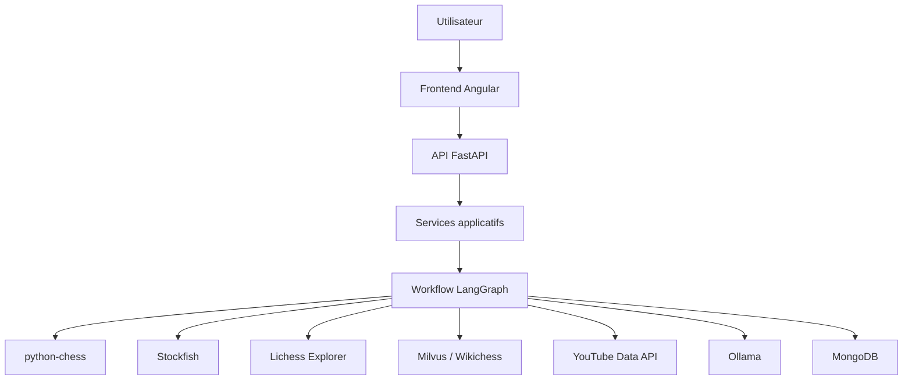
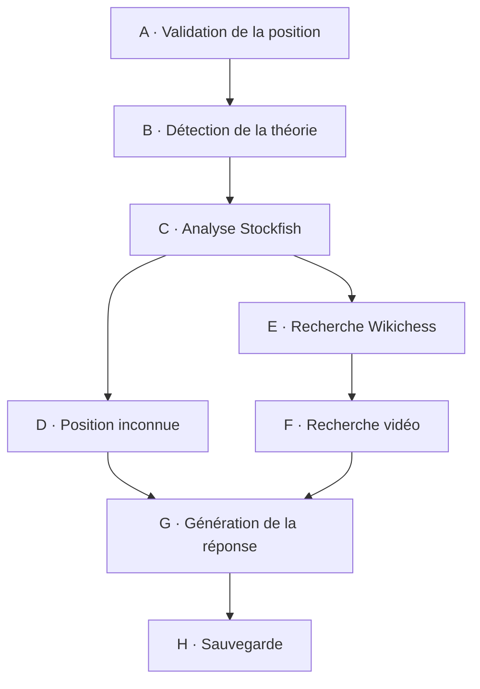

# Chess Agent

**Chess Agent** est une application d'aide à l'apprentissage des ouvertures d'échecs.

À partir d'une position FEN et de l'historique des coups, l'application combine plusieurs sources spécialisées afin de produire une analyse pédagogique :

* validation échiquéenne avec **python-chess** ;
* identification de l'ouverture et statistiques avec **Lichess Explorer** ;
* analyse tactique et positionnelle avec **Stockfish** ;
* recherche documentaire **RAG Wikichess** avec **Milvus** ;
* recherche de ressources pédagogiques avec **YouTube Data API** ;
* génération d'une explication en français avec un **LLM local via Ollama** ;
* conservation des analyses dans **MongoDB** ;
* restitution dans une interface **Angular**.

L'application est orchestrée par **LangGraph**, exposée par une API **FastAPI** et déployée localement avec **Docker Compose**.

---

## Sommaire

1. [Présentation](#présentation)
2. [Architecture](#architecture)
3. [Workflow d'analyse](#workflow-danalyse)
4. [Stack technique](#stack-technique)
5. [Prérequis](#prérequis)
6. [Installation](#installation)
7. [Configuration](#configuration)
8. [Construction des conteneurs](#construction-des-conteneurs)
9. [Premier démarrage](#premier-démarrage)
10. [Initialisation du LLM](#initialisation-du-llm)
11. [Initialisation du RAG Wikichess](#initialisation-du-rag-wikichess)
12. [Accès à l'application](#accès-à-lapplication)
13. [Vérification de l'installation](#vérification-de-linstallation)
14. [Utilisation](#utilisation)
15. [Persistance](#persistance)
16. [Logs et diagnostic](#logs-et-diagnostic)
17. [Arrêt et redémarrage](#arrêt-et-redémarrage)
18. [Reconstruction](#reconstruction)
19. [Qualité et tests](#qualité-et-tests)
20. [Scénarios de démonstration](#scénarios-de-démonstration)
21. [Documentation technique](#documentation-technique)
22. [Limites actuelles](#limites-actuelles)
23. [Évolutions](#évolutions)

---

# Présentation

Chess Agent répond à une question simple :

> Comment transformer une position d'échecs en une explication pédagogique exploitable par un joueur ?

L'application ne confie pas l'ensemble du raisonnement à un modèle de langage.

Chaque composant possède une responsabilité précise :

| Composant          | Responsabilité                                |
| ------------------ | --------------------------------------------- |
| `python-chess`     | validation de la position et des coups        |
| Lichess Explorer   | identification de l'ouverture et statistiques |
| Stockfish          | calcul échiquéen                              |
| Wikichess + Milvus | contexte théorique et pédagogique             |
| YouTube Data API   | ressources vidéo complémentaires              |
| Ollama             | formulation de l'explication                  |
| MongoDB            | historique et persistance                     |
| Angular            | interface utilisateur                         |

Le principe fondamental du projet est le suivant :

> **Stockfish calcule, les sources documentaires apportent le contexte et le LLM explique.**

Le modèle de langage n'est donc pas utilisé pour inventer un score moteur, un meilleur coup ou une source documentaire.

---

# Architecture

L'application suit une architecture en couches.



## Organisation logique

| Couche      | Responsabilité                                        |
| ----------- | ----------------------------------------------------- |
| Frontend    | interaction avec l'utilisateur                        |
| API         | exposition des routes HTTP et validation des contrats |
| Services    | cas d'usage applicatifs                               |
| LangGraph   | orchestration du workflow                             |
| Adapters    | intégration des technologies externes                 |
| Schemas     | contrats Pydantic                                     |
| Core        | configuration, cycle de vie, exceptions et logs       |
| Persistance | stockage et historique                                |

Cette séparation limite le couplage entre FastAPI, le workflow IA et les services techniques.

---

# Workflow d'analyse

Une analyse est orchestrée par un graphe LangGraph composé de huit étapes principales.



Le workflow est conditionnel.

Une position invalide constitue une erreur bloquante. En revanche, l'absence d'une ouverture connue, d'un document Wikichess, d'une vidéo ou l'indisponibilité d'un service facultatif peut conduire à une réponse partielle.

L'analyse Stockfish reste la source de référence pour les données calculées sur la position.

---

# Stack technique

| Domaine           | Technologie                    |
| ----------------- | ------------------------------ |
| Langage backend   | Python 3.12                    |
| API               | FastAPI                        |
| Validation        | Pydantic v2                    |
| Orchestration     | LangGraph                      |
| Échecs            | python-chess                   |
| Moteur            | Stockfish                      |
| Base documentaire | Wikichess                      |
| Embeddings        | Qwen3-Embedding-0.6B           |
| Base vectorielle  | Milvus                         |
| Statistiques      | Lichess Explorer               |
| Vidéos            | YouTube Data API               |
| LLM               | Ollama                         |
| Persistance       | MongoDB                        |
| Frontend          | Angular                        |
| Conteneurisation  | Docker Compose                 |
| Gestion Python    | uv                             |
| Qualité           | Ruff, Pyright, Pytest, Vulture |

---

# Prérequis

## Obligatoires

La machine doit disposer de :

* **Git** ;
* **Docker Desktop** ;
* **Docker Compose** ;
* une connexion Internet lors de l'installation initiale.

Vérifier Docker :

```bash
docker --version
docker compose version
```

Vérifier Git :

```bash
git --version
```

## GPU

Un GPU NVIDIA compatible CUDA peut accélérer l'exécution des modèles locaux.

Il ne doit cependant être considéré comme obligatoire que si la configuration Docker du dépôt impose explicitement son utilisation.

Sous Windows, vérifier éventuellement sa disponibilité avec :

```powershell
nvidia-smi
```

---

# Installation

## 1. Récupérer le projet

```bash
git clone <URL_DU_DEPOT>
cd chess_agent
```

L'URL définitive du dépôt doit remplacer `<URL_DU_DEPOT>` avant publication.

---

## 2. Créer la configuration locale

Le projet doit fournir un fichier `.env.example`.

### Windows PowerShell

```powershell
Copy-Item .env.example .env
```

### Linux / macOS

```bash
cp .env.example .env
```

Le fichier `.env` contient la configuration locale et les éventuels secrets.

Il ne doit jamais être ajouté au dépôt Git.

---

# Configuration

Les valeurs exactes doivent rester alignées avec le modèle `Settings` du backend et le fichier `.env.example`.

La configuration couvre notamment :

| Domaine    | Configuration                          |
| ---------- | -------------------------------------- |
| FastAPI    | hôte, port, préfixe API                |
| MongoDB    | URI et base                            |
| Milvus     | hôte, port et collection               |
| Embeddings | modèle et paramètres                   |
| Stockfish  | chemin, profondeur, threads et mémoire |
| Lichess    | endpoint et timeout                    |
| YouTube    | clé API, région et nombre de résultats |
| Ollama     | URL et modèle                          |
| Frontend   | URL du backend / proxy                 |
| CORS       | origines autorisées                    |

## Secrets

Les secrets doivent uniquement être stockés dans l'environnement local ou dans un gestionnaire de secrets.

Ne jamais placer :

```text
clé YouTube
token
mot de passe
secret applicatif
clé privée
```

dans :

```text
Git
le code Python
le code Angular
une image Docker
la documentation publique
```

---

# Construction des conteneurs

Construire l'ensemble de la stack :

```bash
docker compose build
```

Pour forcer une reconstruction complète :

```bash
docker compose build --no-cache
```

Cette opération peut être relativement longue lors de la première installation, notamment à cause des dépendances Python, Angular et des modèles utilisés par le projet.

---

# Premier démarrage

Démarrer les services :

```bash
docker compose up -d
```

Vérifier immédiatement leur état :

```bash
docker compose ps
```

Selon la topologie Docker du dépôt, la stack peut comprendre notamment :

```text
Angular
FastAPI
MongoDB
Milvus
etcd
MinIO
Ollama
```

Lichess Explorer et YouTube Data API restent des services externes interrogés par le backend.

---

# Initialisation du LLM

Chess Agent utilise Ollama pour l'exécution locale du modèle de langage.

Lors de la première installation, le modèle configuré doit être téléchargé.

Avec le modèle de référence documenté :

```bash
docker exec -it chess-agent-ollama ollama pull qwen2.5:7b-instruct
```

Vérifier les modèles disponibles :

```bash
docker exec -it chess-agent-ollama ollama list
```

Une fois le modèle installé, redémarrer le backend si nécessaire :

```bash
docker compose restart backend
```

Le modèle doit être conservé dans un volume persistant afin d'éviter son téléchargement à chaque redémarrage.

---

# Initialisation du RAG Wikichess

Chess Agent utilise un système de **Retrieval-Augmented Generation**.

Le pipeline est le suivant :

```text
Wikichess
    ↓
Extraction des documents
    ↓
Nettoyage
    ↓
Découpage en chunks
    ↓
Embeddings
    ↓
Indexation Milvus
    ↓
Recherche vectorielle
    ↓
Contexte transmis au workflow
```

Lors d'une première installation, le corpus doit être préparé puis indexé dans Milvus.

La commande exacte doit correspondre au script d'ingestion présent dans le dépôt.

Si le dépôt contient :

```text
backend/scripts/pipeline_wikichess.py
```

la commande est :

```bash
docker compose exec backend python backend/scripts/pipeline_wikichess.py
```

Si l'ingestion est séparée en plusieurs scripts, utiliser les scripts réellement présents dans `scripts/`.

Cette étape doit être exécutée :

* lors de la première installation ;
* après une suppression du volume Milvus ;
* après une modification volontaire du corpus ;
* après une modification incompatible du modèle d'embeddings ou du schéma de collection.

Une fois l'index créé, Milvus conserve les données dans son volume persistant.

---

# Accès à l'application

Après démarrage complet :

## Interface Angular

```text
http://localhost:4200
```

## API FastAPI

```text
http://localhost:8000
```

## Documentation Swagger / OpenAPI

```text
http://localhost:8000/docs
```

## Healthcheck

```text
http://localhost:8000/api/healthcheck
```

Le healthcheck permet de contrôler l'état des principaux services nécessaires au backend.

---

# Vérification de l'installation

Une installation ne doit pas être considérée comme terminée simplement parce que les conteneurs sont démarrés.

## 1. Vérifier les conteneurs

```bash
docker compose ps
```

Les services requis doivent être démarrés et les services possédant un healthcheck doivent atteindre l'état attendu.

## 2. Vérifier le backend

Ouvrir :

```text
http://localhost:8000/api/healthcheck
```

## 3. Vérifier Swagger

Ouvrir :

```text
http://localhost:8000/docs
```

La documentation OpenAPI doit présenter les routes réellement exposées par le backend.

## 4. Vérifier Ollama

```bash
docker exec -it chess-agent-ollama ollama list
```

## 5. Vérifier le frontend

Ouvrir :

```text
http://localhost:4200
```

L'interface Chess Agent doit être affichée.

## 6. Effectuer une analyse complète

Une analyse fonctionnelle permet de vérifier le chemin de bout en bout :

```text
Angular
   ↓
FastAPI
   ↓
LangGraph
   ├── python-chess
   ├── Stockfish
   ├── Lichess
   ├── Milvus / Wikichess
   ├── YouTube
   └── Ollama
   ↓
MongoDB
   ↓
Angular
```

---

# Utilisation

L'utilisateur peut :

1. saisir ou construire une position sur l'échiquier ;
2. fournir une position FEN ;
3. lancer l'analyse ;
4. suivre la progression du workflow ;
5. consulter l'ouverture détectée ;
6. consulter les statistiques Lichess ;
7. examiner l'évaluation Stockfish ;
8. consulter les variantes proposées ;
9. lire l'explication pédagogique ;
10. accéder aux ressources vidéo proposées.

Les informations affichées dépendent des sources réellement disponibles pour la position analysée.

---

# Persistance

Chess Agent utilise des volumes Docker pour séparer les données persistantes du cycle de vie des conteneurs.

Selon la topologie Docker retenue, ils peuvent conserver :

| Donnée                 | Service            |
| ---------------------- | ------------------ |
| analyses et historique | MongoDB            |
| index vectoriel        | Milvus             |
| métadonnées Milvus     | etcd               |
| objets Milvus          | MinIO              |
| modèle LLM             | Ollama             |
| modèles d'embeddings   | cache Hugging Face |

Afficher les volumes :

```bash
docker volume ls
```

Inspecter un volume :

```bash
docker volume inspect <NOM_DU_VOLUME>
```

Les noms exacts doivent être lus dans le fichier `docker-compose.yml`.

---

## Tester la persistance

Arrêter la stack :

```bash
docker compose down
```

Puis la redémarrer :

```bash
docker compose up -d
```

Les données présentes dans les volumes doivent être conservées.

### Attention

```bash
docker compose down -v
```

supprime également les volumes associés à la stack.

Cette commande entraîne donc potentiellement la suppression :

* de l'historique MongoDB ;
* de l'index Milvus ;
* des données etcd / MinIO ;
* des modèles Ollama ;
* des caches persistants.

Elle ne doit être utilisée que lorsqu'une réinitialisation complète est réellement souhaitée.

---

# Logs et diagnostic

## Tous les services

```bash
docker compose logs
```

## Suivi en temps réel

```bash
docker compose logs -f
```

## Backend uniquement

```bash
docker compose logs -f backend
```

## Dernières lignes

```bash
docker compose logs --tail 100 backend
```

## Rechercher une erreur sous PowerShell

```powershell
docker compose logs backend | Select-String "ERROR"
```

Lors d'un problème de démarrage, vérifier en priorité :

```text
1. docker compose ps
2. logs du backend
3. disponibilité MongoDB
4. disponibilité Milvus
5. disponibilité Stockfish
6. disponibilité Ollama
7. configuration .env
8. disponibilité du modèle LLM
9. disponibilité du corpus RAG
```

---

# Arrêt et redémarrage

## Arrêter

```bash
docker compose down
```

Les volumes sont conservés.

## Redémarrer

```bash
docker compose up -d
```

## Redémarrer uniquement le backend

```bash
docker compose restart backend
```

## Redémarrer uniquement le frontend

```bash
docker compose restart frontend
```

---

# Reconstruction

Après modification du backend ou du frontend :

```bash
docker compose up -d --build
```

Pour reconstruire complètement sans cache :

```bash
docker compose down
docker compose build --no-cache
docker compose up -d
```

Vérifier ensuite :

```bash
docker compose ps
```

et :

```bash
docker compose logs --tail 100 backend
```

---

# Qualité et tests

Le backend utilise plusieurs outils complémentaires.

## Ruff

Analyse statique :

```bash
uv run ruff check backend
```

Vérification du formatage :

```bash
uv run ruff format --check backend
```

## Pyright

```bash
uv run pyright backend
```

## Pytest

```bash
uv run pytest
```

## Vulture

Lorsque l'outil est configuré dans le projet :

```bash
uv run vulture backend
```

Une validation de livraison doit idéalement conserver :

* la date d'exécution ;
* la version du dépôt ;
* les versions des outils ;
* la sortie globale des tests ;
* le nombre de tests exécutés ;
* les éventuelles exclusions justifiées.

Le code Python suit la convention **MISA v2.0** utilisée par le projet.

---

# Scénarios de démonstration

## 1. Partie espagnole / Ruy Lopez

### Coups

```text
1. e4 e5
2. Nf3 Nc6
3. Bb5
```

### FEN

```text
r1bqkbnr/pppp1ppp/2n5/1B2p3/4P3/5N2/PPPP1PPP/RNBQK2R b KQkq - 3 3
```

### Objectif

Ce scénario permet de présenter le parcours complet :

```text
Position valide
      ↓
Ouverture connue
      ↓
Statistiques Lichess
      ↓
Analyse Stockfish
      ↓
RAG Wikichess
      ↓
Ressources vidéo
      ↓
Explication pédagogique
```

---

## 2. Gambit dame

### Coups

```text
1. d4 d5
2. c4
```

### FEN

```text
rnbqkbnr/ppp1pppp/8/3p4/2PP4/8/PP2PPPP/RNBQKBNR b KQkq - 0 2
```

Ce scénario vérifie notamment la reconnaissance d'une ouverture commençant par `1.d4`.

---

## 3. Défense sicilienne

### Coups

```text
1. e4 c5
2. Nf3 d6
3. d4 cxd4
4. Nxd4
```

### FEN

```text
rnbqkbnr/pp2pppp/3p4/8/3NP3/8/PPP2PPP/RNBQKB1R b KQkq - 0 4
```

Ce scénario permet de tester une famille d'ouverture très différente de la Partie espagnole.

---

## 4. Défense française

### Coups

```text
1. e4 e6
2. d4 d5
3. Nc3
```

### FEN

```text
rnbqkbnr/ppp2ppp/4p3/3p4/3PP3/2N5/PPP2PPP/R1BQKBNR b KQkq - 1 3
```

---

## 5. Défense Caro-Kann

### Coups

```text
1. e4 c6
2. d4 d5
3. Nc3
```

### FEN

```text
rnbqkbnr/pp2pppp/2p5/3p4/3PP3/2N5/PPP2PPP/R1BQKBNR b KQkq - 1 3
```

---

## Sortie de théorie

Un scénario complémentaire consiste à partir d'une ouverture connue puis à atteindre une position pour laquelle le corpus théorique n'apporte plus suffisamment d'informations.

Le comportement attendu devient :

```text
Position valide
      ↓
Théorie absente ou insuffisante
      ↓
Analyse Stockfish
      ↓
Contexte disponible
      ↓
Réponse adaptée
```

Ce scénario permet de montrer que le système sait fonctionner en mode dégradé au lieu d'inventer une théorie inexistante.

---

# Documentation technique

La documentation détaillée du projet est organisée par domaine.

| Document                                    | Contenu                         |
| ------------------------------------------- | ------------------------------- |
| `01-presentation-projet.md`                 | besoin, objectifs et périmètre  |
| `02-architecture-technique.md`              | architecture et dépendances     |
| `03-workflow-langgraph.md`                  | workflow et nœuds LangGraph     |
| `04-etat-et-routage.md`                     | état partagé et routage         |
| `05-services-applicatifs.md`                | services métier                 |
| `06-adapters-infrastructure.md`             | intégrations techniques         |
| `07-rag-wikichess.md`                       | RAG et recherche vectorielle    |
| `08-api-contrats-erreurs.md`                | API, contrats et erreurs        |
| `09-modeles-donnees.md`                     | modèles Pydantic                |
| `10-persistance-mongodb.md`                 | MongoDB et idempotence          |
| `11-cycle-vie-configuration-supervision.md` | démarrage et supervision        |
| `12-frontend-angular.md`                    | architecture frontend           |
| `13-qualite-tests.md`                       | qualité et stratégie de tests   |
| `14-convention-misa.md`                     | convention de développement     |
| `15-limites-evolutions.md`                  | limites et évolutions           |
| `16-glossaire.md`                           | vocabulaire                     |
| `17-guide-presentation.md`                  | préparation de la démonstration |
| `18-inventaire-sources.md`                  | sources et niveau de preuve     |

Le README constitue le **point d'entrée opérationnel** du projet.

Les documents du dossier de documentation fournissent le niveau de détail nécessaire à sa compréhension technique.

---

# Limites actuelles

Chess Agent est un **Proof of Concept**.

Les principaux points à consolider avant une exploitation de niveau produit sont notamment :

* authentification et autorisation ;
* gestion complète des utilisateurs ;
* stratégie de sauvegarde et restauration ;
* observabilité et métriques ;
* objectifs de disponibilité ;
* gestion centralisée des secrets ;
* industrialisation du déploiement ;
* validation systématique du frontend contre l'OpenAPI ;
* maîtrise des quotas des services externes ;
* automatisation complète du pipeline documentaire ;
* tests de charge ;
* tests de sécurité ;
* stratégie de rétention des données.

Les modèles utilisateur présents dans le domaine doivent être intégrés à un véritable parcours d'authentification ou retirés du périmètre tant que cette fonctionnalité n'est pas implémentée.

---

# Évolutions

Le projet a été conçu pour permettre plusieurs évolutions.

Parmi les pistes étudiées :

* exposition des capacités via **Model Context Protocol (MCP)** ;
* authentification et personnalisation ;
* recommandations adaptées au niveau du joueur ;
* enrichissement du corpus RAG ;
* amélioration du classement des vidéos ;
* recherche d'une position précise dans une vidéo ;
* amélioration de l'observabilité ;
* déploiement sur une infrastructure distante ;
* mise en cache des résultats ;
* génération automatique des modèles TypeScript depuis l'OpenAPI.

L'extension MCP et l'analyse approfondie des contenus vidéo constituent des **évolutions étudiées**, et non des fonctionnalités considérées comme présentes dans le POC actuel.

---

# Statut du projet

**Projet :** Chess Agent
**Nature :** Proof of Concept
**Backend :** FastAPI / Python 3.12
**Frontend :** Angular
**Orchestration IA :** LangGraph
**Moteur d'échecs :** Stockfish
**RAG :** Wikichess / Sentence Transformers / Milvus
**LLM :** Ollama
**Persistance :** MongoDB
**Déploiement local :** Docker Compose

---

# Auteur

**Stéphane Moa**

Projet réalisé dans le cadre de la formation **Ingénieur IA**.
