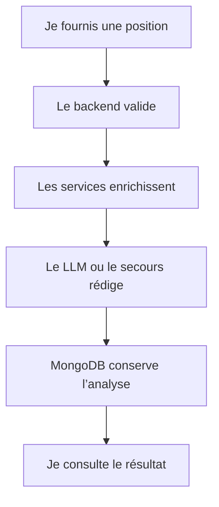

# Présentation du projet

[Sommaire](index.md) · [Architecture](02-architecture-technique.md) · [Guide de présentation](17-guide-presentation.md)

## Le problème que je cherche à résoudre

Une évaluation brute d’un moteur d’échecs est utile, mais elle n’explique pas toujours pourquoi un coup est bon, à quelle ouverture appartient la position ni quelles ressources permettent de progresser. Avec Chess Agent, je cherche donc à réunir plusieurs formes d’information dans une seule analyse structurée et pédagogique.

Mon application reçoit principalement une position au format FEN. Elle peut aussi utiliser l’historique réel des coups et une question de l’utilisateur. Elle enrichit ensuite cette entrée avec des données échiquéennes, documentaires et génératives.

**Statut : Confirmé.**

## Mon objectif fonctionnel

Je veux permettre à un utilisateur de :

- vérifier qu’une position est valide ;
- comprendre à qui est le trait et dans quel état se trouve l’échiquier ;
- reconnaître une ouverture connue ;
- obtenir une évaluation Stockfish et des coups candidats ;
- recevoir un contexte Wikichess correspondant réellement à l’ouverture ou aux coups joués ;
- consulter des vidéos pédagogiques pertinentes ;
- lire une réponse synthétique en français ;
- retrouver l’analyse enregistrée.

## Les entrées et sorties principales

| Élément | Rôle |
| --- | --- |
| FEN | décrit la position actuelle |
| historique de coups | relie la position à un chemin d’ouverture réel |
| question | précise ce que l’utilisateur souhaite comprendre |
| langue | détermine la langue de la réponse finale |
| réponse structurée | regroupe statut, ouverture, évaluation, documents, vidéos, explication et identifiant |

Le service d’orchestration utilise `fen`, `moves`, `question` et
`response_language`. La consolidation la plus récente a retiré
`AnalysisMode`, car cette valeur ne pilotait aucune branche réelle du workflow.
Le schéma joint le plus ancien ne contient que `fen` et conserve encore le
mode : je le traite comme une source historique, pas comme le contrat
canonique.

## Les sources que je distingue

Je ne mélange pas les rôles de Lichess, Stockfish et Wikichess :

| Source | Ce qu’elle m’apporte | Ce qu’elle ne remplace pas |
| --- | --- | --- |
| Lichess Explorer | nom d’ouverture et statistiques de parties | une évaluation tactique de la position |
| Stockfish | score, profondeur, meilleur coup et variantes | une explication documentaire d’une ouverture |
| Wikichess via RAG | contenu pédagogique et continuations documentées | le calcul du meilleur coup |
| YouTube | ressources vidéo classées | la réponse principale |
| Ollama | formulation finale à partir du contexte | les sources factuelles en amont |

Cette séparation est importante : le modèle de langage rédige la réponse, mais il ne doit pas inventer les données techniques déjà produites par les services spécialisés.

## Le parcours utilisateur

## Le périmètre réellement couvert

| Domaine | Couverture |
| --- | --- |
| backend Python | **Confirmé** pour les modules reçus |
| workflow LangGraph | **Confirmé** pour l’état, les nœuds et les destinations |
| services externes | **Confirmé** pour leurs responsabilités et leur cycle de vie |
| RAG Wikichess | **Confirmé** pour la recherche en ligne ; ingestion non entièrement fournie |
| persistance | **Confirmé** pour les analyses MongoDB |
| API FastAPI | **Déclaré consolidé** dans l’état le plus récent ; les sources des routes ne sont pas jointes à ce dossier documentaire |
| frontend Angular | **Partiel** : document de fonctionnement disponible, sources réelles absentes |
| déploiement | **Partiel** : des valeurs Docker sont suggérées par la configuration, mais la topologie n’est pas fournie |

## Ce que je ne prétends pas démontrer

Je ne présente pas comme acquis :

- le chemin exact d’un endpoint public d’analyse sans lecture du routeur canonique ;
- un système d’authentification ou d’autorisation ;
- une interface Angular vérifiée fichier par fichier ;
- une exécution Docker complète ;
- un résultat Ruff, Pyright ou Pytest final sans les rapports d’exécution associés ;
- les conditions internes exactes de `routing.py` lorsqu’elles ne sont pas visibles dans le lot final consultable.
