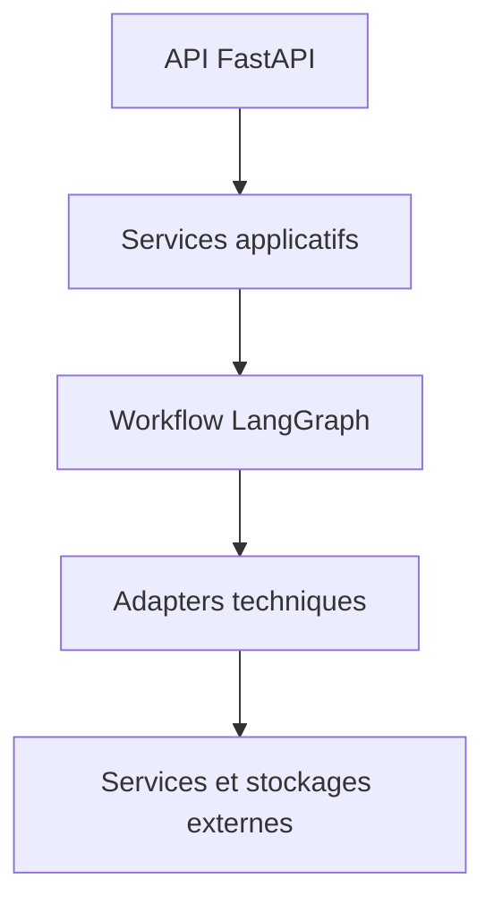
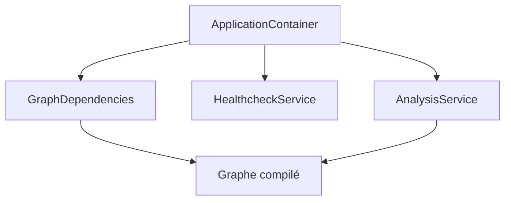

# Architecture technique

[Sommaire](index.md) · [Présentation](01-presentation-projet.md) · [Services](05-services-applicatifs.md)

## Mon principe d’architecture

J’ai séparé le backend en couches pour que chaque partie ait une responsabilité claire. FastAPI gère le transport HTTP, les services portent les cas d’usage, LangGraph orchestre les étapes et les adapters isolent les technologies externes.

**Statut : Confirmé pour le backend disponible.**



## Les couches

| Couche | Exemples | Responsabilité |
| --- | --- | --- |
| API | routes, dépendances, handlers | recevoir une requête et produire une réponse HTTP |
| services | `AnalysisService`, `ChessService`, `VectorSearchService`, `HealthcheckService` | exécuter un cas d’usage |
| agent | graphe, état, routage, nœuds A à H | enchaîner les étapes de l’analyse |
| adapters | Lichess, Stockfish, embeddings, Milvus, Ollama, YouTube, MongoDB | encapsuler une technologie externe |
| schémas | modèles Pydantic et énumérations | valider et sérialiser les données |
| core | configuration, constantes, conteneur, lifespan, exceptions, logging | fournir les mécanismes transversaux |
| database | accès commun à MongoDB | fournir les collections et le ping technique |

## Le conteneur de dépendances

`create_application_container()` construit les objets partagés une seule fois :

- `ChessService` ;
- `EmbeddingService` ;
- `MilvusService` ;
- `VectorSearchService`, qui dépend des deux précédents ;
- `StockfishService` ;
- `LichessService` ;
- `LLMService` ;
- `YoutubeService` ;
- `MongoDBService`.

Le conteneur construit ensuite de manière atomique le graphe compilé, `AnalysisService` et `HealthcheckService`. Je publie ces trois éléments uniquement après leur création complète, afin de ne pas exposer un état partiellement opérationnel.

## L’injection dans LangGraph

Je ne stocke pas les services dans `ChessAnalysisState`. Le conteneur crée un objet `GraphDependencies`, puis `build_graph_config()` place les références dans `RunnableConfig["configurable"]`.

| Clé injectable | Objet |
| --- | --- |
| `chess_service` | `ChessService` |
| `stockfish_service` | `StockfishService` |
| `lichess_service` | `LichessService` |
| `embedding_service` | `EmbeddingService` |
| `milvus_service` | `MilvusService` |
| `vector_search_service` | `VectorSearchService` |
| `youtube_service` | `YoutubeService` |
| `llm` | `LLMService` |
| `mongodb_service` | `MongoDBService` |

Ce choix permet de tester un nœud avec une dépendance contrôlée sans démarrer toute l’application.

## Les dépendances majeures



`VectorSearchService` forme une composition particulière : il utilise `EmbeddingService` pour produire le vecteur de requête, puis `MilvusService` pour rechercher les documents.

## L’arborescence logique

```text
backend/app/
├── adapters/
├── agent/
│   ├── nodes/
│   ├── graph.py
│   ├── routing.py
│   ├── state.py
│   └── utils/
├── api/
│   ├── dependencies/
│   ├── routes/
│   └── exception_handlers.py
├── core/
├── database/
├── schemas/
│   ├── analysis/
│   ├── chess/
│   ├── common/
│   ├── media/
│   └── rag/
├── services/
└── utils/
```

Cette arborescence est confirmée par les imports des versions récentes. Les schémas joints plus anciens utilisent une arborescence plate `app.schemas.*`, ce qui constitue une migration à terminer.

## Mes règles de dépendance

- une route délègue au service correspondant ;
- un service ne dépend pas de FastAPI ;
- un nœud lit l’état et retourne une mise à jour partielle ;
- un nœud obtient ses services depuis `RunnableConfig` ;
- un adapter convertit les erreurs techniques en exceptions du projet ;
- un schéma ne prend pas de décision métier ;
- le lifespan est responsable du démarrage et de l’arrêt ;
- le conteneur partage les instances, mais ne pilote pas leur cycle de vie.

