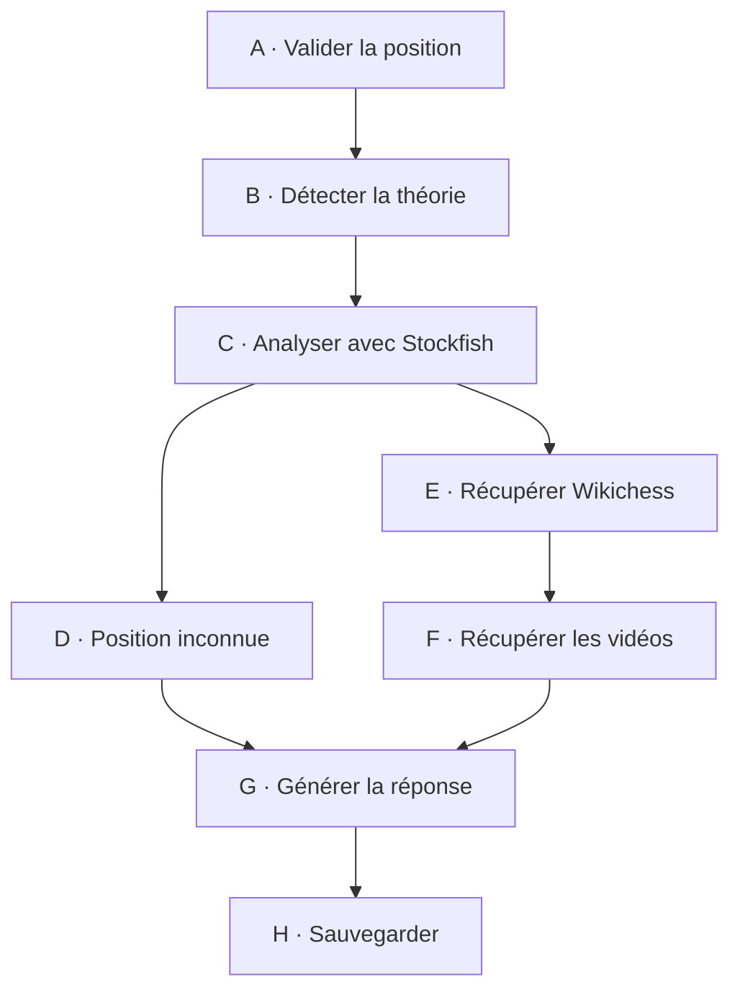

# Workflow LangGraph

[Sommaire](index.md) · [Architecture](02-architecture-technique.md) · [État et routage](04-etat-et-routage.md)

## Le rôle du workflow

J’utilise LangGraph pour décomposer une analyse complexe en étapes lisibles. Chaque nœud reçoit un `ChessAnalysisState` et un `RunnableConfig`, puis renvoie un `StateUpdate`. LangGraph fusionne cette mise à jour avec l’état partagé.

**Statut : Confirmé pour les huit nœuds, leurs responsabilités et les destinations enregistrées.**

## Le graphe principal

Le graphe réel est conditionnel : une option désactivée, une erreur, l’absence d’ouverture ou un service indisponible peut faire sauter une étape. Le schéma montre le chemin fonctionnel le plus riche, pas une séquence obligatoire.

## Les huit nœuds

| Étape | Fonction | Ce que je fais | Dépendance principale |
| --- | --- | --- | --- |
| A | `validate_position` | je valide la FEN et construis `BoardPosition` | `ChessService` |
| B | `detect_theory` | je recherche une ouverture et prépare son contexte | `LichessService` |
| C | `engine_analysis` | je calcule et enrichis l’évaluation | `StockfishService` |
| D | `unknown_position_analysis` | je prépare un contexte si aucune ouverture n’est connue | état Stockfish déjà produit |
| E | `retrieve_context` | je retrouve le document Wikichess correspondant | `ChessService`, `VectorSearchService` |
| F | `retrieve_videos` | je cherche et sélectionne des vidéos pédagogiques | `YoutubeService` |
| G | `generate_response` | je construis le prompt et la réponse finale | `LLMService` |
| H | `save_analysis` | je persiste un enregistrement complet | `MongoDBService` |

## Ce que chaque nœud ajoute

| Étape | Données enrichies |
| --- | --- |
| validation | `position`, résumé de position, statut et étape terminée |
| théorie | `opening`, résumé Lichess, avertissement si ouverture absente |
| moteur | `engine_analysis`, `evaluation`, synthèse moteur |
| position inconnue | `unknown_position_context` |
| contexte | `retrieval_context`, résumé Wikichess |
| vidéos | liste `videos`, résumé des vidéos |
| réponse | `response`, `final_summary` ou réponse de secours |
| sauvegarde | `analysis_id` ou avertissement de persistance |

## Les comportements d’erreur

Je distingue trois situations :

1. une erreur bloquante rend le statut `FAILED` et alimente `errors` ;
2. une dépendance facultative indisponible produit un avertissement et permet une réussite partielle ;
3. une étape sans donnée exploitable peut se terminer normalement avec un résultat vide.

Exemples confirmés :

- une FEN invalide bloque l’analyse ;
- une ouverture inconnue devient un avertissement et non une panne ;
- une recherche Wikichess indisponible peut produire un contexte vide ;
- l’échec d’Ollama déclenche une réponse de secours ;
- l’échec de MongoDB ne supprime pas l’analyse déjà produite.

## Les préconditions importantes

- `unknown_position_analysis` refuse de s’exécuter si une ouverture existe ;
- ce même nœud exige une évaluation Stockfish ;
- la recherche Wikichess utilise l’historique réel transmis, jamais un historique inventé depuis la seule FEN ;
- la recherche par coups convertit l’historique UCI en SAN avant de comparer `moves_path` ;
- la sauvegarde nécessite un `request_id` dans les métadonnées ;
- le LLM ne reçoit que les sections de contexte réellement disponibles.

## La fin du workflow

`save_analysis` possède une transition fixe vers `END`. Les autres nœuds utilisent les fonctions conditionnelles de `routing.py`. Les destinations exactes enregistrées dans `graph.py` sont détaillées dans [04 — État et routage](04-etat-et-routage.md).

