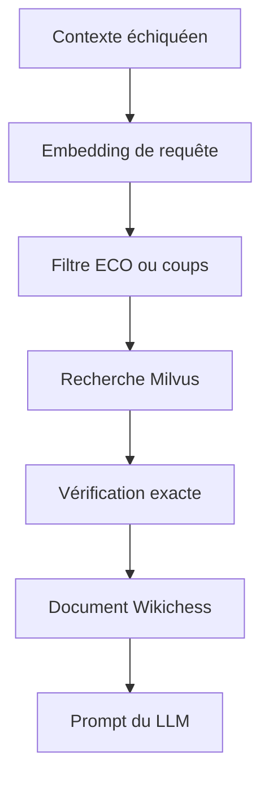

# RAG et Wikichess

[Sommaire](index.md) · [Workflow](03-workflow-langgraph.md) · [Adapters](06-adapters-infrastructure.md)

## Ce que j’appelle RAG dans ce projet

Dans Chess Agent, le RAG correspond à la récupération d’un contenu Wikichess avant la génération de la réponse. Le LLM n’interroge pas directement Milvus : `VectorSearchService` retrouve un document, le nœud `retrieve_context` le transforme en modèles métier, puis `generate_response` l’intègre au prompt.

**Statut : Confirmé pour la recherche en ligne. L’ingestion initiale du corpus n’est pas entièrement couverte par les sources finales.**

## La construction de la requête

Le nœud prépare une description factuelle pouvant contenir :

- le type de contenu attendu : présentation Wikichess ;
- l’historique des coups ;
- le nom d’ouverture trouvé par Lichess ;
- le code ECO trouvé par Lichess.

Je conserve l’historique transmis par l’appelant. Quand il est exprimé en UCI, `ChessService` le convertit en SAN pour correspondre au format `moves_path` indexé dans Wikichess.

## La stratégie de recherche

`search_wikichess()` applique cet ordre :

1. si un code ECO existe, je recherche les documents de ce code ;
2. si cette recherche ne retourne rien et que des coups existent, je recherche la séquence exacte ;
3. si je ne possède ni ECO ni coups, je ne lance pas la recherche ;
4. si aucun résultat ne correspond, je construis un `RetrievalContext` vide.

Le code ECO est donc prioritaire. Les coups servent de stratégie de repli, pas de simple décoration de la requête.

## La double vérification

Pour éviter qu’une proximité vectorielle retourne un contenu appartenant à une autre ouverture, je combine deux protections :

- un filtre structurel est envoyé à Milvus ;
- les résultats sont vérifiés une seconde fois dans l’application.

La recherche par ECO compare le code exact. La recherche par coups compare le `moves_path` exact. L’embedding sert ensuite à classer les documents à l’intérieur du sous-ensemble cohérent.

## La transformation du résultat

Le nœud construit :

- un `Document` avec son titre et son contenu ;
- un `DocumentMetadata` avec la source, la langue, l’URL, l’ECO, les coups, la position résultante et les continuations ;
- un `DocumentChunk` représentant le contenu indexé ;
- un `RetrievedDocument` avec une similarité limitée entre 0 et 1 et un extrait de 500 caractères ;
- un `RetrievalContext` contenant la requête et les documents retenus.

La version finale du nœud utilise `SELECTED_DOCUMENT_LIMIT = 1`. Le paramètre
`rag_search_top_k` reste la limite des recherches vectorielles générales, mais
le workflow Wikichess conserve volontairement un seul document correspondant
au contexte échiquéen. L’ancien paramètre
`rag_max_selected_documents`, qui n’était pas consommé, a été retiré.

## L’utilisation par le LLM

Je garde les informations Wikichess dans une section distincte du prompt. Les règles de génération demandent de ne pas confondre :

- une continuation documentée par Wikichess ;
- une fréquence observée par Lichess ;
- un meilleur coup calculé par Stockfish.

Le nœud retire aussi certaines lignes de métadonnées vectorielles avant d’exposer le contenu au modèle. L’objectif est de transmettre l’information pédagogique, pas le bruit technique de l’index.

## Le mode dégradé

Une erreur d’embedding ou de recherche Milvus devient une `RetrievalError`. Le nœud peut alors ajouter un `WorkflowWarning`, produire un contexte vide et laisser les autres sources construire la réponse. Une erreur de configuration structurelle, comme l’absence du service injecté, reste bloquante.
