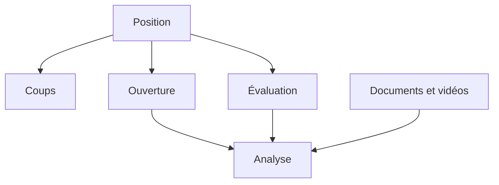

# Modèles de données

[Sommaire](index.md) · [État](04-etat-et-routage.md) · [Persistance](10-persistance-mongodb.md)

## Mon principe de modélisation

J’utilise Pydantic pour valider les frontières entre l’API, les services, le workflow et la persistance. La plupart des modèles interdisent les champs supplémentaires avec `extra="forbid"`. Les objets de référence sont parfois immuables avec `frozen=True`, tandis que l’état LangGraph autorise la validation à l’affectation.

## Carte des domaines

## Position

| Modèle | Informations |
| --- | --- |
| `FenRequest` | FEN à valider |
| `BoardPosition` | FEN, trait, compteurs, roque et état de la partie |
| `PositionContext` | position et coups légaux associés |

`ChessService` enrichit ces modèles avec la légalité, l’échec, le mat, le pat, la nulle et la fin de partie.

## Coups

| Modèle | Rôle |
| --- | --- |
| `Move` | origine, destination, UCI, SAN et promotion éventuelle |
| `LegalMove` | coup légal avec indicateurs de capture, échec et roque |
| `PlayedMove` | coup appliqué avec FEN avant et après |
| `BestMove` | coup recommandé et évaluation associée |
| `MoveSuggestion` | proposition accompagnée d’une explication |
| `MoveStatistics` | fréquences et résultats observés |

## Ouvertures

| Modèle | Rôle |
| --- | --- |
| `Opening` | identité, code ECO, nom et description |
| `OpeningVariation` | ligne ou variante associée |
| `OpeningStatistics` | parties et résultats blancs/noirs/nuls |
| `OpeningTheory` | principes, plans, pièges et recommandations |
| `OpeningDetails` | agrégat renvoyé par Lichess |

## Évaluation moteur

| Modèle | Rôle |
| --- | --- |
| `Evaluation` | score, type, profondeur, nœuds et durée |
| `PrincipalVariation` | séquence principale et son évaluation |
| `EngineAnalysis` | meilleur coup, évaluation, variante et alternatives |
| `PositionEvaluation` | analyse enrichie avec thèmes, forces, faiblesses et conseils |

Les versions des nœuds vérifient parfois la présence du meilleur coup ou d’informations moteur. Les modèles joints les plus anciens les rendent obligatoires. Cette optionalité doit être décidée dans le schéma canonique.

## Documents RAG

| Modèle | Rôle |
| --- | --- |
| `DocumentMetadata` | source, langue, URL, ECO, coups et continuations |
| `Document` | contenu documentaire complet |
| `DocumentChunk` | fragment indexé |
| `RetrievedDocument` | document, similarité, chunk et extrait |
| `RetrievalContext` | requête, documents et total de résultats |

Le schéma joint ancien contient les champs généraux. Le nœud récent utilise en plus des métadonnées Wikichess comme `eco`, `moves`, `moves_path`, `position_after`, `wikichess_title` et `next_moves`.

## Vidéos

| Modèle | Rôle |
| --- | --- |
| `VideoChannel` | identité et URL de la chaîne |
| `Video` | titre, description, URL, miniature, durée et langue |
| `VideoRecommendation` | vidéo avec pertinence et raisons |
| `VideoCollection` | résultat agrégé de la recherche |

## Utilisateur

Les schémas reçus définissent `User`, `UserPreferences` et `UserProfile`. Ils permettent de représenter un compte, ses préférences et son profil. Je n’ai toutefois pas observé leur utilisation dans les routes ou la persistance d’analyse disponibles. Je les considère donc comme un domaine préparé, pas comme une fonctionnalité intégrée.

## Analyse et persistance

Le backend récent utilise plusieurs contrats :

- `AnalysisRequest` et `AnalysisResponse` pour le cas d’usage ;
- `ChessAnalysisState` pour le workflow ;
- `AnalysisRecord` pour MongoDB ;
- `AnalysisSummary` pour l’historique ;
- `AnalysisSaveResult` pour le résultat d’écriture.

`AnalysisRecord` conserve les données métier, les options, les résultats techniques sérialisés, l’avancement, les avertissements, les erreurs et les dates.

La notion d’`AnalysisMode` a été retirée du contrat récent, de l’état et de la
persistance parce qu’elle ne pilotait aucune branche réelle. Elle subsiste dans
les schémas historiques joints et ne doit pas être réintroduite sans besoin
fonctionnel explicite.

## Les énumérations

Les concepts observés couvrent : statut, étape du workflow, couleur, notation,
type d’évaluation, état de service, source de recherche, type de document,
plateforme vidéo et difficulté. Le mode d’analyse appartient uniquement au
contrat historique.

Le fichier joint ancien et les imports récents ne sont pas alignés sur
`AnalysisStatus` ni sur l’emplacement des énumérations. La consolidation déclare
une énumération canonique ; ses valeurs JSON doivent être figées par un test de
contrat et une preuve OpenAPI.
