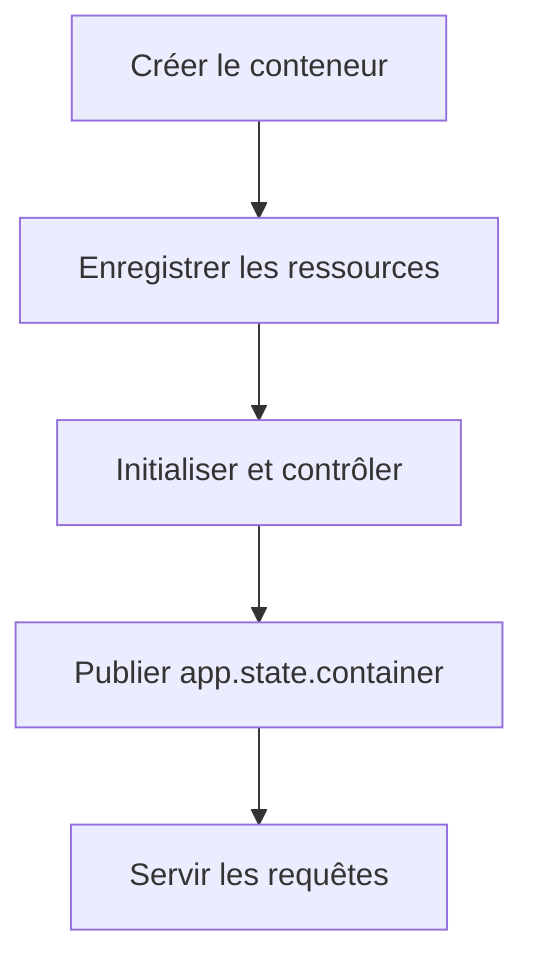

# Cycle de vie, configuration et supervision

[Sommaire](index.md) · [Adapters](06-adapters-infrastructure.md) · [API](08-api-contrats-erreurs.md)

## Mon objectif de démarrage

Je veux publier le conteneur dans `app.state` uniquement lorsque toutes les ressources obligatoires sont disponibles. Pour cela, le lifespan crée le conteneur, construit un `ResourceManager`, initialise les ressources dans l’ordre, puis expose l’application.

**Statut : Confirmé.**

## L’ordre d’initialisation

| Ordre | Ressource | Requise | Initialisation |
| --- | --- | --- | --- |
| 1 | MongoDB | oui | collection et index |
| 2 | Embedding | oui | modèle Sentence Transformer |
| 3 | Milvus | oui | client, collection et index |
| 4 | Stockfish | oui | moteur UCI |
| 5 | LLM | oui | client Ollama et modèle |
| 6 | Lichess | non | contrôle du client HTTP |
| 7 | YouTube | non | contrôle du client HTTP |
| 8 | Workflow | oui | graphe, analyse et supervision |

L’arrêt est exécuté dans l’ordre inverse.

## Le rollback

Si une ressource requise échoue, je :

1. nettoie la ressource dont l’initialisation a échoué ;
2. ferme les ressources déjà initialisées dans l’ordre inverse ;
3. remonte une exception contextualisée ;
4. ne publie jamais le conteneur dans FastAPI.

Une ressource facultative indisponible produit un avertissement et autorise le
mode dégradé. Dans l’état consolidé, Lichess et YouTube sont facultatifs ; le LLM
est requis au démarrage. Une erreur de génération après un démarrage réussi
peut encore produire une réponse de secours. Les opérations globales sont
protégées par un verrou et les méthodes de fermeture doivent être idempotentes.

## La configuration

`Settings` charge le fichier `.env`, ignore les variables inconnues, supprime les espaces autour des chaînes et rend l’instance immuable. Les secrets Lichess, YouTube et Hugging Face utilisent `SecretStr`.

### Application et HTTP

| Paramètre | Défaut |
| --- | --- |
| nom / version | `Chess Agent` / `0.1.0` |
| environnement | `development` |
| hôte / port | `0.0.0.0` / `8000` |
| log | `INFO` |
| timeout HTTP | 10 s |
| tentatives HTTP | 3 |
| connexions HTTP | 20 |

### Données et IA

| Paramètre | Défaut |
| --- | --- |
| MongoDB | `mongodb://localhost:27017`, base `chess_agent` |
| Milvus | hôte `milvus`, port `19530`, collection `documents` |
| métrique / index | `COSINE` / `HNSW` |
| modèle d’embedding | `Qwen/Qwen3-Embedding-0.6B` |
| lot d’embeddings | 16 textes |
| Stockfish | `/usr/games/stockfish`, profondeur 15, 2 threads, 128 Mo |
| Lichess | `https://explorer.lichess.ovh` |
| YouTube | région `FR`, langue `fr`, 5 résultats |
| Ollama | `http://ollama:11434`, `qwen2.5:7b-instruct` |
| température | `0.0` |
| timeout LLM | 180 s |

### Workflow et frontend

| Paramètre | Défaut |
| --- | --- |
| itérations agent | 10 |
| résultats RAG généraux | `rag_search_top_k = 5` |
| vidéos sélectionnées | 5 |
| meilleurs coups | 3 |
| origine frontend | `http://localhost:4200` |
| documentation OpenAPI | activée |

## Les niveaux de santé

| Méthode | Question |
| --- | --- |
| `is_ready()` | l’objet est-il prêt localement ? |
| `ping()` | la dépendance répond-elle à un contrôle léger ? |
| `health()` | quel diagnostic détaillé puis-je exposer ? |

`ApplicationContainer.health()` contrôle en parallèle MongoDB, Milvus, embeddings, recherche vectorielle, Stockfish, Lichess, YouTube et LLM, puis ajoute l’état du graphe, de l’analyse et de la supervision.

`HealthcheckService.check()` construit pour l’API un statut global `healthy` ou
`degraded`. Son calcul considère MongoDB, Milvus, embeddings, Stockfish, le LLM
et LangGraph comme requis.

## Les décisions consolidées

- `llm_num_predict` possède une seule définition canonique ;
- le LLM est supervisé et requis au démarrage ;
- le nom de la collection Milvus vient de
  `Settings.milvus_collection_name` ;
- `rag_search_top_k` pilote les recherches générales ;
- le workflow Wikichess conserve volontairement un seul document ;
- `max_agent_iterations` est transmis à LangGraph avec
  `recursion_limit`.

Les preuves d’exécution et les objectifs de supervision restent détaillés dans
[15 — Limites et évolutions](15-limites-evolutions.md).
