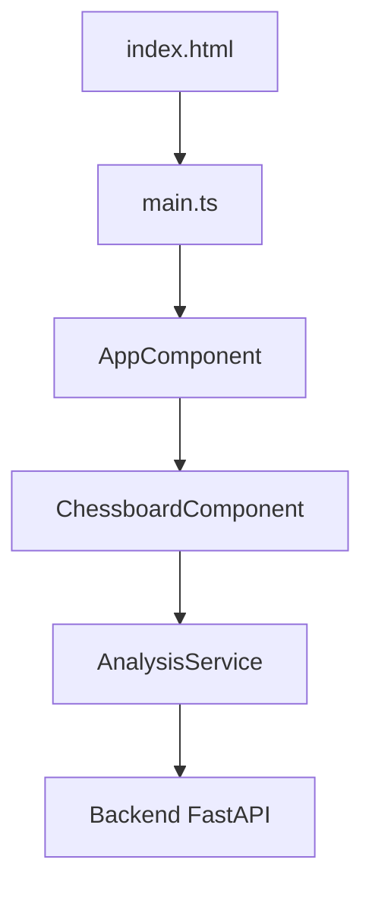

# Frontend Angular

[Sommaire](index.md) · [Présentation](01-presentation-projet.md) · [API](08-api-contrats-erreurs.md)

## La place du frontend

Dans mon projet, Angular représente l’interface visible par l’utilisateur. Il affiche l’échiquier, déclenche l’analyse, reçoit le JSON du backend et présente l’ouverture, l’évaluation, les explications et les ressources.

Le document fourni décrit une application Angular moderne en composants standalone. Les fichiers TypeScript, HTML et SCSS réels ne font pas partie des sources finales consultables. Je présente donc ce chapitre comme une explication d’architecture, pas comme un audit du frontend.

**Statut : Partiel.**

## Le démarrage



- `index.html` contient la balise `<app-root>` ;
- `main.ts` démarre `AppComponent` avec `bootstrapApplication()` ;
- `app.config.ts` enregistre les fournisseurs comme `provideHttpClient()` ;
- `AppComponent` compose l’interface ;
- `ChessboardComponent` gère l’échiquier et les interactions ;
- `AnalysisService` centralise l’appel HTTP.

## La séparation des fichiers

| Fichier | Ce que j’y place |
| --- | --- |
| `.ts` | état, méthodes, injection et logique de présentation |
| `.html` | structure et liaisons Angular |
| `.scss` | apparence locale du composant |
| `.service.ts` | communication avec le backend |
| `.model.ts` | interfaces TypeScript des JSON |
| `.spec.ts` | tests unitaires |

## Le flux d’une analyse

1. l’utilisateur place ou saisit une position ;
2. un événement Angular appelle la méthode du composant ;
3. le composant transmet la FEN et les autres entrées au service ;
4. le service envoie une requête HTTP ;
5. le backend exécute le workflow ;
6. le service reçoit une réponse typée ;
7. le composant met à jour son état ;
8. Angular rafraîchit les blocs `@if` et `@for` concernés.

## Le contrat à respecter

Je dois générer les interfaces TypeScript à partir du contrat Pydantic canonique, en particulier pour :

- le nom du champ FEN ;
- l’historique des coups ;
- les valeurs de statut ;
- l’optionalité de l’ouverture et de l’évaluation ;
- les documents et vidéos ;
- l’identifiant de l’analyse ;
- l’enveloppe d’erreur ;
- le style de nommage JSON.

L’exemple ancien `POST /api/analyze` avec `{ position }` est pédagogique. Il n’est pas confirmé par les sources FastAPI et ne doit pas devenir le contrat réel par simple copie.

## L’arborescence décrite

```text
frontend/
├── public/
├── src/
│   ├── app/
│   │   ├── chessboard/
│   │   ├── analysis.model.ts
│   │   ├── analysis.service.ts
│   │   ├── app.component.ts
│   │   ├── app.component.html
│   │   ├── app.component.scss
│   │   └── app.config.ts
│   ├── index.html
│   ├── main.ts
│   └── styles.scss
├── angular.json
├── package.json
└── Dockerfile
```

## Les vérifications que je dois réaliser avec le dépôt réel

- compiler avec la commande définie dans `package.json` ;
- vérifier l’URL du backend et la configuration CORS ;
- tester les états chargement, succès, partiel et erreur ;
- comparer les modèles TypeScript aux réponses OpenAPI ;
- tester l’accessibilité du plateau et du résultat ;
- vérifier le responsive design ;
- ajouter des tests de composant et un parcours end-to-end.

