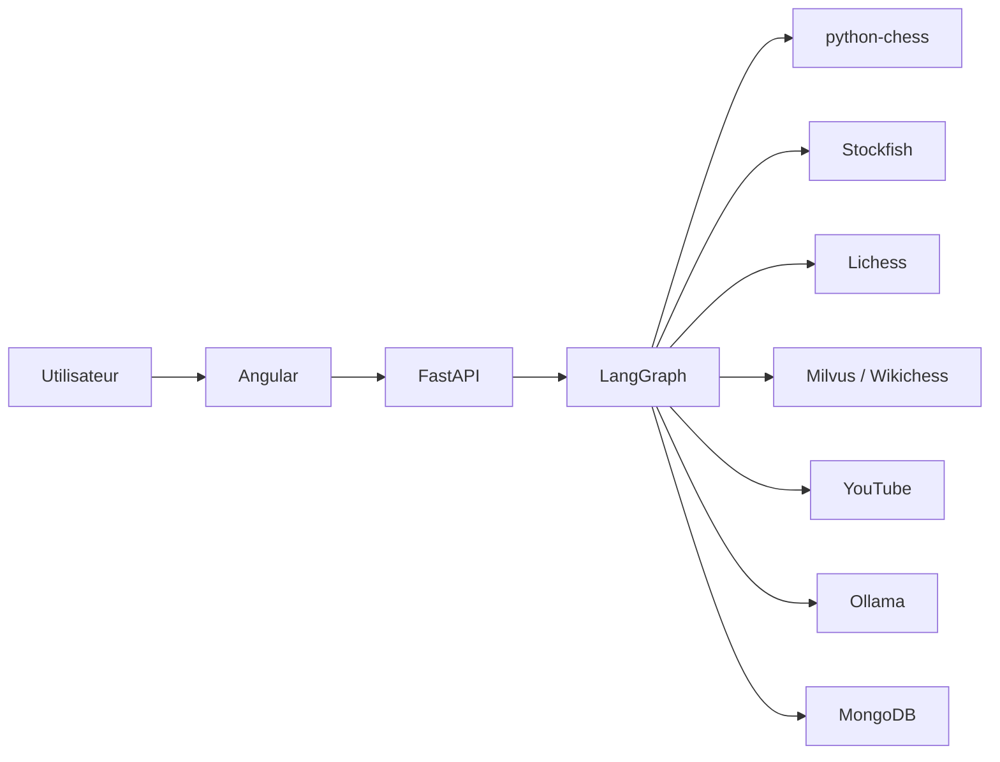
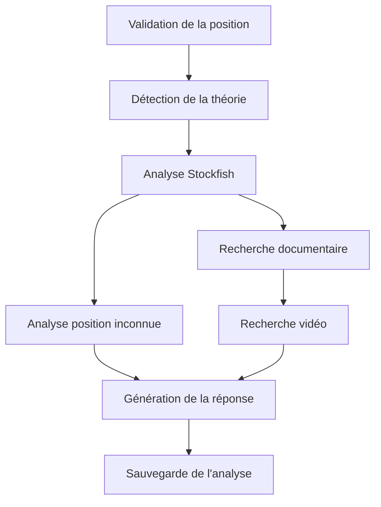
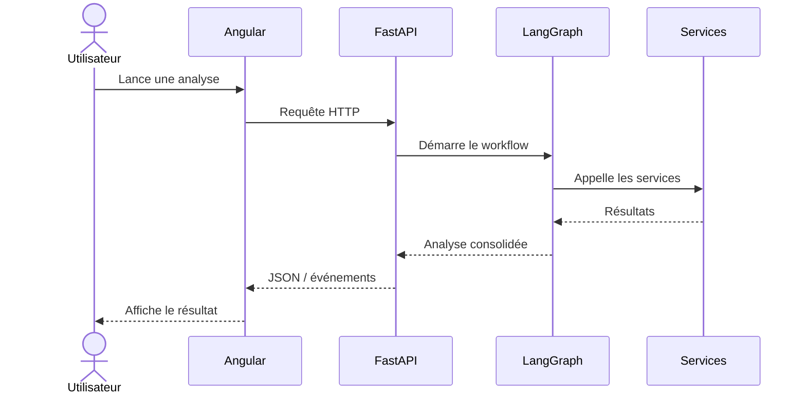
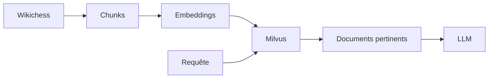

# Documentation complète de Chess Agent

## Agent IA d'aide à l'apprentissage des ouvertures d'échecs

J'ai organisé cette documentation pour présenter mon projet **Chess Agent**
de manière progressive.

Je commence par le besoin auquel répond l'application, puis je présente son
architecture, son workflow d'analyse, ses services, ses intégrations,
ses modèles de données, son frontend Angular et enfin ma démarche de qualité.

Cette documentation correspond à l'état consolidé de mon POC au
**18 août 2026**.

Elle s'appuie sur le code du projet, les schémas Pydantic, l'architecture
FastAPI et LangGraph, la convention MISA, les vérifications de qualité
et le frontend Angular.

Je distingue volontairement les fonctionnalités effectivement présentes
dans mon POC des limites identifiées et des évolutions envisagées.

---

# Présentation

**Chess Agent** est une application d'aide à l'apprentissage des ouvertures
d'échecs.

À partir d'une position FEN et de l'historique des coups, mon application
construit une analyse pédagogique en combinant plusieurs sources spécialisées.

J'utilise :

- **python-chess** pour valider et manipuler la position ;
- **Lichess Explorer** pour identifier l'ouverture et récupérer des
  statistiques ;
- **Stockfish** pour calculer l'évaluation de la position et les variantes ;
- **Wikichess**, **Sentence Transformers** et **Milvus** pour apporter
  un contexte documentaire avec un système RAG ;
- **YouTube Data API** pour rechercher des ressources pédagogiques ;
- **Ollama** pour produire localement l'explication finale ;
- **MongoDB** pour conserver les analyses ;
- **Angular** pour construire l'interface utilisateur.

L'ensemble du processus d'analyse est orchestré par **LangGraph** et exposé
au frontend par une API **FastAPI**.

---

# Objectif du projet

Mon objectif est de ne pas utiliser le modèle de langage comme une source
unique de vérité échiquéenne.

Je sépare les responsabilités entre plusieurs composants spécialisés :

| Composant | Responsabilité |
| --- | --- |
| python-chess | Validation de la position et manipulation des coups |
| Lichess Explorer | Identification de l'ouverture et statistiques |
| Stockfish | Analyse échiquéenne |
| Wikichess | Source documentaire |
| Sentence Transformers | Création des embeddings |
| Milvus | Recherche vectorielle |
| YouTube Data API | Recherche de ressources vidéo |
| Ollama | Génération de l'explication pédagogique |
| MongoDB | Persistance des analyses |
| Angular | Interface utilisateur |
| FastAPI | Exposition de l'API |
| LangGraph | Orchestration du workflow |

Le principe que j'ai retenu pour Chess Agent est donc :

> **Stockfish calcule, les sources documentaires apportent le contexte et le
> LLM explique.**

Cette séparation me permet de limiter le rôle du modèle de langage aux tâches
pour lesquelles il apporte réellement de la valeur.

---

# Architecture générale

Mon application suit le parcours général suivant :



Je sépare ainsi mon application en plusieurs couches :

```text
Utilisateur
    ↓
Frontend Angular
    ↓
API FastAPI
    ↓
Services applicatifs
    ↓
Workflow LangGraph
    ↓
Services spécialisés / adapters
    ↓
Stockfish · Lichess · Milvus · YouTube · Ollama · MongoDB
```

Cette organisation évite de concentrer toutes les responsabilités dans
FastAPI ou dans le modèle de langage.

---

# Workflow d'analyse

Une analyse Chess Agent traverse plusieurs étapes.



Ces étapes correspondent aux principales responsabilités de mon workflow
LangGraph :

1. valider la position ;
2. identifier l'ouverture lorsqu'elle est connue ;
3. analyser la position avec Stockfish ;
4. préparer un contexte adapté lorsqu'aucune théorie n'est disponible ;
5. rechercher des documents pertinents ;
6. rechercher des ressources vidéo ;
7. générer une réponse pédagogique ;
8. sauvegarder le résultat.

Le workflow peut donc adapter son parcours en fonction des informations
réellement disponibles.

---

# Stack technique

J'ai construit Chess Agent autour de la stack suivante :

| Domaine | Technologie |
| --- | --- |
| Backend | Python 3.12 |
| API | FastAPI |
| Validation | Pydantic v2 |
| Orchestration | LangGraph |
| Manipulation des échecs | python-chess |
| Moteur d'échecs | Stockfish |
| Statistiques | Lichess Explorer |
| Corpus documentaire | Wikichess |
| Embeddings | Sentence Transformers |
| Base vectorielle | Milvus |
| Recherche vidéo | YouTube Data API |
| LLM local | Ollama |
| Persistance | MongoDB |
| Frontend | Angular |
| Conteneurisation | Docker Compose |
| Gestion Python | uv |
| Qualité | Ruff, Pyright, Pytest, Vulture |

---

# Parcours de lecture

J'ai organisé la documentation de manière à pouvoir passer progressivement
de la vision générale aux détails techniques.

| Mon besoin | Document |
| --- | --- |
| Comprendre l'idée et les objectifs | [01 — Présentation du projet](01-presentation-projet.md) |
| Comprendre l'architecture globale | [02 — Architecture technique](02-architecture-technique.md) |
| Suivre une analyse de bout en bout | [03 — Workflow LangGraph](03-workflow-langgraph.md) |
| Comprendre l'état partagé et les décisions | [04 — État et routage](04-etat-et-routage.md) |
| Comprendre les cas d'usage | [05 — Services applicatifs](05-services-applicatifs.md) |
| Comprendre les intégrations techniques | [06 — Adapters et infrastructure](06-adapters-infrastructure.md) |
| Comprendre le système documentaire | [07 — RAG et Wikichess](07-rag-wikichess.md) |
| Comprendre les échanges HTTP | [08 — API, contrats et erreurs](08-api-contrats-erreurs.md) |
| Comprendre les données manipulées | [09 — Modèles de données](09-modeles-donnees.md) |
| Comprendre la persistance | [10 — Persistance MongoDB](10-persistance-mongodb.md) |
| Comprendre le démarrage et la configuration | [11 — Cycle de vie, configuration et supervision](11-cycle-vie-configuration-supervision.md) |
| Comprendre mon interface | [12 — Frontend Angular](12-frontend-angular.md) |
| Comprendre ma démarche qualité | [13 — Qualité et tests](13-qualite-tests.md) |
| Comprendre mes conventions de développement | [14 — Convention MISA](14-convention-misa.md) |
| Identifier les limites du POC | [15 — Limites et évolutions](15-limites-evolutions.md) |
| Retrouver une définition | [16 — Glossaire](16-glossaire.md) |
| Préparer ma démonstration | [17 — Guide de présentation](17-guide-presentation.md) |
| Identifier les sources utilisées | [18 — Inventaire des sources](18-inventaire-sources.md) |

---

# Organisation de la documentation

Je peux regrouper les différents chapitres en cinq grands ensembles.

## 1. Comprendre le projet

Je commence par présenter ce que j'ai construit et pourquoi.

- [01 — Présentation du projet](01-presentation-projet.md)
- [02 — Architecture technique](02-architecture-technique.md)

Ces deux chapitres donnent la vision générale nécessaire avant d'entrer dans
les détails d'implémentation.

---

## 2. Comprendre le fonctionnement du backend

Je détaille ensuite le fonctionnement interne de Chess Agent.

- [03 — Workflow LangGraph](03-workflow-langgraph.md)
- [04 — État et routage](04-etat-et-routage.md)
- [05 — Services applicatifs](05-services-applicatifs.md)
- [06 — Adapters et infrastructure](06-adapters-infrastructure.md)

Cette partie explique notamment comment je sépare :

```text
API
 ↓
Services
 ↓
Workflow
 ↓
Adapters
 ↓
Services externes
```

---

## 3. Comprendre les données et les sources

Je présente ensuite les mécanismes utilisés pour enrichir et conserver
l'analyse.

- [07 — RAG et Wikichess](07-rag-wikichess.md)
- [08 — API, contrats et erreurs](08-api-contrats-erreurs.md)
- [09 — Modèles de données](09-modeles-donnees.md)
- [10 — Persistance MongoDB](10-persistance-mongodb.md)

Cette partie couvre aussi bien les données échangées par l'API que les
documents vectorisés dans Milvus et les analyses conservées dans MongoDB.

---

## 4. Comprendre l'application complète

Le backend n'est qu'une partie de Chess Agent.

Je documente également son démarrage, sa supervision et son interface.

- [11 — Cycle de vie, configuration et supervision](11-cycle-vie-configuration-supervision.md)
- [12 — Frontend Angular](12-frontend-angular.md)

Je peux ainsi suivre le parcours complet :

```text
Utilisateur
    ↓
Angular
    ↓
FastAPI
    ↓
LangGraph
    ↓
Services spécialisés
    ↓
Résultat
    ↓
Angular
```

---

## 5. Comprendre ma démarche d'ingénierie

Enfin, je présente les choix qui encadrent le développement et l'évaluation
du projet.

- [13 — Qualité et tests](13-qualite-tests.md)
- [14 — Convention MISA](14-convention-misa.md)
- [15 — Limites et évolutions](15-limites-evolutions.md)
- [16 — Glossaire](16-glossaire.md)
- [17 — Guide de présentation](17-guide-presentation.md)
- [18 — Inventaire des sources](18-inventaire-sources.md)

Cette dernière partie me permet de distinguer ce que j'ai effectivement
implémenté de ce que je pourrais améliorer dans une version ultérieure.

---

# Niveaux de confiance

Je veux éviter qu'une hypothèse documentaire soit présentée comme une
fonctionnalité réellement démontrée.

J'utilise donc quatre niveaux de confiance.

| Niveau | Signification |
| --- | --- |
| **Confirmé** | Je l'ai observé directement dans le code, les contrats ou les résultats disponibles. |
| **Partiel** | Le composant ou le comportement est visible, mais certaines informations nécessaires à sa validation complète manquent. |
| **À harmoniser** | Plusieurs éléments du projet décrivent encore des contrats ou comportements différents. |
| **Proposé** | Il s'agit d'une amélioration, d'une évolution ou d'une organisation recommandée qui n'est pas présentée comme existante. |

Cette distinction est particulièrement importante pour documenter un POC.

Elle me permet de présenter précisément :

```text
Ce qui existe
     ≠
Ce qui est partiellement démontré
     ≠
Ce qui doit encore être harmonisé
     ≠
Ce que je propose pour la suite
```

---

# Principe de traçabilité

Je cherche à maintenir une documentation directement reliée au code.

Lorsqu'une information importante est présentée dans cette documentation,
je dois pouvoir identifier son origine :

```text
Documentation
     ↓
Module / contrat / configuration
     ↓
Implémentation
     ↓
Test ou vérification lorsque disponible
```

Je peux ainsi éviter que la documentation évolue indépendamment de
l'application.

---

# Règle de maintenance

Lorsque je modifie un contrat public de Chess Agent, je mets à jour dans le
même lot les éléments concernés.

Cela peut comprendre :

1. le code Python ;
2. les modèles Pydantic ;
3. les types TypeScript ;
4. les exemples JSON ;
5. les tests ;
6. la documentation OpenAPI ;
7. le chapitre MkDocs correspondant.

Par exemple :

```text
Modification AnalysisResponse
          ↓
Schéma Pydantic
          ↓
Route FastAPI
          ↓
Tests
          ↓
AnalysisResponse TypeScript
          ↓
Frontend Angular
          ↓
Documentation
```

Cette règle limite les écarts entre ce que fait réellement mon application
et ce que décrit ma documentation.

---

# Frontend et backend

Je considère Angular et FastAPI comme deux applications distinctes qui
communiquent à travers un contrat HTTP.



Le contrat entre ces deux couches constitue donc un point important de
l'architecture.

Une modification du backend peut avoir un impact direct sur le frontend si
les modèles TypeScript ne sont pas adaptés.

---

# RAG Wikichess

Mon système RAG apporte un contexte documentaire à l'analyse.

Son fonctionnement général est :



Je ne demande donc pas au LLM de connaître seul la théorie des ouvertures.

Je lui fournis un contexte récupéré depuis mon corpus documentaire lorsque
celui-ci contient des informations pertinentes.

Pour le détail :

[Consulter le chapitre RAG et Wikichess](07-rag-wikichess.md).

---

# Qualité

Je ne limite pas la validation du projet au fait que l'application démarre.

J'utilise plusieurs outils complémentaires :

```text
Ruff
   ↓
Style et erreurs statiques

Pyright
   ↓
Cohérence du typage

Pytest
   ↓
Comportement du code

Vulture
   ↓
Détection de code potentiellement inutilisé
```

La stratégie complète est décrite dans :

[13 — Qualité et tests](13-qualite-tests.md).

---

# Limites du POC

Chess Agent reste un **Proof of Concept**.

Je ne présente donc pas comme acquises des fonctionnalités qui nécessiteraient
encore une industrialisation.

Les limites et évolutions sont documentées séparément afin de conserver une
distinction claire entre :

- le POC actuel ;
- les améliorations techniques possibles ;
- les fonctionnalités d'un futur produit ;
- les évolutions étudiées autour du MCP.

Je détaille ces éléments dans :

[15 — Limites et évolutions](15-limites-evolutions.md).

---

# Pour ma soutenance

Cette documentation me sert également de support pour expliquer mes choix
techniques.

Je dois notamment être capable d'expliquer :

1. pourquoi j'ai séparé Angular et FastAPI ;
2. pourquoi j'utilise LangGraph pour orchestrer l'analyse ;
3. pourquoi Stockfish reste responsable du calcul échiquéen ;
4. pourquoi j'utilise un RAG plutôt que de dépendre uniquement du LLM ;
5. comment Milvus retrouve les documents pertinents ;
6. comment les données circulent entre les différentes couches ;
7. comment je gère les erreurs et les indisponibilités ;
8. comment je vérifie la qualité du code ;
9. quelles sont les limites actuelles du POC ;
10. comment l'architecture peut évoluer.

Le chapitre suivant est spécifiquement consacré à cette préparation :

[17 — Guide de présentation](17-guide-presentation.md).

---

# Accès rapide

<div class="grid cards" markdown>

-   :material-information-outline:{ .lg .middle } **Comprendre Chess Agent**

    ---

    Je commence par le besoin, les objectifs et le périmètre du projet.

    [:octicons-arrow-right-24: Présentation du projet](01-presentation-projet.md)

-   :material-sitemap:{ .lg .middle } **Explorer l'architecture**

    ---

    Je découvre les couches, les responsabilités et les dépendances.

    [:octicons-arrow-right-24: Architecture technique](02-architecture-technique.md)

-   :material-graph:{ .lg .middle } **Suivre le workflow**

    ---

    Je suis une analyse depuis la position jusqu'à la sauvegarde.

    [:octicons-arrow-right-24: Workflow LangGraph](03-workflow-langgraph.md)

-   :material-database-search:{ .lg .middle } **Comprendre le RAG**

    ---

    Je découvre comment Wikichess, les embeddings et Milvus enrichissent
    l'analyse.

    [:octicons-arrow-right-24: RAG et Wikichess](07-rag-wikichess.md)

-   :material-angular:{ .lg .middle } **Explorer le frontend**

    ---

    Je découvre comment Angular communique avec mon API et restitue
    l'analyse.

    [:octicons-arrow-right-24: Frontend Angular](12-frontend-angular.md)

-   :material-check-decagram-outline:{ .lg .middle } **Vérifier la qualité**

    ---

    Je présente les outils et les contrôles utilisés pour vérifier mon code.

    [:octicons-arrow-right-24: Qualité et tests](13-qualite-tests.md)

-   :material-presentation:{ .lg .middle } **Préparer ma soutenance**

    ---

    Je retrouve le parcours recommandé pour présenter et démontrer Chess
    Agent.

    [:octicons-arrow-right-24: Guide de présentation](17-guide-presentation.md)

-   :material-book-open-variant:{ .lg .middle } **Consulter le glossaire**

    ---

    Je retrouve rapidement les termes techniques utilisés dans le projet.

    [:octicons-arrow-right-24: Glossaire](16-glossaire.md)

</div>

---

# En résumé

Chess Agent combine plusieurs technologies, mais chacune possède une
responsabilité clairement identifiée.

```text
                         CHESS AGENT

Utilisateur
    │
    ▼
┌─────────────┐
│   Angular   │
└──────┬──────┘
       │ HTTP
       ▼
┌─────────────┐
│   FastAPI   │
└──────┬──────┘
       │
       ▼
┌─────────────┐
│  LangGraph  │
└──────┬──────┘
       │
       ├──────── python-chess
       ├──────── Lichess
       ├──────── Stockfish
       ├──────── Milvus / Wikichess
       ├──────── YouTube
       ├──────── Ollama
       └──────── MongoDB
```

Ma documentation suit volontairement cette même logique :

> **Je présente d'abord ce que fait Chess Agent, puis comment je l'ai
> construit, comment ses composants communiquent, comment je vérifie son
> fonctionnement et enfin quelles sont ses limites et ses possibilités
> d'évolution.**

Cette page constitue le point d'entrée de toute la documentation technique
du projet.