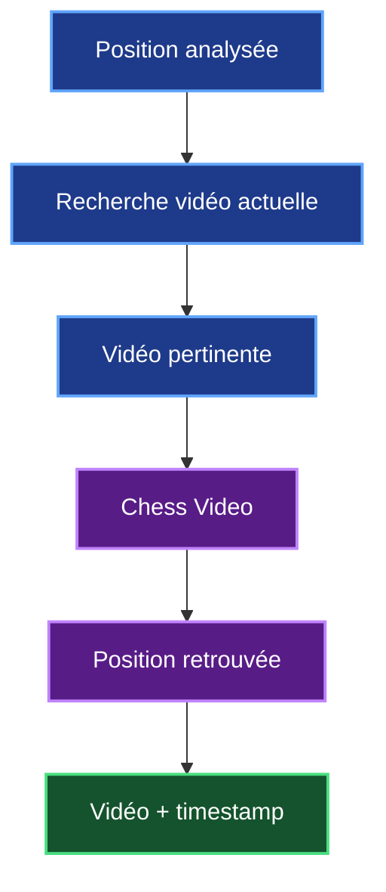
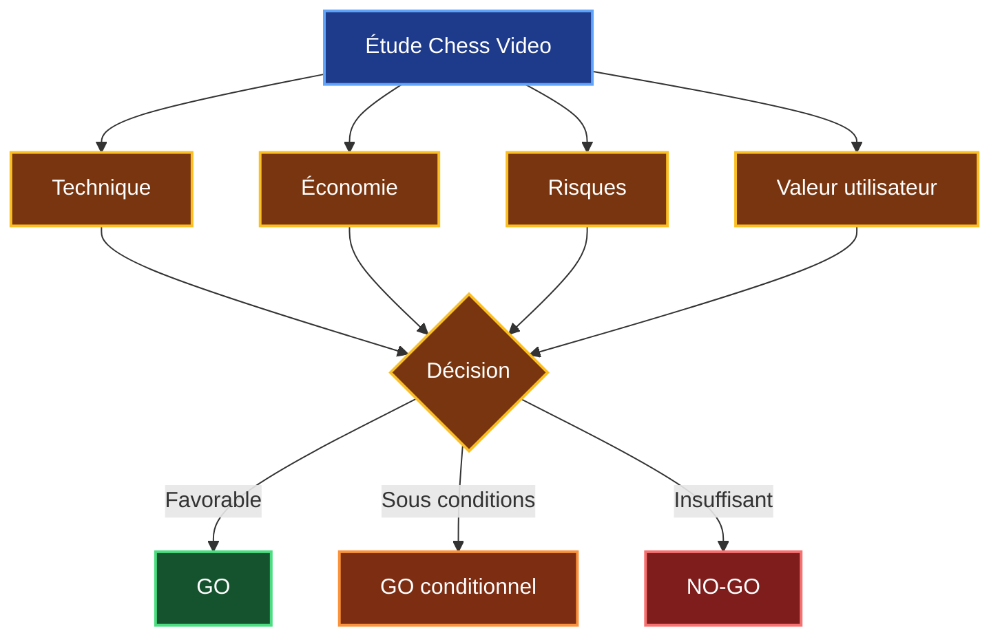
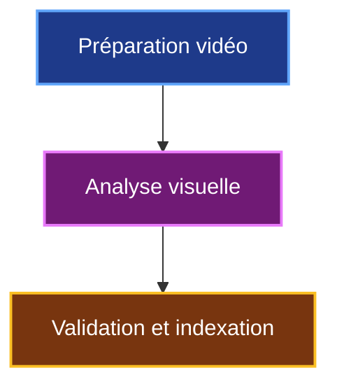
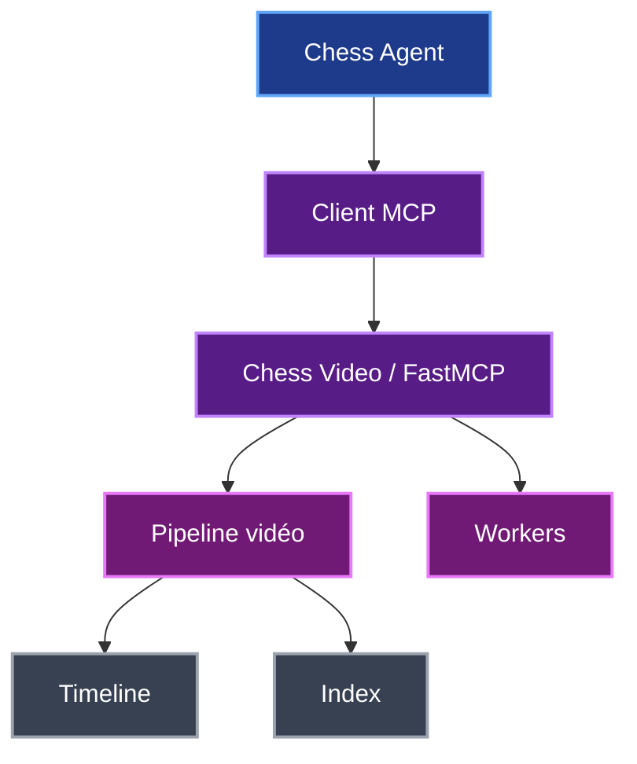
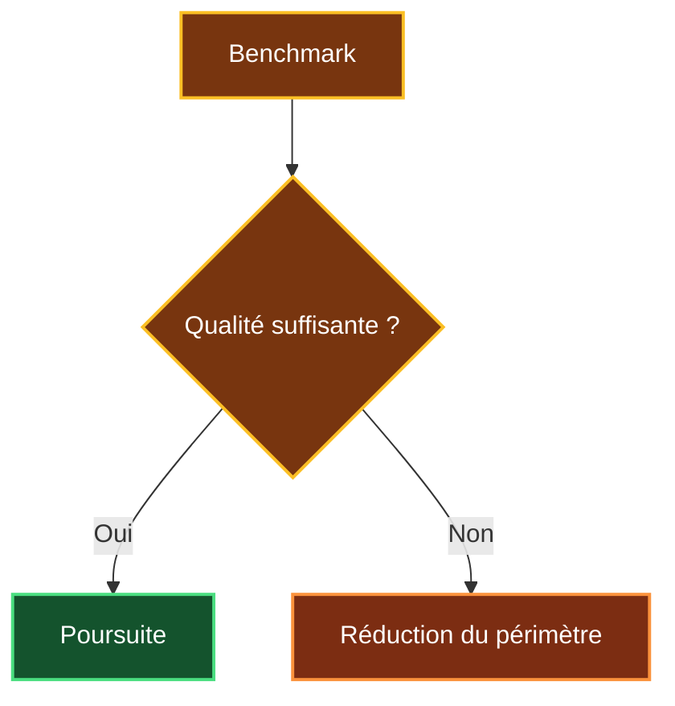
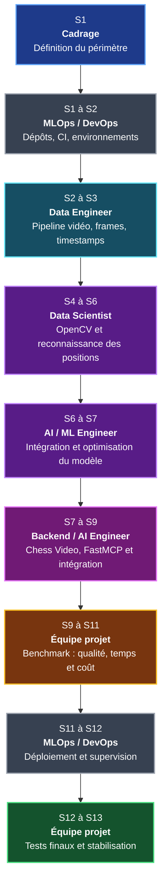
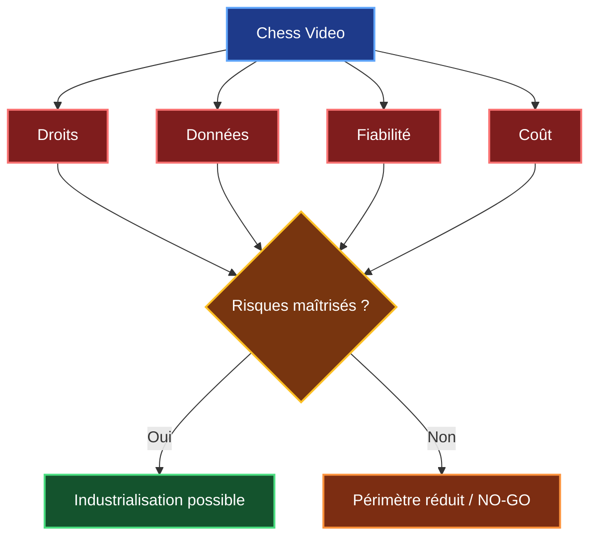
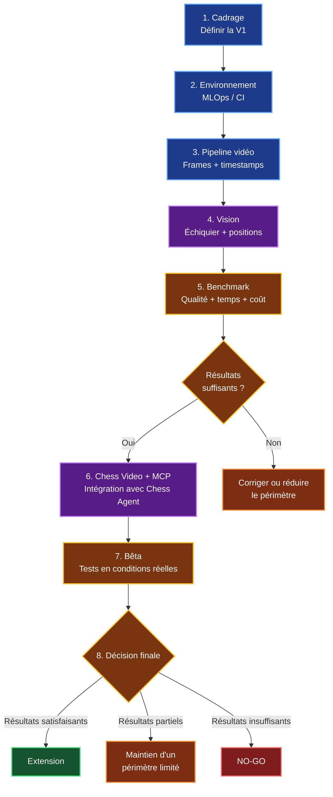
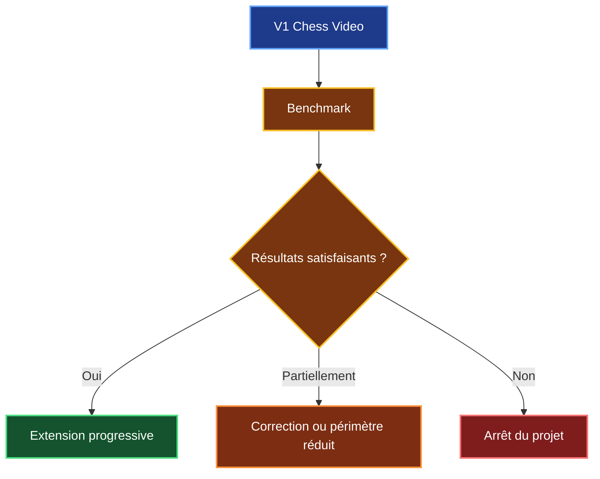
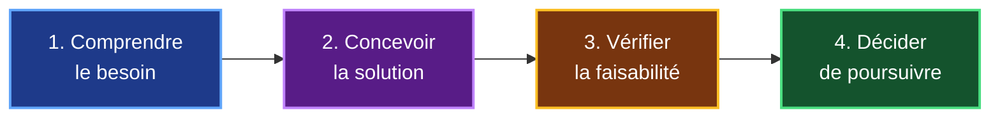

# Étude de faisabilité de Chess Video

## Module avancé d'analyse vidéo de Chess Agent

## Contexte

Chess Agent dispose déjà d'un POC capable d'analyser une position d'échecs et de proposer plusieurs ressources pédagogiques.

Le projet utilise notamment :

- **Stockfish** et `python-chess` pour l'analyse échiquéenne ;
- **Milvus et le RAG** pour rechercher de la documentation ;
- **YouTube** pour proposer des vidéos ;
- **LangGraph** pour orchestrer l'analyse ;
- **FastAPI** pour le backend ;
- **Angular** pour l'interface utilisateur.

Une limite concerne la précision de la recommandation vidéo.

Chess Agent peut trouver une vidéo en rapport avec une ouverture ou une position, mais il ne sait pas encore déterminer **à quel moment précis cette position apparaît dans la vidéo**.

L'évolution étudiée consiste donc à créer un service spécialisé :

> **Chess Video**

Son rôle sera d'analyser des vidéos d'échecs, d'identifier les positions qui y apparaissent, de les associer à des timestamps puis de permettre à Chess Agent de retrouver directement le passage correspondant.



Chess Video va constituer **une extension de Chess Agent**.

---

# Question de faisabilité

Mon étude cherche à répondre à la question suivante :

> **Est-il techniquement, économiquement et opérationnellement réaliste de développer Chess Video et de l'intégrer à Chess Agent via MCP ?**

La réponse nécessite d'évaluer quatre dimensions :

| Dimension | Question |
|---|---|
| Technique | Le système peut-il reconnaître les positions avec suffisamment de fiabilité ? |
| Économique | Le développement et l'exploitation restent-ils raisonnables ? |
| Risques | Les droits, les données personnelles et les limites techniques sont-ils maîtrisables ? |
| Produit | Le passage précis apporte-t-il réellement une valeur à l'utilisateur ? |



---

# Organisation de l'étude

L’étude est organisée en onze chapitres qui suivent mon raisonnement de construction d’un projet réel :

```text
Comprendre le besoin
        ↓
Définir la solution
        ↓
Étudier les technologies
        ↓
Vérifier la faisabilité
        ↓
Évaluer le coût
        ↓
Analyser les risques
        ↓
Comparer les alternatives
        ↓
Planifier le développement
        ↓
Décider
```

---

# 1. État initial et besoin

Dans cette première partie, je présente mon POC Chess Agent et la limite que j'ai identifiée dans la recherche de vidéos.

Actuellement, mon application est capable de proposer une vidéo en rapport avec la position ou l'ouverture analysée. Cependant, elle ne sait pas retrouver le moment précis où cette position apparaît dans la vidéo.

L'utilisateur doit donc encore parcourir lui-même la vidéo pour trouver le passage qui l'intéresse.

Avec Chess Video, mon objectif est d'aller plus loin et de passer de :

« Je te propose une vidéo qui parle de cette position »

à :

« Cette position apparaît dans cette vidéo à 18 min 24 s. »

C'est cette amélioration que je cherche à étudier dans mon étude de faisabilité.

```text
Vidéo pertinente
```

à :

```text
Vidéo pertinente
+
passage précis
+
timestamp
```

### Question traitée

> **Pourquoi Chess Agent a-t-il besoin de Chess Video ?**

[Consulter la partie 1](01_ETAT_INITIAL_ET_BESOIN.md)

---

# 2. Description du module vidéo

Le premier est l’**indexation**. L’objectif sera d’analyser les vidéos en amont, avant qu’un utilisateur effectue une recherche, afin d’identifier les différentes positions d’échecs qui apparaissent dans chaque vidéo et de les associer à leur timestamp.

Ainsi, lorsqu’un utilisateur recherchera une position, la vidéo n’aura pas besoin d’être analysée à nouveau. Les informations nécessaires seront déjà enregistrées dans l’index de Chess Video.


Le second est la **recherche**. Lorsqu’un utilisateur analyse une position avec Chess Agent, celui-ci va interroger l’index de Chess Video pour vérifier si cette position a déjà été détectée dans une vidéo.

Si une correspondance est trouvée, Chess Video pourra retourner la vidéo concernée et le timestamp correspondant.

La recherche sera donc rapide, puisque l’analyse des vidéos aura déjà été réalisée lors de l’indexation.


Cette séparation permet d’**éviter d’analyser une vidéo complète au moment de la demande**. L’analyse est faite en amont, ce qui permet à l’utilisateur d’obtenir une réponse beaucoup plus rapidement.

### Question traitée

> **Que doit réellement faire Chess Video ?**

[Consulter la partie 2](02_MODULE_VIDEO_CIBLE.md)

---

# 3. Étude technologique

Pour construire Chess Video, je vais décomposer l’analyse d’une vidéo en trois grandes étapes. Cela me permet d’identifier plus facilement les technologies dont j’aurai besoin et le rôle de chacune dans le traitement.



Je vais d’abord découper la vidéo en images, appelées **frames**, afin de sélectionner celles qui sont utiles à l’analyse.

J’utiliserai ensuite OpenCV pour repérer l’échiquier dans l’image et le préparer pour faciliter son analyse.

Un modèle de vision pourra alors reconnaître les pièces présentes sur les 64 cases et reconstruire la position.

Enfin, la position obtenue pourra être contrôlée puis enregistrée avec son timestamp.

Pour éviter des traitements inutiles, je prévois également de détecter les changements sur l’échiquier. Si le plateau reste identique pendant plusieurs secondes, il ne sera pas nécessaire d’envoyer toutes les frames au modèle de vision. Cela permettra de réduire le temps de traitement et les coûts.

### Question traitée

> **Comment passer d'une vidéo à un index de positions ?**

[Consulter la partie 3](03_ETUDE_TECHNOLOGIQUE.md)

---

# 4. Solutions techniques étudiées

Pour reconnaître les positions d’échecs, j’ai comparé deux stratégies principales : créer un **modèle spécialisé** ou utiliser un **modèle de vision** déjà existant.

| Critère | Modèle spécialisé | Modèle existant / multimodal |
|---|---|---|
| Dataset | Nécessaire | Limité au benchmark |
| Entraînement | Oui | Non au départ |
| Développement | Plus long | **Plus rapide** |
| Contrôle | **Élevé** | Moyen |
| Maintenance ML | Plus importante | Plus faible |
| V1 | Conditionnel | **Recommandé** |

Pour la V1, l'étude privilégie :

> **OpenCV + modèle de vision existant**

Cette solution me permet de tester rapidement la faisabilité de Chess Video, sans investir dès le départ dans la création et l’entraînement d’un modèle spécialisé.

Si le benchmark montre que le modèle existant n’est pas assez précis, je pourrai alors envisager de développer un modèle spécialisé, ce qui représenterait environ **20 à 30 jours/homme supplémentaires**.

### Question traitée

> **Quelle technologie de vision utiliser pour la V1 ?**

[Consulter la partie 4](04_SOLUTIONS_TECHNIQUES.md)

---

# 5. Architecture Chess Video avec MCP

Chess Video sera développé comme un service indépendant de Chess Agent.

J’utiliserai **FastMCP** pour exposer les fonctionnalités de Chess Video sous forme d’outils. Chess Agent jouera alors le rôle de client MCP et pourra appeler ces outils lorsqu’il aura besoin de rechercher une position dans une vidéo.

Cette séparation me permettra de faire évoluer Chess Video indépendamment, sans avoir à modifier directement le fonctionnement principal de Chess Agent.



Les principaux outils MCP envisagés sont :

| Outil | Fonction |
|---|---|
| `video.search_position` | Rechercher une position |
| `video.start_indexing` | Lancer une indexation |
| `video.get_job` | Suivre un traitement |
| `video.get_timeline` | Consulter une timeline |

### Question traitée

> **Comment Chess Agent communique-t-il avec Chess Video ?**

[Consulter la partie 5](05_ARCHITECTURE_CHESS_VIDEO_MCP.md)

---

# 6. Faisabilité technique

D’après mon étude, la majorité des briques techniques nécessaires à Chess Video sont réalisables avec des technologies existantes.

La principale incertitude concerne la reconnaissance des pièces. Je dois vérifier qu’un modèle de vision est capable de reconstruire correctement une position complète, mais surtout qu’il reste suffisamment fiable sur des vidéos qu’il n’a jamais vues.

| Composant | Faisabilité | Vigilance |
|---|---|---|
| Acquisition vidéo | Élevée | Faible |
| Extraction des frames | Élevée | Faible |
| Gestion des timestamps | Élevée | Faible |
| Détection de l'échiquier | Élevée | Moyenne |
| Orientation du plateau | Élevée | Moyenne |
| Reconnaissance des pièces | **A valider** | **Élevée** |
| `python-chess` | Élevée | Faible |
| Création de la timeline | Élevée | Moyenne |
| Indexation | Élevée | Faible |
| MCP / FastMCP | Élevée | Faible |
| Fonctionnement sur des vidéos inconnues | **À démontrer** | **Très élevée** |

C’est pour cette raison que je prévois un **benchmark avant de valider définitivement la solution**.

Je vais principalement mesurer le **nombre de positions entièrement correctes**, les **faux positifs**, la **précision des timestamps**, le **temps nécessaire pour indexer une vidéo** et son **coût de traitement**.

Ces résultats me permettront de décider si la solution est suffisamment **fiable et économique** pour poursuivre le développement.



### Question traitée

> **Chess Video peut-il fonctionner avec une qualité suffisante ?**

[Consulter la partie 6](06_FAISABILITE_TECHNIQUE.md)

---

# 7. Faisabilité économique

Pour estimer le coût de Chess Video, je suis parti sur une V1 représentant environ **65 jours/homme de travail**.

Comme plusieurs métiers peuvent intervenir à des moments différents ou travailler en parallèle, ces **65 jours/homme correspondent à environ 11 à 13 semaines de projet, soit environ 3 mois**.

| Indicateur | Valeur de référence |
|---|---:|
| **Charge V1** | **65 j.h** |
| **Durée calendaire** | **11 à 13 semaines** |
| **Durée arrondie** | **≈ 3 mois** |
| Coût humain | **38 400 € HT** |
| Réserve projet | **3 840 € HT** |
| **Build** | **≈ 42 000 € HT** |
| **OPEX annuel** | **≈ 5 000 à 12 000 € HT** |
| **Première année** | **≈ 47 000 à 54 000 € HT** |
| Indexation initiale | **À benchmarker** |
| Modèle spécialisé éventuel | **+20 à 30 j.h** |

Les 65 j.h sont répartis entre cinq compétences :

| Métier | Charge |
|---|---:|
| Data Engineer | **14 j.h** |
| Data Scientist / Computer Vision | **15 j.h** |
| AI / ML Engineer | **12 j.h** |
| Backend / AI Engineer | **13 j.h** |
| MLOps / DevOps | **11 j.h** |
| **TOTAL** | **65 j.h** |

Le parallélisme entre certains métiers réduit la **durée calendaire**, mais ne réduit pas la charge totale de 65 j.h.

### Timeline de référence



### Question traitée

> **Combien de temps et combien coûterait Chess Video ?**

[Consulter la partie 7](07_FAISABILITE_ECONOMIQUE.md)

---

# 8. Bénéfices, limites et risques

Le principal bénéfice que j’attends de Chess Video est de rendre la recherche vidéo beaucoup plus précise.

Au lieu de simplement proposer une vidéo en rapport avec la position étudiée, mon objectif est de pouvoir **envoyer directement l’utilisateur vers le passage où cette position apparaît**.

J’ai également identifié quatre risques principaux qui pourraient remettre en cause la faisabilité du projet. Pour chacun, je prévois une réponse concrète.

| Risque principal                   | Réponse prévue                                                                         |
| ---------------------------------- | -------------------------------------------------------------------------------------- |
| **Droits sur les vidéos**          | Utiliser uniquement des sources dont l’exploitation est autorisée                      |
| **Données personnelles**           | Ne conserver que les données nécessaires et supprimer les données temporaires          |
| **Fiabilité de la reconnaissance** | Mesurer la précision avec un benchmark et ne pas retourner de résultat en cas de doute |
| **Coût d’exploitation**            | Mesurer le coût réel d’indexation par heure de vidéo                                   |




### Question traitée

> **Quels risques peuvent réellement remettre Chess Video en cause ?**

[Consulter la partie 8](08_BENEFICES_LIMITES_RISQUES.md)

---

# 09. Plan de développement

Pour développer **Chess Video**, je prévois une progression par étapes.

L’objectif est de **valider les points les plus importants progressivement**, afin d’éviter d’investir dans l’ensemble du développement si la reconnaissance visuelle n’est pas suffisamment fiable.

| Étape | Ce que je cherche à faire |
|---|---|
| **1. Cadrage** | Définir précisément le périmètre de la V1 et les vidéos de test |
| **2. Environnement** | Préparer les dépôts, les environnements et la CI |
| **3. Pipeline vidéo** | Extraire les frames utiles et leurs timestamps |
| **4. Vision** | Détecter l’échiquier et reconnaître les positions |
| **5. Benchmark** | Mesurer la précision, le temps de traitement et le coût |
| **6. Chess Video + MCP** | Construire le service et le connecter à Chess Agent |
| **7. Bêta** | Tester la solution dans des conditions proches de l’utilisation réelle |
| **8. Décision** | Décider si le projet peut être étendu ou doit rester limité |

Le **benchmark constitue une étape importante**. Si la reconnaissance des positions n’est pas suffisamment fiable, je pourrai corriger la solution ou réduire son périmètre avant d’engager davantage de développement.



Cette organisation me permet de **limiter le risque financier et technique**. Je valide d’abord que le cœur de Chess Video fonctionne, notamment la reconnaissance visuelle, avant de poursuivre vers une intégration et une industrialisation plus importantes.

### Question traitée

> **Comment vais-je développer Chess Video progressivement tout en limitant le risque et les dépenses ?**

[Consulter la partie 9](09_PLAN_DE_DEVELOPPEMENT.md)

---

# 10. Alternatives et solutions complémentaires

Pour répondre au besoin de **Chess Video**, la solution principale reste l’**analyse visuelle de la vidéo**.

C’est cette méthode qui permet d’observer réellement l’échiquier affiché à l’écran, de reconnaître la position et de l’associer au timestamp correspondant.

J’ai néanmoins étudié deux solutions complémentaires qui pourraient être utilisées lorsque les données sont disponibles.

| Solution | Intérêt | Limite |
|---|---|---|
| **PGN synchronisé** | Retrouver les positions à partir des coups de la partie | Nécessite de disposer du PGN et de pouvoir le synchroniser avec la vidéo |
| **Transcription** | Repérer les passages où une ouverture, une position ou un coup est expliqué | Ne garantit pas que la position recherchée soit réellement affichée à l’écran |

Ces solutions peuvent aider à **réduire ou orienter le traitement**, mais elles ne remplacent pas la vision pour répondre au besoin principal de Chess Video.

Pour ma V1, je conserve donc **l’analyse visuelle comme méthode principale**. Le PGN et la transcription restent des pistes d’optimisation qui pourront être étudiées plus tard si elles permettent de réduire le temps ou le coût d’indexation.

### Question traitée

> **Existe-t-il des solutions complémentaires permettant d’améliorer ou d’optimiser l’analyse visuelle de Chess Video ?**


[Consulter la partie 10](10_ALTERNATIVES_ETUDIEES.md)

---

# 11. Conclusion et décision GO / NO-GO

À la fin de cette étude, je considère que **Chess Video est réalisable sur un périmètre contrôlé**.

Les principales briques dont j’ai besoin reposent sur des technologies existantes : traitement vidéo, extraction des frames, détection de l’échiquier, indexation, gestion des timestamps et communication avec Chess Agent grâce à MCP.

La principale incertitude reste la **reconnaissance visuelle des positions**. Je dois notamment vérifier qu’elle reste suffisamment fiable lorsque Chess Video analyse des vidéos différentes de celles utilisées pendant mes premiers tests.

C’est pour cette raison que le **benchmark occupe une place importante dans mon plan de développement**.

## Synthèse de l'étude

| Dimension | Conclusion |
|---|---|
| Besoin utilisateur | **Pertinent** |
| Pipeline vidéo | **Faisable** |
| Extraction des frames et timestamps | **Faisable** |
| Détection de l'échiquier | **Faisable** |
| Reconnaissance des pièces | **À valider par benchmark** |
| Indexation des positions | **Faisable** |
| Architecture MCP / FastMCP | **Faisable** |
| Fonctionnement sur des vidéos inconnues | **À démontrer** |
| Charge estimée de la V1 | **65 j.h** |
| Durée du projet | **11 à 13 semaines** |
| Coût de développement | **≈ 42 000 € HT** |
| Coût estimé de la première année | **≈ 47 000 à 54 000 € HT** |

---

## Ma décision

À partir des résultats de cette étude, ma décision serait :

> ## **GO pour développer une V1 de Chess Video sur un périmètre contrôlé.**

L’objectif de cette V1 sera d’abord de démontrer que le système est capable de réaliser correctement la chaîne principale.

Je ne prévois donc pas de chercher immédiatement à analyser **tous les types de vidéos d’échecs**.

Je commencerai avec un ensemble limité de vidéos afin de mesurer la qualité réelle de la reconnaissance.

---

## Conditions pour aller plus loin

Le passage d’une V1 à une version plus importante dépendra principalement de quatre éléments :

| Condition | Ce que je dois vérifier |
|---|---|
| **Fiabilité** | Les positions sont reconnues avec suffisamment de précision |
| **Coût** | L’indexation d’une heure de vidéo reste économiquement acceptable |
| **Droits** | Les vidéos peuvent être utilisées dans les conditions prévues |
| **Valeur utilisateur** | Le timestamp apporte réellement un intérêt pédagogique |



Ma décision concernant une industrialisation complète reste donc un :

> ## **GO conditionnel**

Je veux d’abord obtenir des mesures réelles avant d’augmenter les investissements.

---

# Synthèse globale de mon étude

J’ai organisé mon étude autour de quatre grandes étapes qui correspondent à mon raisonnement pour construire le projet.



| Étape | Chapitres | Ce que je cherche à déterminer |
|---|---|---|
| **Comprendre** | 1 à 2 | Quel est le besoin et que doit faire Chess Video ? |
| **Concevoir** | 3 à 5 | Quelles technologies et quelle architecture utiliser ? |
| **Vérifier** | 6 à 10 | Est-ce faisable, à quel coût, avec quels risques et quelles alternatives ? |
| **Décider** | 11 | Est-il raisonnable de développer Chess Video ? |

---

# Chiffres retenus pour l'étude

Pour conserver les mêmes hypothèses dans l’ensemble de mon dossier, je retiens les valeurs suivantes :

| Indicateur | Estimation retenue |
|---|---:|
| **Charge totale V1** | **65 j.h** |
| **Durée calendaire** | **11 à 13 semaines** |
| **Durée simplifiée** | **≈ 3 mois** |
| **Coût de développement** | **≈ 42 000 € HT** |
| **Coût d'exploitation annuel** | **≈ 5 000 à 12 000 € HT** |
| **Coût estimé de la première année** | **≈ 47 000 à 54 000 € HT** |
| **Coût d'indexation** | **À mesurer pendant le benchmark** |
| **Modèle spécialisé si nécessaire** | **+20 à 30 j.h** |

---

## Conclusion générale

Cette étude ne me permet pas encore d’affirmer que Chess Video pourra reconnaître correctement **n’importe quelle position dans n’importe quelle vidéo**.

En revanche, elle montre que les technologies nécessaires existent et qu’une **V1 sur un périmètre contrôlé est réaliste**.

Je retiens donc :

> **GO pour une V1 de Chess Video estimée à 65 jours.homme et environ 42 000 € HT de développement.**

La suite dépendra des résultats du benchmark. Je pourrai alors décider de **poursuivre le développement, réduire le périmètre ou arrêter le projet** si la reconnaissance n’est pas suffisamment fiable ou si son coût devient trop important.