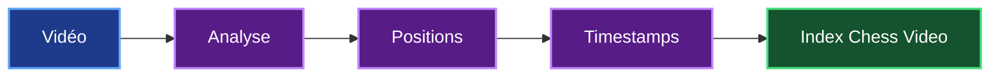
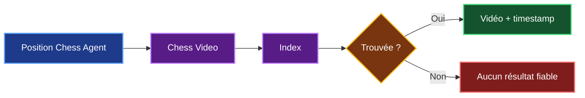

# 1. Du POC Chess Agent au besoin Chess Video

## 1.1 Point de départ

Mon projet **Chess Agent** dispose déjà d'un POC capable d'analyser une position d'échecs et de proposer différentes informations pédagogiques.

L'utilisateur fournit une position au format FEN et Chess Agent utilise plusieurs outils pour réaliser son analyse :

- **FastAPI** pour le backend ;
- **LangGraph** pour organiser les étapes de l'analyse ;
- **Stockfish** et **python-chess** pour les positions d'échecs ;
- **Milvus et le RAG** pour rechercher de la documentation ;
- **MongoDB** pour conserver les analyses ;
- **Angular** pour l'interface utilisateur.

Chess Agent est également capable de rechercher des vidéos pédagogiques en rapport avec la position ou l'ouverture étudiée.

Mon étude ne consiste donc pas à reconstruire Chess Agent, mais à étudier une **évolution du POC existant** que j'appelle :

> **Chess Video**

---

## 1.2 Limite actuelle

Actuellement, Chess Agent peut proposer une vidéo en rapport avec une position.

Par exemple :


Le problème est que cette vidéo peut durer 20, 30 ou 40 minutes.

Chess Agent ne sait pas encore **à quel moment précis la position étudiée apparaît dans la vidéo**.

L'utilisateur doit donc chercher lui-même le passage qui l'intéresse.

---

## 1.3 Besoin identifié

Avec **Chess Video**, mon objectif est d'aller plus loin.

Je veux passer de :

> **« Cette vidéo parle de cette position ou de cette ouverture. »**

à :

> **« Cette position apparaît dans cette vidéo à 18 min 24 s. »**

Le résultat attendu devient donc :


Chess Video doit donc permettre de créer un lien entre **une position d'échecs et le moment où elle apparaît dans une vidéo**.

---

## 1.4 Fonctionnement général

Pour réaliser cela, mon module Chess Video va reposer sur **deux traitements distincts**.

### Indexation

Le premier est **l'indexation**.

L'objectif sera d'analyser les vidéos en amont, avant qu'un utilisateur effectue une recherche, afin d'identifier les différentes positions qui apparaissent dans chaque vidéo et de les associer à leur timestamp.



Par exemple :

```text
Vidéo A

00:15 → position A
00:42 → position B
01:08 → position C
```

Ces informations seront enregistrées dans un index.

### Recherche

Le second traitement est **la recherche**.

Lorsqu'un utilisateur analysera une position avec Chess Agent, celui-ci pourra interroger l'index de Chess Video.



Cette séparation permet d'éviter d'analyser une vidéo complète au moment de la demande.

**L'analyse est faite en amont**, ce qui permet ensuite d'obtenir une réponse beaucoup plus rapidement.

---

## 1.5 Ce que devra faire Chess Video

Pour répondre au besoin, Chess Video devra être capable de :

| Fonction | Objectif |
|---|---|
| Accéder à une vidéo | Obtenir une vidéo dont l'analyse est autorisée |
| Extraire les images utiles | Éviter d'analyser toutes les frames |
| Détecter l'échiquier | Localiser le plateau dans l'image |
| Reconnaître les pièces | Identifier le contenu des 64 cases |
| Reconstruire la position | Obtenir une représentation exploitable |
| Détecter les changements | Éviter d'analyser plusieurs fois la même position |
| Associer un timestamp | Savoir quand la position apparaît |
| Indexer le résultat | Préparer les futures recherches |
| Rechercher une position | Retourner la vidéo et le timestamp |

Le fonctionnement général que je souhaite étudier est donc :


---

## 1.6 Périmètre de départ

Je ne pars pas du principe que Chess Video pourra immédiatement reconnaître **toutes les vidéos d'échecs existantes**.

Pour rester réaliste, je vais commencer avec un périmètre contrôlé.

| Type de contenu | V1 |
|---|---|
| Échiquier numérique 2D | **Oui** |
| Orientation Blancs / Noirs | **Oui** |
| Plusieurs thèmes graphiques | **À tester** |
| Annotations et flèches | **À tester** |
| Plateau partiellement masqué | **Non prioritaire** |
| Échiquier physique | **Évolution future** |
| Toutes les vidéos d'échecs | **Hors périmètre V1** |

Cette limitation va me permettre de mesurer la faisabilité sur des cas réalistes avant d'essayer d'étendre la solution.

Les vidéos utilisées devront également être des contenus dont **l'analyse est autorisée**.

---

## 1.7 Pourquoi réaliser cette étude de faisabilité ?

Plusieurs briques nécessaires à Chess Video reposent déjà sur des technologies connues.

La principale incertitude concerne la **reconnaissance visuelle** : je dois vérifier que le système est capable d'identifier correctement les positions dans différentes vidéos.

Je dois également vérifier que le coût de traitement reste raisonnable.

Mon étude doit donc répondre à quatre questions principales :

| Domaine | Question |
|---|---|
| **Technique** | Est-ce que la reconnaissance des positions fonctionne suffisamment bien ? |
| **Architecture** | Comment intégrer Chess Video à Chess Agent ? |
| **Économie** | Combien coûteront le développement et l'exploitation ? |
| **Risques** | Quelles limites peuvent remettre en cause le projet ? |

La question centrale de mon étude est donc :

> **Est-il réaliste de développer Chess Video, un service capable d'analyser des vidéos d'échecs, d'identifier les positions affichées et de retrouver leur timestamp ?**

La suite de mon étude va me permettre de déterminer **comment construire cette solution, avec quelles technologies, à quel coût et avec quelles limites**, avant de prendre une décision **GO / NO-GO**.