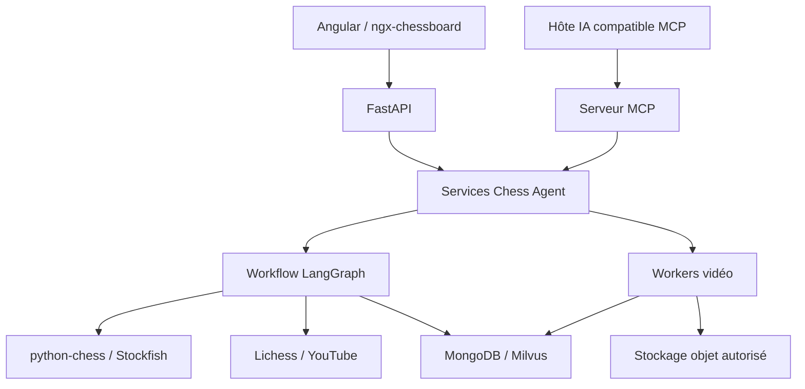
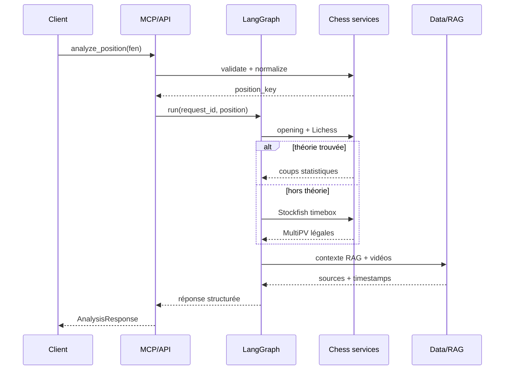
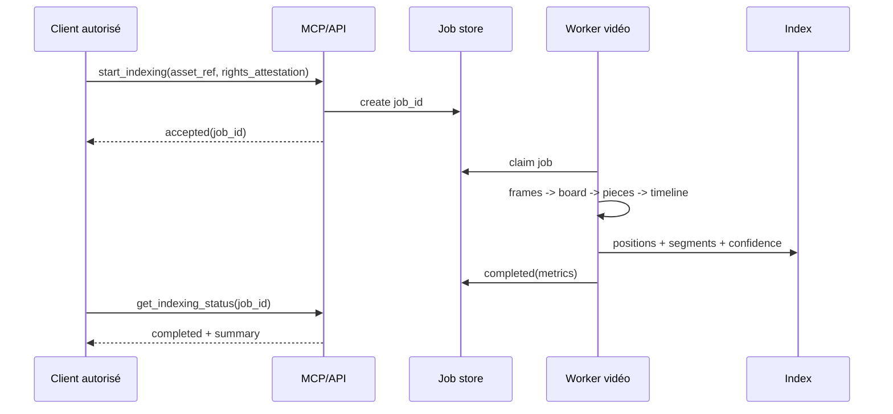
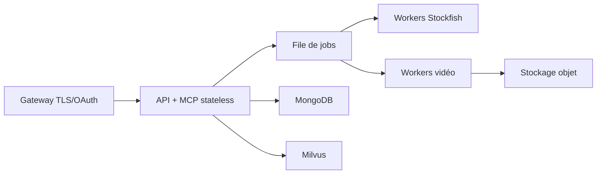

# Architecture MCP cible

## 1. Principes

1. Le domaine échiquéen reste indépendant du transport MCP et de FastAPI.
2. FastAPI et MCP appellent les mêmes services applicatifs.
3. Le serveur MCP est sans état de connexion ; tout état long porte un identifiant explicite.
4. Les outils renvoient des objets structurés conformes aux schémas.
5. Les appels externes sont bornés, mis en cache et observables.
6. Les sorties LLM ne peuvent pas rendre légal un coup qui ne l'est pas selon `python-chess`.
7. Les vidéos analysées ont une provenance et une autorisation documentées.

## 2. Vue logique

## 3. Couches

| Couche | Responsabilité | Ne doit pas faire |
| --- | --- | --- |
| Schémas | validation et sérialisation | logique métier ou HTTP |
| Domaine | règles FEN, coups, ouvertures | appels réseau |
| Application | cas d'usage, idempotence, politiques de repli | dépendre du frontend |
| Adaptateurs | Lichess, YouTube, Stockfish, MongoDB, Milvus | décider du parcours pédagogique |
| Orchestration | ordre, branches, timeouts | cacher les erreurs ou les contrats |
| Interfaces | FastAPI et MCP | contenir des calculs complexes |
| Workers | traitement vidéo/embeddings | accepter des sources non autorisées |

## 4. Catalogue MCP recommandé

### Tools

| Nom | Entrée principale | Sortie | Effet |
| --- | --- | --- | --- |
| `chess.validate_fen` | `fen` | position normalisée, erreurs | lecture seule |
| `chess.identify_opening` | `fen` | ECO, nom, variante, confiance | lecture seule |
| `chess.recommend_moves` | `fen`, budget moteur | coups, mode theory/engine | calcul borné |
| `chess.analyze_position` | `fen`, langue, difficulté | analyse agrégée et sources | calcul/lecture |
| `video.search_position` | `fen`, filtres | vidéos, segments, timestamps | lecture seule |
| `video.start_indexing` | référence d'actif autorisé | `job_id` | écrit un job |
| `video.get_indexing_status` | `job_id` | état, progression, erreur | lecture seule |
| `video.cancel_indexing` | `job_id` | état annulé | action sensible |

Le POC peut se limiter aux six premiers en excluant annulation et ingestion distante si le corpus est préchargé.

### Resources

| URI | Contenu | Cache |
| --- | --- | --- |
| `chess://openings/{eco}` | théorie, variantes, statistiques, sources | longue durée versionnée |
| `chess://positions/{position_key}` | analyse déterministe et liens | courte durée |
| `chess://videos/{video_id}/timeline` | segments position/timestamp autorisés | versionnée |
| `chess://schemas/analysis-response` | contrat de sortie | longue durée |
| `chess://policies/video-ingestion` | politique de provenance | longue durée |

### Prompts

| Nom | Usage | Entrées |
| --- | --- | --- |
| `explain_opening` | explication adaptée au niveau | ouverture, langue, difficulté |
| `compare_candidate_moves` | comparaison de coups légaux | position, candidats |
| `build_training_plan` | plan de travail sourcé | profil, ouvertures, durée |

Les prompts n'exécutent pas de logique métier. Ils structurent la présentation d'informations déjà validées.

## 5. Séquence d'analyse

## 6. Séquence d'indexation vidéo

## 7. Workflow LangGraph

Noeuds recommandés :

1. `validate_input`
2. `load_cached_analysis`
3. `identify_opening`
4. `query_lichess`
5. `route_theory_or_engine`
6. `run_stockfish`
7. `retrieve_documents`
8. `search_videos`
9. `compose_explanation`
10. `validate_output`
11. `persist_result`

Branches obligatoires : FEN invalide, cache hit, Lichess vide, Lichess 429, Stockfish timeout, Milvus indisponible, LLM indisponible, aucun segment vidéo.

## 8. État et idempotence

- `request_id` : idempotence d'une analyse.
- `job_id` : cycle de vie d'une ingestion vidéo.
- `asset_id` : actif source et preuve de droits.
- `position_key` : recherche exacte normalisée.
- `model_version` : version vision/embedding.
- `index_version` : permet réindexation sans collision.

Index uniques proposés : `request_id`, `(asset_id, index_version)`, `(video_id, position_key, start_ms, model_version)`.

## 9. Transports et exposition

### Local

- MCP sur `stdio` pour l'inspecteur et les hôtes locaux.
- FastAPI sur réseau Docker privé.
- services et bases via Docker Compose.

### Distant

- MCP `Streamable HTTP` sur `/mcp`.
- FastAPI interne ou exposée sur `/api/v1` selon besoin frontend.
- TLS à la passerelle.
- OAuth/OIDC et scopes par outil sensible.
- en-têtes MCP nécessaires à la version 2026-07-28 conservés par la passerelle.

## 10. Autorisation

Scopes minimaux :

- `chess:read` : validation, ouverture, analyse ;
- `video:read` : recherche et timelines ;
- `video:index` : démarrage d'un job autorisé ;
- `video:cancel` : annulation ;
- `admin:corpus` : politiques, réindexation et purge.

Les outils de lecture peuvent être accessibles à plus de clients que les outils d'ingestion. Toute action d'écriture journalise identité, actif, motif et résultat.

## 11. Compatibilité protocolaire

La cible est MCP `2026-07-28` avec le SDK Python v2. Le protocole a retiré les sessions et le handshake obligatoire ; les requêtes transportent les métadonnées nécessaires. Le catalogue doit rester compatible avec les clients réellement visés, vérifiés un par un.

L'extension Tasks n'est pas une dépendance du MVP. Les jobs métier explicites évitent un blocage de compatibilité et restent compréhensibles par le modèle.

## 12. Déploiement minimal

## 13. Décisions à figer avant développement

1. clients MCP cibles et versions minimales ;
2. corpus vidéo et droits ;
3. politique de FEN partielle ;
4. SLO et budget Stockfish ;
5. fournisseur ou auto-hébergement de MongoDB/Milvus ;
6. fournisseur LLM/embeddings ou mode local ;
7. authentification du frontend et du MCP distant ;
8. durée de conservation des actifs et preuves.
