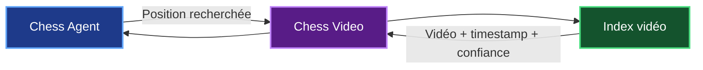
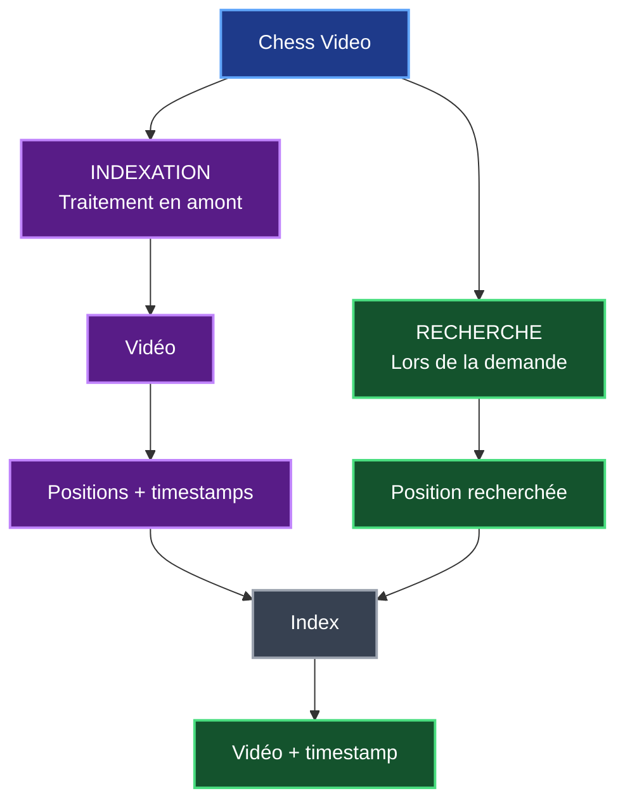
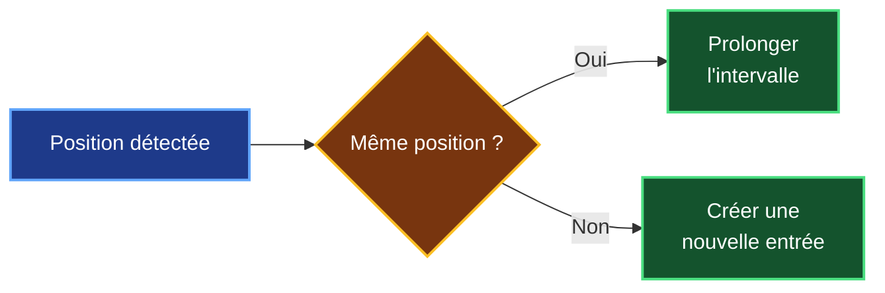
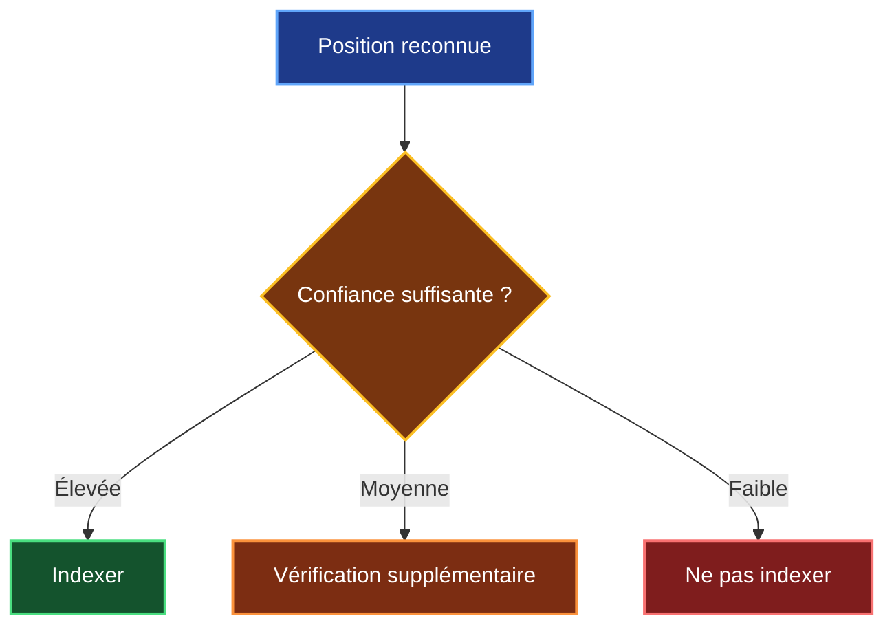
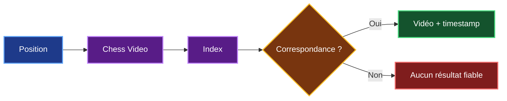
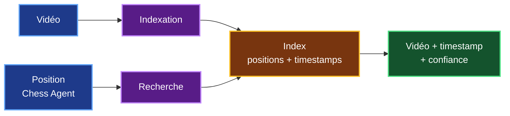

# 2. Définition fonctionnelle de Chess Video

## 2.1 Objectif de Chess Video

**Chess Video** sera le service spécialisé dans l'analyse des vidéos d'échecs.

Son objectif principal sera de permettre à Chess Agent de retrouver **le passage précis d'une vidéo dans lequel une position apparaît**.

Chess Video ne remplacera pas Chess Agent. Les deux auront des responsabilités différentes :

- **Chess Agent** continuera d'analyser la position et de construire la réponse pédagogique ;
- **Chess Video** sera spécialisé dans l'indexation et la recherche des positions présentes dans les vidéos.



L'objectif est donc de passer de :

> **« Cette vidéo peut être intéressante pour cette position. »**

à :

> **« Cette position apparaît dans cette vidéo à 18 min 24 s. »**

---

## 2.2 Deux fonctions principales

Pour obtenir ce résultat, je sépare le fonctionnement de Chess Video en **deux traitements**.

Le premier est **l'indexation**. Les vidéos sont analysées en amont afin d'identifier les positions qui apparaissent et de les associer à leurs timestamps.

Le second est **la recherche**. Lorsqu'un utilisateur analyse une position, Chess Agent interroge l'index déjà construit.



Cette séparation est importante.

**L'indexation est le traitement lourd**, car elle nécessite d'analyser les vidéos.

La **recherche doit rester rapide**, car la vidéo n'a pas besoin d'être analysée à nouveau lorsque l'utilisateur effectue une demande.

---

## 2.3 Fonction d'indexation

L'indexation doit transformer une vidéo en une **timeline de positions**.

Par exemple :

```text
Vidéo A

00:15 → 00:41 : position A
00:42 → 01:07 : position B
01:08 → 01:34 : position C
```

Pour obtenir ce résultat, Chess Video devra réaliser plusieurs opérations.

| Étape | Objectif |
|---|---|
| **Accéder à la vidéo** | Obtenir une source dont le traitement est autorisé |
| **Valider la vidéo** | Vérifier qu'elle peut être analysée |
| **Extraire les images utiles** | Éviter d'analyser inutilement toutes les frames |
| **Détecter l'échiquier** | Localiser le plateau dans l'image |
| **Reconnaître les pièces** | Identifier le contenu des 64 cases |
| **Reconstruire la position** | Obtenir une représentation exploitable |
| **Suivre les changements** | Déterminer quand la position change |
| **Associer les timestamps** | Localiser chaque position dans le temps |
| **Indexer** | Enregistrer les résultats pour les recherches futures |

Le fonctionnement général devient :


---

## 2.4 Gestion des positions dans le temps

Une vidéo contient généralement plusieurs images par seconde.

Je ne souhaite donc pas enregistrer chaque frame comme une nouvelle position.

Si la même position reste affichée pendant plusieurs secondes :

```text
18:22 → position A
18:23 → position A
18:24 → position A
18:25 → transition
18:26 → position B
```

Chess Video devra plutôt produire :

```text
Position A → 18:22 à 18:24
Position B → à partir de 18:26
```

Cela permettra de construire une véritable **timeline des positions présentes dans la vidéo**.



Le système devra également accepter qu'une vidéo pédagogique ne suive pas forcément une partie de manière linéaire.

Un formateur peut revenir en arrière, présenter une variante ou afficher plusieurs fois la même position.

Chess Video devra donc **enregistrer ce qui apparaît réellement dans la vidéo**, sans supposer que chaque nouvelle position correspond forcément au coup suivant.

---

## 2.5 Représentation et confiance

Une fois les pièces reconnues, Chess Video doit produire une représentation permettant de retrouver la position.

Chess Agent utilise déjà le format **FEN**, mais une image ne permet pas forcément de reconstruire toutes les informations d'une FEN complète.

Une image permet principalement d'observer **le placement des pièces**.

Certaines informations peuvent être impossibles à déterminer uniquement avec l'image :

- le joueur au trait ;
- les droits de roque ;
- la prise en passant ;
- les compteurs de coups.

La question à résoudre pendant l'étude technique sera donc :

> **Quelle représentation de la position est suffisante pour retrouver de manière fiable le même échiquier dans une vidéo ?**

Chess Video devra également associer un **niveau de confiance** à la reconnaissance.



Cette possibilité de **ne pas indexer une position incertaine** est importante : je préfère obtenir moins de correspondances mais qu'elles soient fiables, plutôt que de proposer des timestamps incorrects.

Une entrée de l'index pourra donc contenir au minimum :

| Information | Rôle |
|---|---|
| `video_id` | Identifier la vidéo |
| `position` | Identifier la position |
| `start_timestamp` | Début de l'apparition |
| `end_timestamp` | Fin de l'apparition |
| `confidence` | Niveau de confiance |

Le modèle de données exact sera défini plus tard dans l'architecture.

---

## 2.6 Fonction de recherche

La deuxième fonction de Chess Video sera beaucoup plus simple.

Lorsqu'un utilisateur analysera une position, **Chess Agent transmettra cette position à Chess Video**.

Chess Video recherchera alors les correspondances dans son index.

La vidéo ne sera **pas analysée à ce moment-là**.



Une position peut apparaître dans plusieurs vidéos ou plusieurs fois dans une même vidéo.

Chess Video devra donc pouvoir retourner **plusieurs correspondances**.

Par exemple :

```text
Position recherchée

Vidéo A → 05:20
Vidéo A → 18:24
Vidéo B → 06:14
Vidéo C → 32:10
```

Le résultat pourra contenir :

```text
video_id
url
start_timestamp
end_timestamp
confidence
```

L'utilisateur pourra alors accéder directement au passage qui correspond à sa position.

---

## 2.7 Périmètre fonctionnel de la V1

Je ne souhaite pas construire dès la première version un système capable d'analyser tous les contenus d'échecs existants.

Je définis donc un périmètre initial volontairement limité.

| Fonction | V1 |
|---|---|
| Vidéo numérique | **Oui** |
| Échiquier 2D | **Oui** |
| Orientation Blancs / Noirs | **Oui** |
| Position + timestamp | **Oui** |
| Score de confiance | **Oui** |
| Plusieurs vidéos | **Oui** |
| Plusieurs passages par vidéo | **Oui** |
| PGN / timeline | **Solution complémentaire éventuelle** |
| Transcription | **Solution complémentaire éventuelle** |
| Échiquier physique complexe | **Non prioritaire** |
| Reconnaissance de toutes les vidéos | **Non** |

Ce périmètre me permet de concentrer la V1 sur la fonction qui apporte réellement la valeur :

> **retrouver une position affichée dans une vidéo et son timestamp.**

---

## 2.8 Synthèse fonctionnelle

À ce stade, je peux définir Chess Video comme un service ayant **deux responsabilités principales** :

1. **analyser et indexer les positions présentes dans des vidéos d'échecs** ;
2. **rechercher une position dans les vidéos déjà indexées**.



Le résultat central de Chess Video est donc l'association :

> **VIDÉO + POSITION + TIMESTAMP + CONFIANCE**

Ce chapitre définit **ce que Chess Video doit faire**, sans encore imposer la manière technique de le réaliser.

Le chapitre suivant pourra maintenant répondre à la question :

> **Comment construire cette chaîne d'analyse vidéo et quelles technologies utiliser ?**