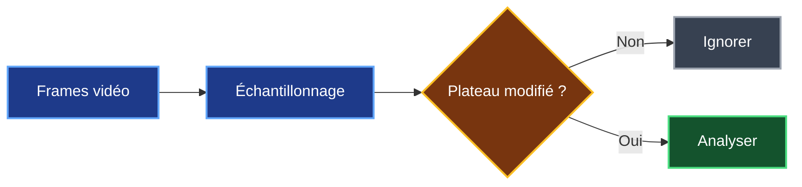
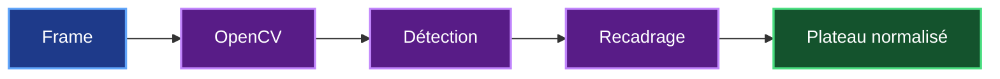
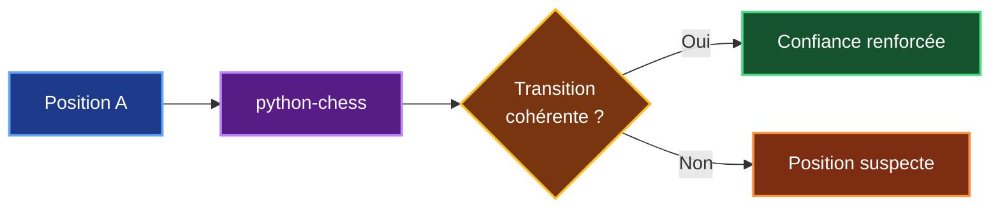

# 3. Étude technologique

## 3.1 Objectif

Pour construire Chess Video, je dois déterminer quelles technologies peuvent transformer une vidéo en une suite de positions associées à leurs timestamps.

Le traitement peut être résumé ainsi :


La lecture de la vidéo et la récupération des timestamps reposent sur des technologies déjà maîtrisées.

La principale difficulté concerne la **vision** : il faut être capable de détecter l'échiquier puis de reconnaître correctement les pièces qui apparaissent dessus.

---

## 3.2 Traitement de la vidéo

Je vais d'abord **découper la vidéo en images**, appelées *frames*, afin de sélectionner celles qui sont utiles à l'analyse.

Une vidéo de 30 minutes enregistrée à 30 images par seconde contient environ :

```text
30 × 60 × 30 = 54 000 frames
```

Il serait inutile d'envoyer ces 54 000 images à un modèle de vision.

Je prévois donc deux niveaux de réduction.

Le premier consiste à effectuer un **échantillonnage**, par exemple en ne sélectionnant qu'une frame à intervalle régulier.

Le second consiste à **détecter les changements importants sur l'échiquier**.



Si le plateau reste identique pendant plusieurs secondes, il n'est pas nécessaire d'analyser plusieurs fois la même position.

Cette optimisation doit permettre de **réduire le temps de traitement, le nombre d'inférences et le coût d'indexation**.

La fréquence exacte sera déterminée pendant le benchmark.

---

## 3.3 OpenCV pour préparer les images

J'utiliserai ensuite **OpenCV** pour préparer les images avant leur analyse.

OpenCV est une bibliothèque open source de vision par ordinateur disponible en Python.

Dans Chess Video, elle pourra notamment servir à :

- détecter la zone de l'échiquier ;
- recadrer l'image ;
- redimensionner le plateau ;
- corriger certaines transformations ;
- comparer plusieurs frames ;
- détecter les changements.



OpenCV ne sera cependant pas chargé de comprendre la position d'échecs.

Son rôle sera surtout de **fournir au modèle de vision une image du plateau aussi propre et régulière que possible**.

---

## 3.4 Reconnaissance de la position

Une fois l'échiquier isolé, un **modèle de vision** devra reconnaître les pièces présentes sur les 64 cases.

Chaque case peut correspondre à 13 états :

- une case vide ;
- les six pièces blanches ;
- les six pièces noires.

Le résultat attendu est donc le placement complet des pièces.


C'est ici que se trouve **la principale incertitude technique du projet**.

Pour Chess Video, reconnaître presque toute la position n'est pas suffisant.

```text
63 cases correctes
+
1 case incorrecte
=
position incorrecte
```

Le benchmark devra donc mesurer en priorité le **pourcentage de positions entièrement correctes**, et pas uniquement la précision moyenne de reconnaissance des pièces.

---

## 3.5 Deux stratégies étudiées

Pour reconnaître les positions, j'ai comparé deux stratégies principales.

### Utiliser un modèle existant

La première solution consiste à utiliser un **modèle de vision déjà disponible**.

Cette approche permet de commencer rapidement les expérimentations sans devoir créer immédiatement un dataset important et entraîner mon propre modèle.

### Créer un modèle spécialisé

La seconde solution consiste à développer un modèle spécialement entraîné pour reconnaître les pièces d'échecs.

Cette solution apporterait davantage de contrôle, mais nécessiterait :

- la création d'un dataset ;
- l'entraînement du modèle ;
- des ressources GPU ;
- des tests supplémentaires ;
- une maintenance ML plus importante.

La comparaison est donc la suivante :

| Critère | Modèle spécialisé | Modèle existant / multimodal |
|---|---|---|
| Dataset d'entraînement | Nécessaire | Non au départ |
| Corpus de benchmark | Nécessaire | Nécessaire |
| Entraînement | Oui | Non au départ |
| Temps de développement | Plus long | **Plus rapide** |
| Contrôle | **Élevé** | Moyen |
| Maintenance ML | Plus importante | Plus faible |
| Coût initial | Plus élevé | **Plus faible** |
| Choix pour la V1 | À envisager si nécessaire | **Recommandé** |

Pour ma V1, je privilégie donc :

> **OpenCV + modèle de vision existant**

Cette solution me permet de **tester rapidement la faisabilité de Chess Video**, sans investir immédiatement dans la création d'un modèle spécialisé.

Si le benchmark montre que les modèles existants ne sont pas suffisamment précis, je pourrai alors envisager un modèle spécialisé.

Cette évolution représenterait environ **20 à 30 jours.homme supplémentaires** et ne fait donc pas partie des **65 jours.homme prévus pour la V1**.

---

## 3.6 Validation avec python-chess

Une fois la position reconnue, je peux utiliser **python-chess**, déjà présent dans Chess Agent, pour effectuer certaines vérifications.

Par exemple, lorsque deux positions successives sont reconnues, je peux vérifier si leur transition est cohérente avec les règles des échecs.



Cette vérification peut aider à repérer une mauvaise orientation, une erreur de reconnaissance ou une frame prise pendant une animation.

Elle ne garantit cependant pas qu'une position soit correcte. Une mauvaise reconnaissance peut malgré tout produire une position légale.

`python-chess` sera donc utilisé comme **contrôle supplémentaire**, et non comme système de reconnaissance.

---

## 3.7 Données nécessaires au benchmark

Même si je n'entraîne pas mon propre modèle pour la V1, j'ai besoin d'un **jeu de données de test annoté**.

Sans positions de référence, je ne pourrai pas mesurer si le modèle fonctionne correctement.

Le benchmark devra contenir plusieurs situations :

| Variation | Pourquoi la tester ? |
|---|---|
| Différents thèmes d'échiquier | Vérifier la généralisation |
| Différents styles de pièces | Éviter la dépendance à une interface |
| Blancs et Noirs en bas | Tester l'orientation |
| Plusieurs résolutions | Tester la qualité vidéo |
| Flèches et annotations | Tester les vidéos pédagogiques |
| Compression vidéo | Se rapprocher des conditions réelles |
| Vidéos inconnues | Vérifier la généralisation |

Les vidéos utilisées pour l'évaluation devront être différentes de celles ayant servi aux premiers réglages.

L'objectif n'est pas seulement de vérifier que le système fonctionne sur quelques exemples choisis, mais qu'il reste suffisamment fiable sur **des vidéos qu'il n'a jamais analysées**.

---

## 3.8 Critères du benchmark

Le choix définitif de la technologie de vision reposera sur des mesures.

| Mesure | Ce que je veux vérifier |
|---|---|
| **Détection de l'échiquier** | Le plateau est correctement localisé |
| **Précision par case** | Identifier les erreurs du modèle |
| **Position entièrement correcte** | Mesurer la réussite réelle |
| **Faux positifs** | Éviter les résultats incorrects |
| **Précision du timestamp** | Retrouver correctement le passage |
| **Nombre de frames analysées** | Vérifier l'efficacité de l'optimisation |
| **Temps par heure de vidéo** | Dimensionner le traitement |
| **Coût par heure de vidéo** | Vérifier la viabilité économique |

Le benchmark devra donc répondre à une question simple :

> **La solution est-elle suffisamment précise, rapide et économique pour être utilisée dans Chess Video ?**

---

## 3.9 Choix technologique pour la V1

À ce stade de l'étude, je retiens donc la chaîne suivante pour la V1 :


Ce choix n'est pas définitif.

Il constitue **la solution la plus raisonnable à tester pour une première version**, car elle limite le développement ML spécifique et permet d'obtenir rapidement des mesures réelles.

| Élément | Choix V1 |
|---|---|
| Traitement vidéo | **Outils Python / vidéo** |
| Prétraitement | **OpenCV** |
| Réduction des frames | **Échantillonnage + détection des changements** |
| Reconnaissance | **Modèle de vision existant** |
| Validation métier | **python-chess** |
| Modèle spécialisé | **Uniquement si le benchmark le justifie** |

---

## 3.10 Conclusion

Cette étude technologique montre que les différentes étapes nécessaires à Chess Video peuvent être réalisées avec des technologies existantes.

La principale inconnue reste **la précision de la reconnaissance visuelle sur des vidéos variées**.

Je ne souhaite donc pas commencer par développer mon propre modèle.

Pour la V1, je vais privilégier :

> **OpenCV + modèle de vision existant + python-chess**

Cette approche me permettra de mesurer rapidement la faisabilité réelle du projet.

Si les résultats sont insuffisants, le développement d'un **modèle spécialisé** restera une évolution possible, estimée à **20 à 30 jours.homme supplémentaires**.

Le chapitre suivant pourra maintenant étudier **les solutions techniques concrètes permettant de mettre en œuvre cette chaîne et de choisir les composants les plus adaptés**.