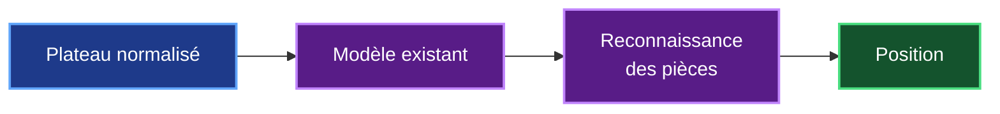
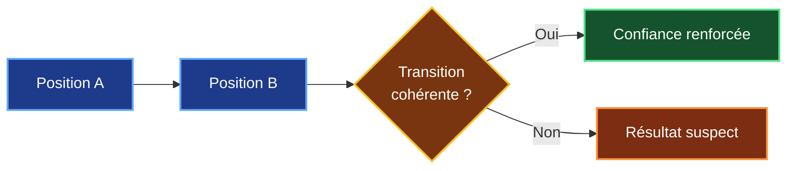
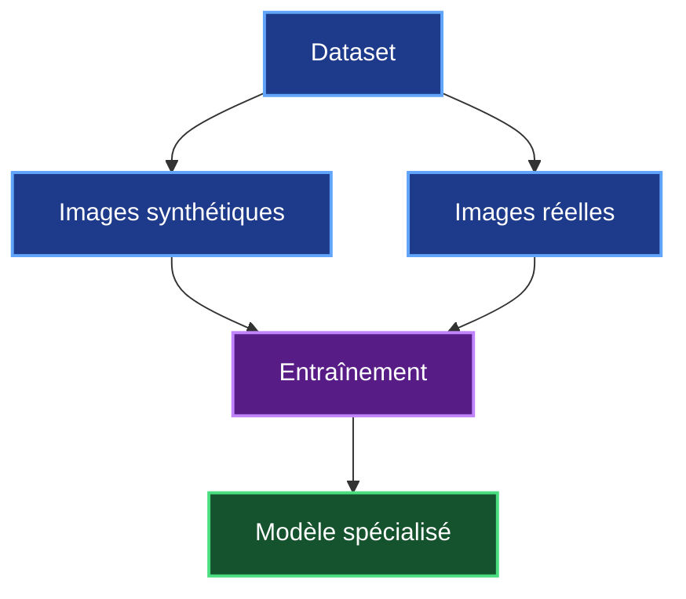
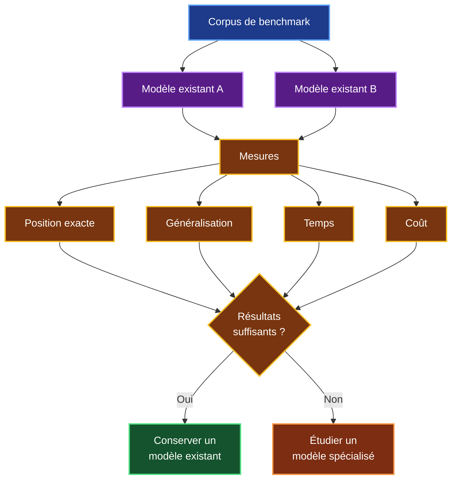
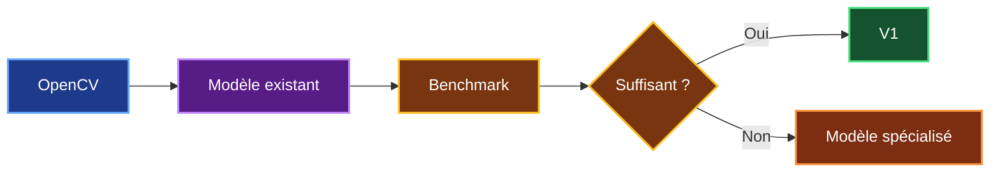

# 4. Solutions techniques étudiées

## 4.1 Objectif

Le chapitre précédent m'a permis de définir la chaîne technologique générale de Chess Video.

Pour la V1, je souhaite partir d'une solution qui me permette de **tester rapidement la faisabilité**, sans commencer immédiatement par entraîner mon propre modèle.

La chaîne retenue est :


Il reste cependant plusieurs possibilités pour réaliser la reconnaissance.

Mon objectif n'est donc pas de choisir un modèle uniquement sur ses caractéristiques annoncées, mais de **comparer les solutions sur des images provenant réellement de vidéos d'échecs**.

---

## 4.2 Solution privilégiée pour la V1

Pour la première version, je privilégie :

> **OpenCV + modèle de vision existant**

Les deux composants auront des responsabilités différentes.

| Composant | Rôle |
|---|---|
| **OpenCV** | Préparer les images et isoler l'échiquier |
| **Modèle de vision** | Reconnaître les pièces |
| **python-chess** | Effectuer des contrôles échiquéens |
| **Chess Video** | Associer la position au timestamp et l'indexer |

Cette solution présente un avantage important pour mon étude : **je peux tester le cœur du projet sans devoir commencer par créer et entraîner un modèle spécialisé**.

---

## 4.3 Rôle d'OpenCV

Une frame provenant d'une vidéo peut contenir beaucoup plus que l'échiquier :

- webcam du créateur ;
- texte ;
- barre d'évaluation ;
- interface du site ;
- commentaires ;
- autres éléments graphiques.

Le modèle n'a pas besoin d'analyser toute cette image.

OpenCV doit donc permettre de passer de :

```text
Frame vidéo complète
        ↓
Détection de l'échiquier
        ↓
Recadrage
        ↓
Normalisation
        ↓
Plateau exploitable
```

Les principales opérations envisagées sont :

| Traitement | Utilité |
|---|---|
| Détection | Localiser l'échiquier |
| Recadrage | Supprimer les éléments inutiles |
| Redimensionnement | Uniformiser les entrées |
| Correction géométrique | Corriger certaines déformations |
| Comparaison de frames | Détecter les changements |
| Normalisation | Préparer l'entrée du modèle |

Une partie importante de ces opérations peut être réalisée sur CPU.

Cela permet de **réserver les traitements de vision plus coûteux aux images réellement utiles**.

---

## 4.4 Modèle de vision existant

Une fois l'échiquier isolé, je dois reconnaître le contenu des 64 cases.

Pour la V1, je souhaite commencer avec **un modèle déjà existant**, plutôt que d'en entraîner immédiatement un nouveau.

Le modèle devra produire une information structurée permettant de reconstruire le placement des pièces.



Plusieurs modèles pourront être testés pendant le benchmark.

Je ne fixe donc pas encore un modèle précis dans l'architecture.

Ce choix évite de rendre Chess Video dépendant d'une technologie avant d'avoir obtenu des résultats réels.

---

## 4.5 API externe ou modèle hébergé

Un modèle existant peut être utilisé de deux manières principales.

### API externe

Chess Video envoie l'image à un service externe et récupère le résultat.

Cette solution permet de démarrer rapidement et ne nécessite pas de gérer un GPU.

### Modèle hébergé

Le modèle peut également être exécuté sur une infrastructure contrôlée par Chess Video.

Cette solution demande davantage d'infrastructure mais apporte plus de maîtrise.

| Critère | API externe | Modèle hébergé |
|---|---|---|
| Mise en place | **Rapide** | Plus complexe |
| GPU interne | Non | Oui |
| Maintenance | **Faible** | Plus importante |
| Coût | Par utilisation | Infrastructure |
| Contrôle des données | Plus faible | **Élevé** |
| Dépendance fournisseur | Élevée | **Faible** |
| Gros volume | À mesurer | Potentiellement intéressant |

Pour la phase de faisabilité, **une API peut permettre de tester rapidement plusieurs modèles**.

Le choix entre API et hébergement devra ensuite dépendre du volume, du coût mesuré et des contraintes sur les données.

---

## 4.6 Exactitude attendue

La principale difficulté est que Chess Video doit retrouver **la position exacte**.

Une reconnaissance presque correcte n'est pas nécessairement suffisante :

```text
64 cases
   ↓
63 correctes
+
1 incorrecte
   ↓
Position incorrecte
```

Je dois donc distinguer deux mesures.

| Mesure | Utilité |
|---|---|
| **Précision par case** | Comprendre où le modèle se trompe |
| **Position entièrement correcte** | Vérifier si le résultat peut réellement être utilisé |

La seconde est la plus importante pour Chess Video.

Un modèle capable de reconnaître correctement 99 % des cases n'est pas automatiquement capable de reconstruire 99 % des positions.

---

## 4.7 Validation avec python-chess

Après la reconnaissance, `python-chess` peut apporter un contrôle supplémentaire.

Par exemple, si Chess Video reconnaît deux positions successives, je peux vérifier si la transition entre elles est compatible avec les règles des échecs.



Cette vérification peut permettre de détecter certaines erreurs :

- mauvaise orientation ;
- pièce mal reconnue ;
- frame prise pendant une animation ;
- transition incohérente.

Elle reste cependant un **contrôle complémentaire**.

Une position incorrecte peut malgré tout être légalement possible.

---

## 4.8 Solution spécialisée en cas d'échec

Si les modèles existants ne permettent pas d'obtenir une précision suffisante, je pourrai envisager une deuxième stratégie :

> **développer un modèle spécialisé dans la reconnaissance des échiquiers.**

Cette solution pourrait fonctionner sur un plateau complet ou classifier individuellement les 64 cases.


Chaque case possède 13 états possibles :

> **vide + 6 pièces blanches + 6 pièces noires**

Cette approche apporterait davantage de contrôle mais demanderait un investissement supplémentaire.

Il faudrait notamment :

- constituer un dataset ;
- générer ou annoter des images ;
- entraîner le modèle ;
- évaluer sa généralisation ;
- gérer son déploiement et ses versions.

Cette solution n'est donc **pas incluse dans les 65 jours.homme de la V1**.

Si elle devient nécessaire, j'estime cette évolution à environ :

> **+20 à 30 jours.homme**

---

## 4.9 Données d'entraînement en cas de modèle spécialisé

Si je dois développer ce modèle, je pourrai combiner deux types de données.



Les **images synthétiques** permettent de générer automatiquement de nombreuses positions avec une annotation connue.

Les **images réelles** permettent de représenter les difficultés rencontrées dans les vidéos :

- compression ;
- animations ;
- annotations ;
- curseurs ;
- thèmes différents ;
- styles de pièces différents.

Cette combinaison permettrait de travailler sur le principal problème d'un modèle spécialisé : **sa capacité à fonctionner sur des vidéos différentes de celles utilisées pendant son entraînement**.

---

## 4.10 Comparaison des solutions

Je retiens donc trois niveaux possibles.

| Critère | Modèle existant / API | Modèle existant hébergé | Modèle spécialisé |
|---|---|---|---|
| Mise en place | **Rapide** | Moyenne | Longue |
| Entraînement | Non | Non | **Oui** |
| Dataset d'entraînement | Non | Non | **Oui** |
| Benchmark | **Oui** | **Oui** | **Oui** |
| GPU interne | Non | Oui | Oui |
| Contrôle | Moyen | Élevé | **Très élevé** |
| Maintenance ML | Faible | Moyenne | **Élevée** |
| Coût initial | **Faible** | Moyen | Élevé |
| Coût à gros volume | À mesurer | Potentiellement intéressant | Potentiellement intéressant |
| V1 | **À tester en priorité** | À comparer | Seulement si nécessaire |

Cette comparaison conduit à une démarche progressive plutôt qu'à un choix définitif immédiat.

---

## 4.11 Benchmark de décision

Je vais comparer les solutions à partir d'un **même corpus de test**.



Les principales mesures seront :

| Mesure | Pourquoi ? |
|---|---|
| **Position exacte** | Vérifier la qualité réelle |
| **Faux positifs** | Éviter de proposer de mauvais timestamps |
| **Généralisation** | Tester des vidéos inconnues |
| **Timestamp** | Vérifier la précision temporelle |
| **Temps / heure vidéo** | Dimensionner le traitement |
| **Nombre d'inférences** | Mesurer l'efficacité |
| **Coût / heure vidéo** | Vérifier la viabilité économique |

Je ne fixerai donc pas arbitrairement la technologie définitive avant ces mesures.

---

## 4.12 Stratégie retenue

Ma stratégie de développement est progressive :



Je commence donc par **la solution la moins coûteuse à expérimenter**.

Si elle répond au besoin, je peux poursuivre la V1 sans construire mon propre modèle.

Si elle n'est pas suffisamment fiable, les résultats du benchmark me permettront de savoir **où se situent les erreurs** avant d'investir dans un modèle spécialisé.

---

## 4.13 Tableau récapitulatif

| Objet | Avantage | Limite / risque | Réponse prévue |
|---|---|---|---|
| **OpenCV** | Traitement rapide et maîtrisé | Détection perturbée sur certaines interfaces | Tester plusieurs vidéos et normaliser les images |
| **Modèle existant** | Démarrage rapide sans entraînement | Exactitude à démontrer | Benchmark sur positions complètes |
| **API externe** | Pas d'infrastructure GPU initiale | Coût et dépendance fournisseur | Mesurer le coût par heure vidéo |
| **Modèle hébergé** | Plus de contrôle | Infrastructure GPU | Comparer avec l'API selon le volume |
| **python-chess** | Contrôle métier supplémentaire | Ne détecte pas toutes les erreurs | Ne pas l'utiliser comme seule validation |
| **Modèle spécialisé** | Contrôle et optimisation | Dataset, entraînement et maintenance | Seulement si le benchmark le justifie |

---

## 4.14 Conclusion

Pour la V1, je ne prévois pas de développer immédiatement un modèle spécialisé.

Je retiens comme première solution :

> **OpenCV + modèle de vision existant + validation avec python-chess**

Cette solution me permet de **tester le cœur de Chess Video rapidement et avec un investissement limité**.

Le benchmark déterminera ensuite si cette approche est suffisamment précise, rapide et économique.

Si ce n'est pas le cas, je pourrai envisager le développement d'un **modèle spécialisé**, avec une charge supplémentaire estimée entre **20 et 30 jours.homme**.

Ma décision technique suit donc cette logique :

> **Tester → mesurer → décider → spécialiser uniquement si nécessaire.**

Le chapitre suivant peut maintenant répondre à une autre question :

> **Comment intégrer Chess Video à l'architecture existante de Chess Agent avec MCP et FastMCP ?**