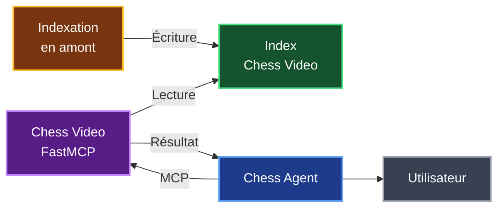
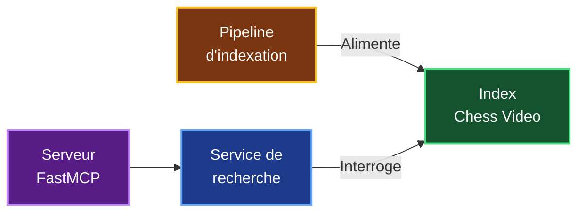
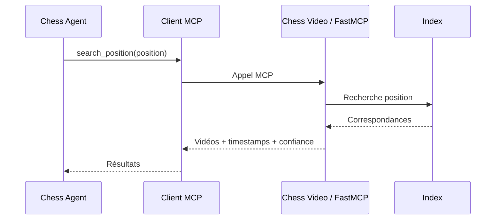
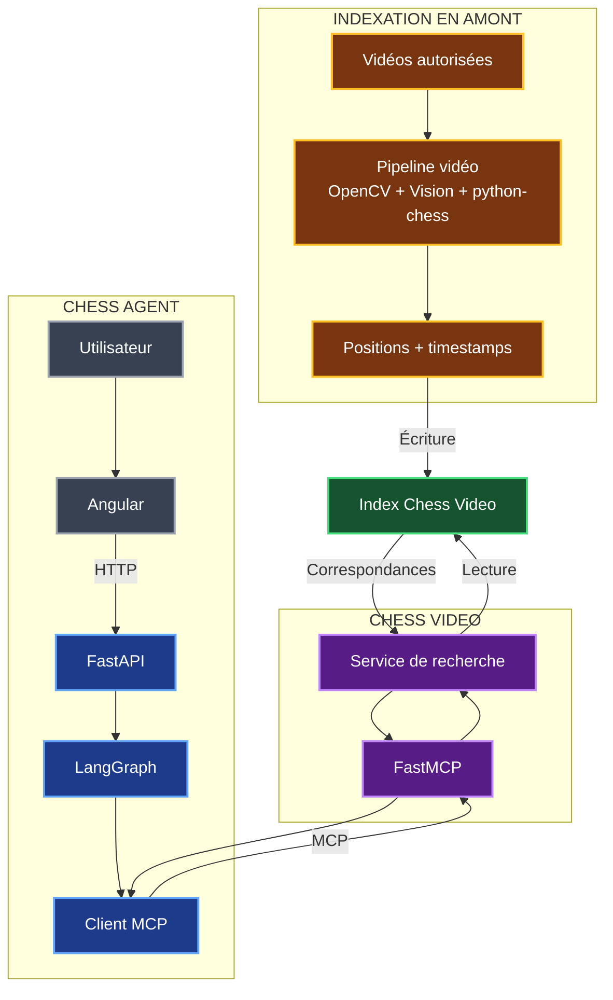
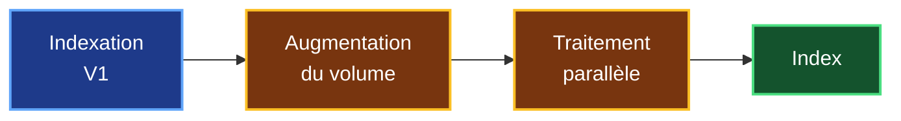

# 5. Architecture de Chess Video avec MCP / FastMCP

## 5.1 Objectif de l'architecture

Les chapitres précédents ont défini le fonctionnement attendu de Chess Video et les technologies envisagées pour analyser les vidéos.

Je dois maintenant déterminer **comment organiser ces composants et comment intégrer Chess Video à mon POC Chess Agent existant**.

Mon choix principal est de créer **Chess Video comme un service indépendant**.

L'architecture doit respecter la séparation définie précédemment entre :

- l'**indexation**, qui analyse les vidéos en amont et alimente un index ;
- la **recherche**, qui consulte cet index lorsqu'un utilisateur utilise Chess Agent.

L'architecture générale repose donc sur le principe suivant :



Le point important est que **Chess Agent n'analyse pas lui-même les vidéos**.

Il utilise Chess Video comme un service spécialisé.

---

## 5.2 Séparation des responsabilités

Je souhaite éviter d'ajouter directement toute la logique vidéo dans Chess Agent.

Les différents composants ont donc des responsabilités bien séparées.

| Composant | Responsabilité |
|---|---|
| **Chess Agent** | Analyser la position et construire la réponse pédagogique |
| **Chess Video** | Rechercher les passages vidéo correspondant à une position |
| **Pipeline d'indexation** | Préparer les positions et timestamps à partir des vidéos |
| **Index Chess Video** | Stocker les correspondances déjà calculées |
| **MCP** | Permettre la communication entre Chess Agent et Chess Video |

Cette séparation permet à Chess Agent de rester centré sur son rôle actuel.

Chess Agent n'a pas besoin de connaître le fonctionnement interne de l'analyse vidéo.

Il doit simplement pouvoir demander à Chess Video :

> **« Quels passages vidéo correspondent à cette position ? »**

Chess Video masque ainsi la complexité de l'analyse vidéo derrière une interface simple.

---

## 5.3 Les composants de Chess Video

L'architecture interne de Chess Video peut être découpée en quatre blocs principaux.



### Pipeline d'indexation

Le pipeline réalise en amont l'analyse technique étudiée dans les chapitres précédents.

Son résultat est une série de correspondances entre :

> **vidéo + position + timestamp + confiance**

Ces informations sont ensuite enregistrées dans l'index.

### Index Chess Video

L'index représente la frontière entre l'analyse vidéo et la recherche utilisateur.

Il est **alimenté par l'indexation** puis **consulté par Chess Video lors d'une recherche**.

### Service de recherche

Ce composant contient la logique permettant de retrouver les passages correspondant à une position.

Il travaille uniquement à partir des informations déjà présentes dans l'index.

### Serveur FastMCP

FastMCP expose les fonctionnalités de Chess Video afin qu'elles puissent être utilisées par Chess Agent à travers MCP.

---

## 5.4 L'index Chess Video

L'index constitue le composant central partagé entre l'indexation et la recherche.

Une entrée pourra contenir au minimum :

| Information | Rôle |
|---|---|
| `video_id` | Identifier la vidéo |
| `position` | Identifier la position |
| `start_timestamp` | Début de l'apparition |
| `end_timestamp` | Fin de l'apparition |
| `confidence` | Fiabilité de la reconnaissance |
| `model_version` | Version du système ayant produit le résultat |

Par exemple :

```text
video_id        : video_042
position        : position_X
start_timestamp : 1104
end_timestamp   : 1118
confidence      : 0.97
model_version   : vision_v1
```

Cette entrée indique que la position a été détectée entre **18 min 24 s et 18 min 38 s**.

### Choix du stockage

Chess Agent utilise actuellement **MongoDB** et **Milvus**.

Milvus est utilisé pour la recherche vectorielle du RAG.

Or Chess Video doit principalement effectuer une recherche structurée :

```text
Position
   ↓
Correspondances
   ↓
Vidéo + timestamp
```

Pour la V1, **MongoDB constitue donc une solution cohérente à évaluer en priorité**.

Ce choix permettrait de réutiliser une technologie déjà présente dans le projet au lieu d'ajouter immédiatement un nouveau système de stockage.

Le choix définitif dépendra cependant :

- du nombre de vidéos ;
- du nombre de positions enregistrées ;
- de la représentation retenue pour les positions ;
- des performances mesurées pendant le benchmark.

---

## 5.5 Communication avec Chess Agent grâce à MCP

Chess Video étant indépendant de Chess Agent, il faut définir un moyen de communication entre les deux services.

Je prévois d'utiliser **MCP, Model Context Protocol**.

L'organisation devient :


Dans cette architecture :

| Élément | Rôle |
|---|---|
| **Chess Agent** | Demande une recherche vidéo |
| **Client MCP** | Envoie la demande |
| **MCP** | Définit le protocole d'échange |
| **FastMCP** | Expose les fonctionnalités de Chess Video |
| **Service de recherche** | Recherche les correspondances |
| **Index** | Contient les résultats préalablement calculés |

MCP ne réalise donc **aucune analyse vidéo**.

Il sert de moyen de communication entre Chess Agent et Chess Video.

---

## 5.6 FastAPI et FastMCP ont des rôles différents

Mon architecture utilise à la fois FastAPI et FastMCP, mais ils ne répondent pas au même besoin.


**FastAPI** reste l'API Web de Chess Agent. Il reçoit les demandes provenant de l'interface Angular.

**FastMCP** est utilisé par Chess Video pour exposer ses fonctionnalités à Chess Agent.

Je conserve donc le parcours actuel :

```text
Utilisateur
    ↓
Angular
    ↓
FastAPI
    ↓
LangGraph
```

auquel j'ajoute :

```text
LangGraph
    ↓
Client MCP
    ↓
Chess Video / FastMCP
```

Cette solution permet d'étendre Chess Agent sans modifier le rôle de son API existante.

---

## 5.7 Interface MCP de la V1

Pour la V1, Chess Agent n'a pas besoin de déclencher l'indexation d'une vidéo.

L'indexation reste un processus séparé.

L'interface MCP nécessaire au parcours utilisateur peut donc rester volontairement simple.

La fonction principale envisagée est :

```text
video.search_position
```

Elle reçoit une représentation de la position recherchée et retourne une ou plusieurs correspondances.

### Entrée

```text
position
```

### Sortie

```text
video_id
url
start_timestamp
end_timestamp
confidence
```

Une position pouvant apparaître dans plusieurs vidéos, la fonction pourra retourner plusieurs résultats.

Le dialogue entre les composants devient :



Ce contrat permet à Chess Agent d'utiliser Chess Video sans dépendre de son implémentation interne.

---

## 5.8 Intégration dans LangGraph

Chess Agent utilise déjà **LangGraph** pour orchestrer les différentes étapes de son analyse.

La recherche Chess Video pourra donc être ajoutée comme une étape supplémentaire du workflow.


Pour LangGraph, Chess Video devient simplement **un outil supplémentaire capable de retourner des informations sur les vidéos**.

LangGraph n'a pas à connaître le pipeline de vision.

La séparation reste donc claire :

```text
Chess Agent / LangGraph
        ↓
orchestration
        ↓
Client MCP
        ↓
Chess Video
        ↓
recherche vidéo
```

Ainsi, une évolution future du modèle de vision ne nécessite pas de modifier le fonctionnement général de Chess Agent.

---

## 5.9 Architecture complète de la V1

L'ensemble peut maintenant être représenté dans une seule architecture.



Ce schéma fait apparaître les **trois zones principales de l'architecture**.

### Indexation en amont

Elle prépare les données nécessaires à Chess Video.

```text
Vidéos
   ↓
Pipeline d'indexation
   ↓
Positions + timestamps
   ↓
Index
```

### Chess Agent

Il gère le parcours utilisateur et l'orchestration de l'analyse.

```text
Utilisateur
   ↓
Angular
   ↓
FastAPI
   ↓
LangGraph
   ↓
Client MCP
```

### Chess Video

Il fournit le service spécialisé de recherche.

```text
FastMCP
   ↓
Service de recherche
   ↓
Index
```

Les deux traitements, indexation et recherche, se rejoignent donc uniquement autour de **l'index Chess Video**.

---

## 5.10 Déploiement de la V1

Chess Video sera déployé séparément de Chess Agent.

Cette séparation permet aux deux services d'évoluer indépendamment.


Le pipeline d'indexation reste exécuté séparément pour alimenter l'index.

Pour la V1, je ne prévois pas d'imposer une architecture distribuée complexe.

Une file de traitements, plusieurs workers ou plusieurs machines de calcul pourront être étudiés plus tard si le volume réel de vidéos le nécessite.

La V1 privilégie donc une architecture **simple à développer, tester et mesurer**.

---

## 5.11 Évolutivité

La séparation entre les composants permet de faire évoluer Chess Video progressivement.

Si le volume de vidéos devient important, le pipeline d'indexation pourra être parallélisé sans modifier le contrat utilisé par Chess Agent.



Je ne définis donc pas dès la V1 le nombre de workers ou la technologie de file de traitements.

Ces choix dépendront des mesures obtenues pendant les tests et le benchmark.

Cela évite de surdimensionner l'architecture avant de connaître les besoins réels.

---

## 5.12 Synthèse de l'architecture retenue

L'architecture retenue repose sur une séparation claire des responsabilités.

| Élément | Responsabilité |
|---|---|
| **Pipeline d'indexation** | Préparer les positions et timestamps |
| **Index Chess Video** | Conserver les correspondances |
| **Chess Video** | Rechercher les passages correspondant à une position |
| **FastMCP** | Exposer les fonctions de Chess Video |
| **MCP** | Assurer la communication |
| **Client MCP** | Permettre à Chess Agent d'appeler Chess Video |
| **LangGraph** | Intégrer la recherche vidéo au workflow |
| **FastAPI** | Continuer à servir l'interface Angular |
| **Angular** | Présenter le résultat à l'utilisateur |

L'architecture peut finalement être résumée par deux flux.

### Préparation

```text
Vidéos
   ↓
Pipeline d'indexation
   ↓
Index Chess Video
```

### Utilisation

```text
Utilisateur
   ↓
Chess Agent
   ↓
LangGraph
   ↓
Client MCP
   ↓
Chess Video / FastMCP
   ↓
Index Chess Video
   ↓
Vidéo + timestamp
```

Le choix architectural essentiel est donc :

> **Chess Video est un service indépendant qui expose à Chess Agent une fonction de recherche sur un index préparé en amont.**

Cette organisation permet de conserver la complexité de l'analyse vidéo en dehors du parcours utilisateur tout en laissant chaque composant évoluer indépendamment.

Pour la V1, l'architecture reste volontairement limitée aux composants nécessaires à la validation du besoin.

Les mécanismes de parallélisation et de distribution seront envisagés uniquement si les mesures de charge montrent qu'ils deviennent nécessaires.

Le chapitre suivant pourra ainsi étudier **si cette architecture et les technologies retenues sont réellement faisables en termes de précision, de performance et de coût**.