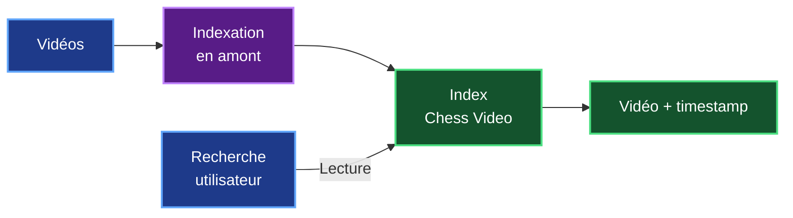
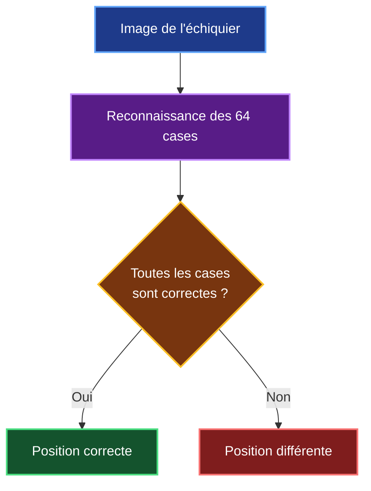
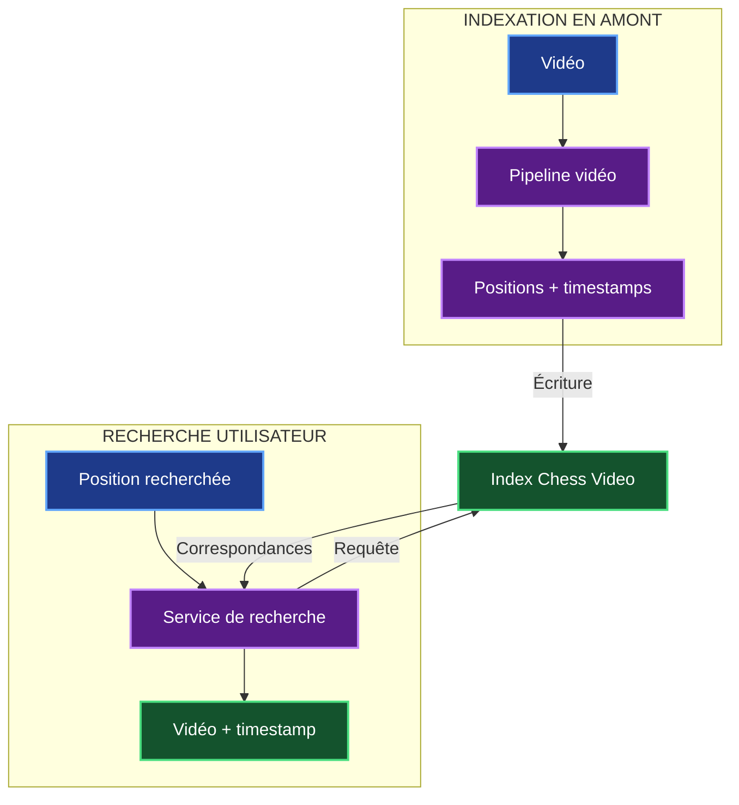
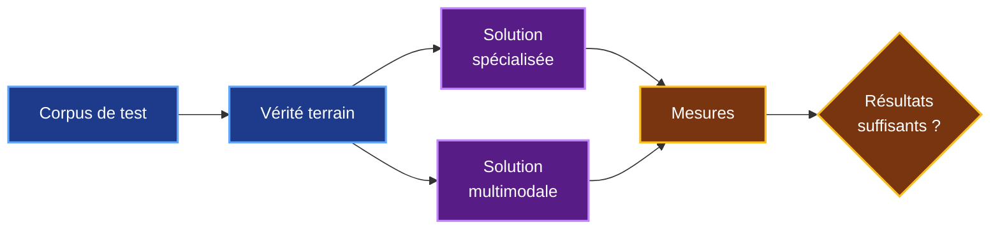
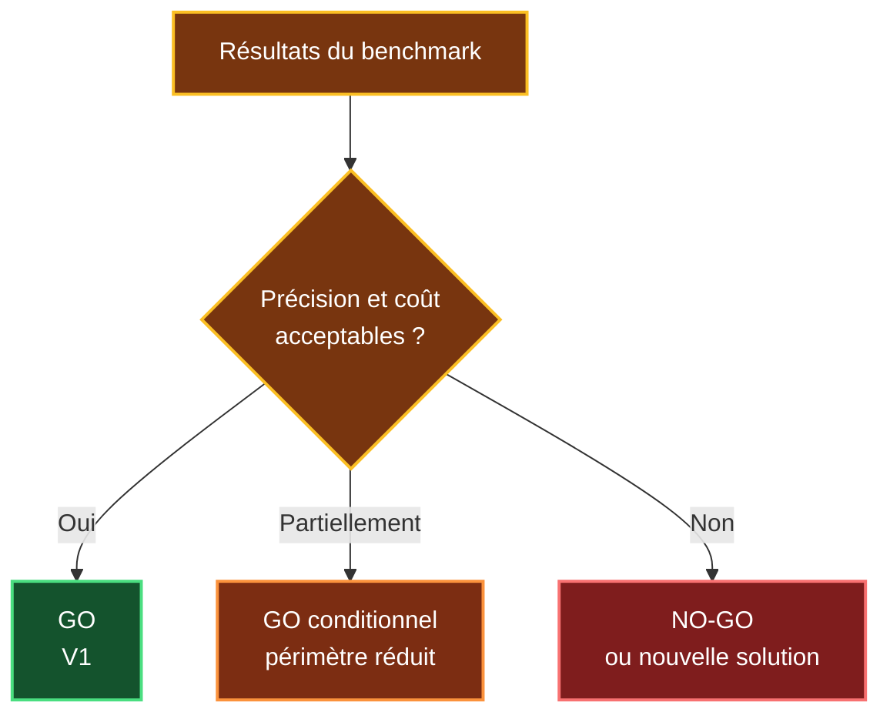

# 6. Faisabilité technique de Chess Video

## 6.1 Objectif et périmètre

Après avoir défini les technologies et l'architecture de Chess Video, je dois maintenant vérifier si la solution envisagée est **réellement réalisable techniquement**.

L'objectif n'est pas de démontrer que Chess Video peut immédiatement fonctionner sur toutes les vidéos d'échecs existantes.

Pour la V1, je conserve le périmètre défini précédemment :

- échiquiers numériques 2D ;
- orientation Blancs ou Noirs ;
- plusieurs thèmes graphiques à tester ;
- annotations et flèches à tester ;
- vidéos dont l'analyse est autorisée ;
- échiquiers physiques hors périmètre initial.

La faisabilité doit être étudiée sur deux traitements distincts :

1. **l'indexation en amont**, qui analyse les vidéos et prépare les positions avec leurs timestamps ;
2. **la recherche utilisateur**, qui interroge ensuite l'index déjà construit.



La principale question de ce chapitre est donc :

> **Les différentes briques de Chess Video sont-elles suffisamment maîtrisées pour construire une V1 et lancer un benchmark ?**

---

## 6.2 Faisabilité globale des composants

Toutes les briques de Chess Video ne présentent pas le même niveau d'incertitude.

Certaines reposent sur des technologies déjà bien maîtrisées, tandis que d'autres devront être validées expérimentalement.

| Composant | Faisabilité | Vigilance |
|---|---|---|
| Acquisition vidéo | **Élevée** | Droits d'accès |
| Extraction des frames | **Élevée** | Volume de données |
| Sélection des frames utiles | **Élevée** | Seuils à calibrer |
| Détection du plateau 2D | **Élevée** | Thèmes et overlays |
| Orientation du plateau | **Élevée** | Cas atypiques |
| Reconnaissance des pièces | **À démontrer** | **Élevée** |
| Validation avec `python-chess` | **Élevée** | Validation complémentaire |
| Timeline / timestamps | **Élevée** | Transitions |
| Indexation | **Élevée** | Temps et coût |
| Recherche dans l'index | **Élevée** | Performance |
| MCP / FastMCP | **Élevée** | Intégration |
| Généralisation à des vidéos inconnues | **À démontrer** | **Très élevée** |

Cette première analyse montre que **la majorité des composants sont techniquement accessibles**.

La principale incertitude concerne la reconnaissance visuelle.

Il ne suffit pas de reconnaître correctement une position sur quelques images sélectionnées : la solution doit également fonctionner sur des vidéos qu'elle n'a jamais rencontrées.

C'est donc principalement cette partie qui devra être validée par le benchmark.

---

## 6.3 Faisabilité du pipeline vidéo

Le pipeline d'indexation doit transformer une vidéo en une série de positions associées à leurs timestamps.

Les technologies nécessaires ont déjà été étudiées dans les chapitres précédents. Ici, je cherche surtout à vérifier que leur enchaînement est réaliste.


### Réduire le nombre d'images à analyser

Une vidéo de 30 minutes à 30 images par seconde représente environ :

```text
30 × 60 × 30 = 54 000 frames
```

Analyser les 54 000 images avec un modèle de vision serait inutilement coûteux.

Le pipeline devra donc commencer par réduire le volume.

Une première sélection temporelle peut être effectuée, puis une comparaison entre les images permet de détecter les changements importants du plateau.

Le principe devient :

```text
Vidéo
  ↓
Échantillonnage
  ↓
Détection des changements
  ↓
Frames réellement utiles
  ↓
Vision
```

Cette optimisation est techniquement accessible avec OpenCV et permet de réserver les traitements les plus coûteux aux images qui apportent réellement une nouvelle information.

### Détection et orientation du plateau

OpenCV peut être utilisé pour localiser l'échiquier, corriger sa perspective et produire une représentation normalisée.

L'objectif est d'obtenir une image comparable quelle que soit la position du plateau dans la vidéo.

L'orientation doit également être déterminée afin de savoir si les Blancs ou les Noirs sont affichés en bas de l'écran.

Ces traitements sont considérés comme **faisables sur le périmètre 2D de la V1**, même si plusieurs thèmes graphiques et overlays devront être testés.

### Reconstruction temporelle

Une fois les positions reconnues, Chess Video doit déterminer leur période d'apparition.

Le résultat recherché n'est donc pas seulement :

```text
position X → 18:24
```

mais plutôt :

```text
position X → 18:24 à 18:38
```

Cela permet de construire une timeline exploitable par la recherche utilisateur.

La faisabilité de cette partie est considérée comme **élevée**, à condition de tester correctement les transitions et les changements rapides de position.

---

## 6.4 Point critique : reconnaissance des positions

La reconnaissance des pièces constitue **la principale incertitude technique de Chess Video**.

Une position d'échecs contient 64 cases.

Pour retrouver précisément une position dans l'index, il faut donc éviter qu'une erreur sur une seule case transforme la position reconnue en une position différente.



### Deux solutions à comparer

Deux approches principales ont été retenues pour le benchmark.

| Solution | Avantage | Incertitude principale |
|---|---|---|
| **Modèle spécialisé** | Contrôle et optimisation pour les échiquiers | Dataset, entraînement et généralisation |
| **Modèle existant / multimodal** | Mise en œuvre rapide pour le benchmark | Exactitude, coût et reproductibilité |

Le modèle spécialisé pourrait offrir de meilleures performances sur un domaine précis, mais nécessite un dataset représentatif et un travail d'entraînement.

Le modèle existant ou multimodal permet au contraire de tester rapidement la faisabilité sans construire immédiatement un modèle spécifique.

À ce stade, je ne peux donc pas affirmer qu'une solution est définitivement meilleure que l'autre.

> **Le choix devra être effectué à partir des résultats du benchmark.**

### Généralisation

Le véritable test ne consiste pas à obtenir de bons résultats sur les vidéos utilisées pendant le développement.

Chess Video doit également fonctionner sur des vidéos inconnues présentant :

- d'autres thèmes ;
- d'autres couleurs ;
- d'autres résolutions ;
- d'autres overlays ;
- d'autres orientations.

Le corpus de test devra donc être séparé du corpus utilisé pour préparer ou entraîner la solution.

Sans cette séparation, je risquerais de mesurer la mémorisation des exemples plutôt que la capacité réelle du système à généraliser.

### Validation avec `python-chess`

`python-chess` peut être utilisé pour contrôler la cohérence échiquéenne des positions reconnues.

Il ne remplace cependant pas le modèle de vision.

Une position peut être techniquement valide tout en étant différente de celle réellement affichée dans la vidéo.

La validation doit donc être considérée comme **un contrôle complémentaire**.

### Placement ou FEN complète

Le modèle de vision n'a pas nécessairement besoin de reconstruire immédiatement une FEN complète.

Une FEN contient également :

- le joueur au trait ;
- les droits de roque ;
- la prise en passant ;
- les compteurs de coups.

Ces informations ne sont pas toujours visibles sur une image.

Pour la recherche vidéo, il peut donc être préférable de commencer par identifier correctement **le placement des pièces**, puis d'utiliser les informations temporelles pour enrichir progressivement la position lorsque cela est possible.

### Confiance et abstention

Chess Video ne doit pas retourner un résultat douteux comme s'il était certain.

Chaque résultat devra donc être associé à un niveau de confiance.

Le principe retenu est :

```text
Confiance élevée
    ↓
Résultat exploitable

Confiance moyenne
    ↓
Résultat à confirmer

Confiance faible
    ↓
Abstention
```

L'abstention est préférable à un timestamp incorrect présenté avec une fausse certitude.

---

## 6.5 Faisabilité de l'indexation et de la recherche

L'architecture de Chess Video repose sur deux traitements indépendants.

Le premier prépare les données.

Le second les utilise.



### Indexation

L'indexation est le traitement le plus coûteux puisqu'elle nécessite l'analyse des vidéos.

Elle est cependant réalisée **avant la demande utilisateur**.

Son temps d'exécution n'a donc pas le même impact que celui d'une requête interactive.

Les principaux éléments à mesurer seront :

| Mesure | Pourquoi ? |
|---|---|
| Temps d'indexation par heure vidéo | Dimensionner le traitement |
| Nombre de frames analysées | Vérifier l'efficacité de la sélection |
| Utilisation CPU / GPU | Estimer les ressources nécessaires |
| Volume de données produit | Dimensionner le stockage |
| Coût par heure vidéo | Vérifier la viabilité économique |

Pour la V1, je ne souhaite pas imposer immédiatement une infrastructure complexe avec plusieurs workers ou une file de traitements.

Le benchmark permettra d'abord de mesurer le besoin réel.

Si le volume de vidéos augmente, le pipeline pourra ensuite être parallélisé sans modifier le fonctionnement général de Chess Agent.

### Recherche

La recherche est beaucoup plus légère.

Lorsqu'un utilisateur analyse une position, Chess Video ne traite pas la vidéo.

Il interroge uniquement les informations déjà préparées.

```text
Position
   ↓
Recherche dans l'index
   ↓
Correspondances
   ↓
Vidéo + timestamp
```

La faisabilité de cette partie est donc considérée comme **élevée**.

Le benchmark devra principalement vérifier que le temps de réponse reste compatible avec une utilisation interactive.

---

## 6.6 Faisabilité de l'intégration avec Chess Agent

L'intégration repose sur l'architecture MCP définie dans le chapitre précédent.

Chess Agent utilise déjà LangGraph pour orchestrer son analyse.

Chess Video peut donc être ajouté comme un service supplémentaire appelé pendant le workflow.


Pour la V1, l'interface MCP nécessaire au parcours utilisateur peut rester simple.

La fonction principale envisagée est :

```text
video.search_position
```

Elle reçoit une position et retourne les passages correspondants :

```text
position
    ↓
Chess Video
    ↓
Index
    ↓
vidéo + timestamp + confiance
```

MCP n'intervient donc pas dans l'analyse visuelle des vidéos.

Son rôle est de permettre à Chess Agent d'interroger Chess Video à travers une interface clairement définie.

Cette intégration présente **moins d'incertitude technique que la reconnaissance visuelle**.

Les principaux points à vérifier seront :

- le contrat d'échange ;
- la gestion des erreurs ;
- les timeouts ;
- l'authentification ;
- la supervision du service.

La faisabilité de l'intégration MCP / FastMCP est donc considérée comme :

> **Élevée.**

---

## 6.7 Benchmark et critères de réussite

La faisabilité réelle de Chess Video ne pourra pas être validée uniquement par l'étude théorique.

Un **benchmark expérimental** est nécessaire.

Son objectif est de mesurer la qualité, les performances et le coût du système sur un corpus représentatif.

### Construction du benchmark

Le benchmark devra utiliser plusieurs types de vidéos :

| Type de vidéo | Objectif |
|---|---|
| Cas simples | Vérifier le fonctionnement de base |
| Thèmes différents | Tester la robustesse graphique |
| Orientation inversée | Tester la normalisation |
| Overlays et annotations | Tester les perturbations |
| Vidéos inconnues | Mesurer la généralisation |

Une vérité terrain devra être préparée manuellement pour connaître les positions et timestamps réellement présents.

Le principe du benchmark devient :



### Métriques principales

Le benchmark devra mesurer au minimum :

| Indicateur | Objectif proposé |
|---|---:|
| Détection correcte du plateau | **≥ 95 %** |
| Positions entièrement correctes | **≥ 90 %** |
| Recherche correcte dans l'index | **≥ 90 %** |
| Timestamp correct à ± 2 secondes | **≥ 90 %** |
| Faux positifs | **À minimiser** |
| Gestion de la confiance | **Obligatoire** |
| Test sur vidéos inconnues | **Obligatoire** |
| Temps d'indexation | **À mesurer** |
| Coût par heure vidéo | **À mesurer** |

Ces valeurs sont **des critères de décision proposés pour le benchmark**.

Elles ne représentent pas des performances déjà obtenues.

### Importance de la position complète

La métrique la plus importante n'est pas seulement la précision moyenne par case.

Par exemple, une précision très élevée sur chaque case peut encore produire des erreurs lorsqu'elle est appliquée aux 64 cases d'un échiquier.

La métrique principale doit donc rester :

> **le pourcentage de positions entièrement correctes.**

### Mesurer également le coût

La faisabilité technique doit être étudiée avec la faisabilité économique.

Deux solutions offrant une précision similaire peuvent avoir des coûts de traitement très différents.

Le benchmark devra donc également mesurer :

```text
temps d'indexation
        ↓
ressources utilisées
        ↓
coût par heure vidéo
```

Ces mesures seront réutilisées dans le chapitre consacré à la faisabilité économique.

### Décision après benchmark

Les résultats pourront conduire à trois décisions.



Cette étape évite de décider d'une industrialisation avant d'avoir mesuré le comportement réel de la solution.

---

## 6.8 Conclusion de faisabilité technique

L'étude montre que la majorité des composants nécessaires à Chess Video reposent sur des technologies connues et peuvent être mises en œuvre sur le périmètre de la V1.

La synthèse est la suivante :

| Domaine | Conclusion |
|---|---|
| Acquisition vidéo | **Faisable sous réserve des droits** |
| Extraction et sélection des frames | **Faisable** |
| Détection du plateau 2D | **Faisable** |
| Orientation | **Faisable** |
| Reconnaissance des pièces | **À benchmarker** |
| Validation avec `python-chess` | **Faisable** |
| Timeline / timestamps | **Faisable** |
| Indexation en amont | **Faisable, performances à mesurer** |
| Recherche dans l'index | **Faisable** |
| MCP / FastMCP | **Faisable** |
| Intégration avec Chess Agent | **Faisable** |
| Généralisation | **À démontrer** |
| Reconnaissance universelle | **Non démontrée** |

Le principal risque technique reste donc :

> **la capacité du système de vision à reconnaître une position complète avec suffisamment de précision sur des vidéos inconnues.**

Le temps et le coût nécessaires pour indexer une heure de vidéo constituent également des données importantes qui devront être mesurées.

La décision technique à ce stade est donc :

> ## **GO technique pour réaliser une V1 sur un périmètre contrôlé et lancer le benchmark.**

En revanche, l'industrialisation complète reste conditionnée aux résultats obtenus sur :

- la précision des positions ;
- la généralisation ;
- les faux positifs ;
- la précision des timestamps ;
- le temps d'indexation ;
- le coût réel du traitement.

Je ne considère donc pas encore comme démontrée la capacité de Chess Video à reconnaître toutes les positions dans toutes les vidéos d'échecs.

L'objectif du benchmark sera précisément de déterminer **jusqu'où le périmètre peut être étendu de manière fiable et économiquement raisonnable**.

Le chapitre suivant va maintenant étudier la **faisabilité économique**, afin d'estimer le coût du développement de la V1 et son coût d'exploitation.