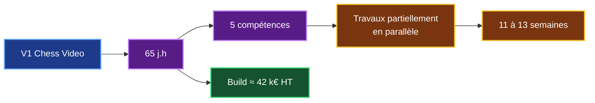
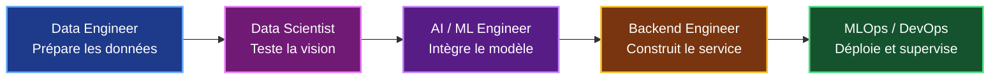
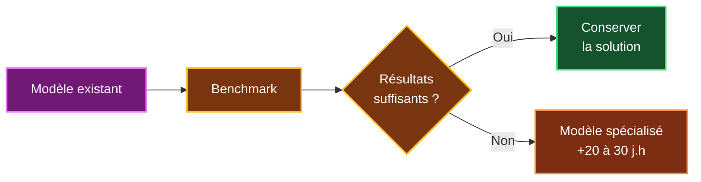
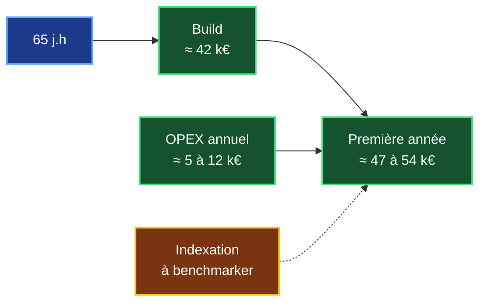
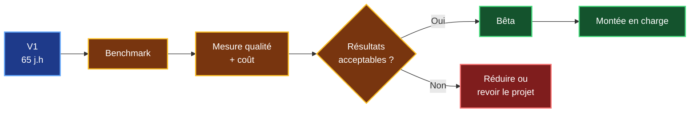

# 7. Faisabilité économique de Chess Video

## 7.1 Objectif et périmètre

Après avoir étudié la faisabilité technique de Chess Video, je dois maintenant déterminer si sa réalisation est également **économiquement raisonnable**.

Cette partie traduit la solution envisagée en :

- charge de travail ;
- compétences nécessaires ;
- durée calendaire ;
- coût de développement ;
- coût d'exploitation.

L'objectif n'est pas de produire un devis définitif, mais d'obtenir une estimation suffisamment réaliste pour prendre une décision.

Le scénario étudié correspond à une **V1 sur un périmètre contrôlé**.

Cette V1 doit permettre d'analyser en amont des vidéos pédagogiques principalement basées sur des échiquiers numériques 2D, de construire un index des positions et de permettre ensuite à Chess Agent de retrouver une vidéo et son timestamp.

La référence économique retenue pour l'ensemble du dossier est :

| Indicateur | Référence |
|---|---:|
| **Charge V1** | **65 j.h** |
| **Durée calendaire** | **11 à 13 semaines** |
| **Durée simplifiée** | **≈ 3 mois** |
| **Build** | **≈ 42 000 € HT** |
| **OPEX annuel** | **≈ 5 000 à 12 000 € HT** |
| **Première année** | **≈ 47 000 à 54 000 € HT** |
| Indexation initiale | **À benchmarker** |
| Modèle spécialisé éventuel | **+20 à 30 j.h** |

Il est important de distinguer **charge** et **durée**.

Les 65 jours.homme représentent la quantité totale de travail. Comme plusieurs compétences peuvent intervenir en parallèle, ces 65 j.h peuvent être répartis sur environ trois mois calendaires.



---

## 7.2 Ce que couvre l'estimation

Chess Video ne part pas de zéro.

Le POC Chess Agent dispose déjà de plusieurs composants réutilisables :

| Besoin | Déjà présent dans Chess Agent |
|---|---|
| Backend | FastAPI |
| Orchestration | LangGraph |
| Gestion des positions | `python-chess` |
| Base documentaire | MongoDB |
| Recherche vectorielle | Milvus |
| RAG | Oui |
| Recherche vidéo | YouTube |
| Interface utilisateur | Angular |
| Conteneurisation | Docker |

L'investissement porte donc principalement sur les nouvelles fonctions nécessaires à Chess Video :

| Inclus dans la V1 | Hors V1 |
|---|---|
| Pipeline vidéo | Reconnaissance universelle |
| Sélection des frames utiles | Échiquiers physiques complexes |
| Préparation OpenCV | Modèle spécialisé créé de zéro |
| Modèle de vision existant | Très grande échelle |
| Reconstruction des positions | GPU permanent |
| Timeline et timestamps | Catalogue illimité |
| Index des positions | Industrialisation massive |
| FastMCP | |
| Benchmark | |
| Déploiement initial | |

Cette réutilisation permet de concentrer l'investissement sur **le nouveau module Chess Video** plutôt que de reconstruire l'ensemble de Chess Agent.

---

## 7.3 Compétences et répartition du travail

Cinq ensembles de compétences sont nécessaires pour construire la V1.

Ces rôles permettent de répartir clairement les responsabilités entre la préparation des données, la vision, l'intégration de l'IA, le développement du service et son déploiement.

Ils ne correspondent pas obligatoirement à cinq personnes différentes. Dans une petite équipe, une même personne peut assurer plusieurs de ces rôles.

| Métier | Travail réalisé dans Chess Video | Charge |
|---|---|---:|
| **Data Engineer** | Construit le pipeline d'acquisition des vidéos, extrait et sélectionne les frames utiles, conserve les timestamps et prépare les données qui seront envoyées à la vision. | **14 j.h** |
| **Data Scientist / Computer Vision** | Expérimente les solutions OpenCV et les modèles de vision, teste la détection de l'échiquier et la reconnaissance des pièces, puis compare leur précision pendant le benchmark. | **15 j.h** |
| **AI / ML Engineer** | Intègre le modèle retenu dans le pipeline, transforme ses résultats en positions exploitables, gère les scores de confiance et l'abstention, utilise `python-chess` pour les contrôles et optimise l'inférence. | **12 j.h** |
| **Backend / AI Engineer** | Construit l'index des positions et timestamps, développe la recherche d'une position, expose Chess Video avec FastMCP et réalise la connexion avec Chess Agent. | **13 j.h** |
| **MLOps / DevOps Engineer** | Prépare les environnements et la CI/CD, conteneurise et déploie Chess Video, configure les ressources nécessaires et met en place les logs, la supervision et les sauvegardes. | **11 j.h** |
| **TOTAL** | | **65 j.h** |

La séparation peut être résumée simplement :



Le **Data Engineer prépare les données**, le **Data Scientist recherche et évalue la solution de vision**, l'**AI / ML Engineer transforme cette solution en composant utilisable**, le **Backend Engineer construit le service accessible par Chess Agent** et le **MLOps / DevOps Engineer permet de déployer et d'exploiter l'ensemble**.

### Répartition par activité

Les 65 j.h peuvent également être présentés par activité.

| Phase | Charge |
|---|---:|
| Cadrage | **3 j.h** |
| Fondations MLOps | **4 j.h** |
| Pipeline vidéo | **5 j.h** |
| Sélection des frames | **4 j.h** |
| OpenCV / préparation du plateau | **6 j.h** |
| Expérimentation vision | **8 j.h** |
| Intégration AI / ML | **5 j.h** |
| Validation `python-chess` | **3 j.h** |
| Timeline et timestamps | **3 j.h** |
| Index et recherche | **4 j.h** |
| FastMCP | **3 j.h** |
| Intégration Chess Agent | **4 j.h** |
| Benchmark | **8 j.h** |
| Industrialisation initiale | **5 j.h** |
| **TOTAL** | **65 j.h** |

Les deux tableaux décrivent donc les mêmes 65 j.h sous deux angles différents :

- le premier indique **qui intervient** ;
- le second indique **sur quelles activités le temps est consacré**.

Cette répartition constitue la **référence unique du dossier**.

---

## 7.4 Organisation et planning

Les 65 jours.homme ne correspondent pas à 65 jours calendaires.

Certaines tâches peuvent être réalisées partiellement en parallèle.

Par exemple, les fondations MLOps peuvent être préparées pendant le démarrage du pipeline vidéo. De la même manière, certaines parties du Backend peuvent commencer avant la fin complète des expérimentations de vision.

Le planning retenu est donc compris entre **11 et 13 semaines**, soit environ **3 mois**.

| Période | Travaux dominants | Compétences principalement mobilisées |
|---|---|---|
| **S1** | Cadrage et démarrage MLOps | Équipe + MLOps |
| **S2-S3** | Pipeline vidéo et sélection des frames | Data Engineer |
| **S4-S6** | OpenCV et expérimentation vision | Data Scientist / CV |
| **S6-S7** | Intégration du modèle et validation | AI / ML Engineer |
| **S7-S9** | Timeline, index, FastMCP et intégration | Data + Backend |
| **S9-S11** | Benchmark et corrections | Data Scientist + AI / ML |
| **S11-S12** | Déploiement et supervision | MLOps / DevOps |
| **S12-S13** | Stabilisation et marge projet | Équipe |

```mermaid
flowchart LR
    A["S1<br/>Cadrage"]
    B["S2-S3<br/>Pipeline"]
    C["S4-S6<br/>Vision"]
    D["S6-S7<br/>AI / ML"]
    E["S7-S9<br/>Backend + MCP"]
    F["S9-S11<br/>Benchmark"]
    G["S11-S12<br/>Déploiement"]
    H["S12-S13<br/>Stabilisation"]

    A --> B --> C --> D --> E --> F --> G --> H

    classDef start fill:#1E3A8A,stroke:#60A5FA,color:#FFFFFF,stroke-width:2px
    classDef data fill:#374151,stroke:#9CA3AF,color:#FFFFFF,stroke-width:2px
    classDef ai fill:#701A75,stroke:#E879F9,color:#FFFFFF,stroke-width:2px
    classDef mcp fill:#581C87,stroke:#C084FC,color:#FFFFFF,stroke-width:2px
    classDef benchmark fill:#78350F,stroke:#FBBF24,color:#FFFFFF,stroke-width:2px
    classDef finish fill:#14532D,stroke:#4ADE80,color:#FFFFFF,stroke-width:2px

    class A start
    class B data
    class C,D ai
    class E mcp
    class F benchmark
    class G data
    class H finish
```



Ce planning reste **prévisionnel**.

Le benchmark constitue une étape importante : si la reconnaissance visuelle nécessite davantage d'itérations, le planning devra être ajusté.

> **Le parallélisme réduit la durée calendaire, mais ne réduit pas la charge totale de 65 j.h.**

---

## 7.5 Coût de développement de la V1

Pour transformer la charge en budget, j'utilise des TJM représentatifs de profils techniques expérimentés.

Ces valeurs sont des **hypothèses d'étude** et non des devis contractuels.

| Profil | Charge | TJM retenu | Coût |
|---|---:|---:|---:|
| Data Engineer | 14 j | 550 € | **7 700 €** |
| Data Scientist / CV | 15 j | 650 € | **9 750 €** |
| AI / ML Engineer | 12 j | 600 € | **7 200 €** |
| Backend / AI Engineer | 13 j | 550 € | **7 150 €** |
| MLOps / DevOps Engineer | 11 j | 600 € | **6 600 €** |
| **TOTAL** | **65 j.h** | | **38 400 € HT** |

Le coût humain estimé est donc de :

> ## **38 400 € HT**

### Réserve projet

Je conserve une réserve de **10 %** afin de couvrir une difficulté imprévue, par exemple :

- une itération supplémentaire sur la vision ;
- un benchmark plus long ;
- une difficulté d'intégration ;
- un ajustement de l'infrastructure.

Le calcul est :

```text
38 400 € × 10 % = 3 840 €
```

Le Build prévisionnel devient donc :

```text
38 400 € + 3 840 € = 42 240 €
```

Pour simplifier la lecture du dossier, je retiens :

> ## **Build Chess Video ≈ 42 000 € HT**

### Cas d'un modèle spécialisé

Cette estimation suppose que la V1 utilise d'abord **un modèle de vision existant**.

Si le benchmark démontre que cette solution est insuffisante, un modèle spécialisé pourra être étudié dans une seconde étape.

Cette évolution demanderait environ :

> **+20 à 30 j.h**

Cette charge supplémentaire n'est **pas comprise dans les 65 j.h de la V1**.



---

## 7.6 Volumétrie et coût d'indexation

Le coût d'exploitation dépend fortement du nombre de vidéos à analyser.

Pour disposer d'ordres de grandeur, je retiens une durée moyenne de **30 minutes par vidéo**.

| Scénario | Nombre de vidéos | Durée totale |
|---|---:|---:|
| Validation / lancement | **300** | **150 h** |
| Croissance | **2 000** | **1 000 h** |
| Catalogue important | **10 000** | **5 000 h** |

Ces valeurs servent à réfléchir à la montée en charge. Elles ne signifient pas que 10 000 vidéos seront indexées dès la V1.

### Pourquoi le filtrage des frames est important

Une vidéo de 30 minutes contient énormément d'images.

Avec un premier échantillonnage d'une image toutes les deux secondes :

```text
30 minutes = 1 800 secondes

1 800 / 2 = 900 frames par vidéo
```

Pour 300 vidéos :

```text
300 × 900 = 270 000 frames
```

Mais ces 270 000 images ne doivent pas toutes être envoyées au modèle de vision.

Le filtrage OpenCV doit réduire ce volume en supprimant les images correspondant à une position inchangée.


À ce stade, je ne dispose pas encore d'une mesure réelle du taux de réduction.

Je ne fixe donc pas artificiellement le coût d'indexation.

Le benchmark devra mesurer :

| Mesure | Utilité |
|---|---|
| Frames conservées / heure vidéo | Mesurer l'efficacité du filtrage |
| Temps d'indexation / heure vidéo | Mesurer les performances |
| CPU / GPU utilisé | Dimensionner l'infrastructure |
| Coût d'inférence | Comparer les modèles |
| **Coût / heure vidéo** | Calculer le coût réel d'un catalogue |

Le coût du catalogue initial pourra ensuite être calculé simplement :

```text
150 heures de vidéo
×
coût mesuré par heure
=
coût d'indexation initiale
```

> **Le coût d'indexation initiale reste donc à déterminer pendant le benchmark.**

Cette dépense est volontairement séparée du Build.

---

## 7.7 Coût d'exploitation

Une fois les vidéos indexées, la recherche utilisateur est beaucoup moins coûteuse puisqu'elle consulte principalement l'index existant.

Les dépenses récurrentes concernent surtout :

- l'hébergement du service Chess Video ;
- le stockage ;
- les sauvegardes ;
- les logs et la supervision ;
- les ressources de calcul utilisées lors de nouvelles indexations ;
- la maintenance humaine.

### Infrastructure

Pour un lancement limité, je retiens comme hypothèse :

> **100 à 400 € HT par mois**

Cette estimation devra être ajustée à partir des mesures du benchmark.

Il n'est notamment pas nécessaire de prévoir dès la V1 un GPU puissant fonctionnant en permanence.

Les ressources de calcul importantes peuvent être mobilisées principalement pendant les périodes d'indexation.

### Maintenance

Chess Video nécessitera également des interventions ponctuelles pour :

- les mises à jour ;
- les incidents ;
- la supervision ;
- les nouvelles interfaces graphiques rencontrées ;
- les évolutions éventuelles du modèle.

L'hypothèse retenue est de :

> **0,5 à 1 j.h par mois**

soit environ :

> **300 à 600 € HT par mois**

### OPEX total

| Poste | Mensuel | Annuel |
|---|---:|---:|
| Infrastructure | 100 à 400 € | 1 200 à 4 800 € |
| Maintenance | 300 à 600 € | 3 600 à 7 200 € |
| **TOTAL** | **400 à 1 000 €** | **4 800 à 12 000 €** |

Pour simplifier le dossier, je retiens :

> ## **OPEX ≈ 5 000 à 12 000 € HT par an**

---

## 7.8 Coût de la première année

Le coût de première année rassemble le Build et les dépenses d'exploitation.

| Poste | Montant |
|---|---:|
| Coût humain | **38 400 € HT** |
| Réserve projet | **3 840 € HT** |
| **Build arrondi** | **≈ 42 000 € HT** |
| OPEX première année | **≈ 5 000 à 12 000 € HT** |
| **TOTAL première année** | **≈ 47 000 à 54 000 € HT** |
| Indexation initiale | **À mesurer pendant le benchmark** |

La première année représente donc environ :

> ## **47 000 à 54 000 € HT**

hors coût d'indexation initiale.

Cette distinction est importante car je ne dispose pas encore des mesures nécessaires pour calculer sérieusement le coût d'analyse de 150 heures de vidéo.

L'étude évite donc de présenter un chiffre artificiellement précis.

### Synthèse économique



---

## 7.9 Conclusion de faisabilité économique

L'étude économique montre qu'une première version de Chess Video peut être envisagée avec un investissement limité par rapport au développement d'un produit complet.

La référence retenue est :

| Indicateur | Valeur |
|---|---:|
| **Charge totale V1** | **65 j.h** |
| **Durée** | **11 à 13 semaines** |
| **Build** | **≈ 42 000 € HT** |
| **OPEX annuel** | **≈ 5 000 à 12 000 € HT** |
| **Première année** | **≈ 47 000 à 54 000 € HT** |
| Indexation initiale | **À benchmarker** |
| Modèle spécialisé éventuel | **+20 à 30 j.h** |

Le principal point encore inconnu est **le coût réel d'indexation d'une heure de vidéo**.

Ce coût dépendra notamment :

- du nombre de frames conservées après filtrage ;
- du modèle de vision choisi ;
- du temps d'inférence ;
- des ressources CPU ou GPU nécessaires.

Il devra donc être mesuré pendant le benchmark avant une montée en charge importante.

La démarche économique retenue est progressive :



La conclusion économique est donc :

> ## **GO économique pour une V1 contrôlée estimée à environ 42 000 € HT de Build.**

La montée en charge reste cependant conditionnée aux résultats du benchmark, en particulier au **coût réel d'indexation par heure de vidéo**.

Cette approche permet de limiter l'investissement initial : je construis d'abord une V1, je mesure son fonctionnement réel, puis je décide si son industrialisation est économiquement justifiée.