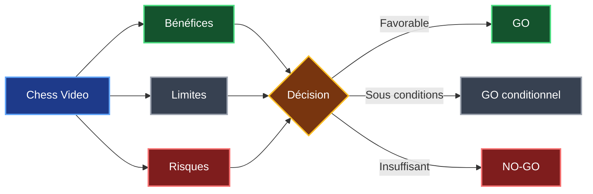
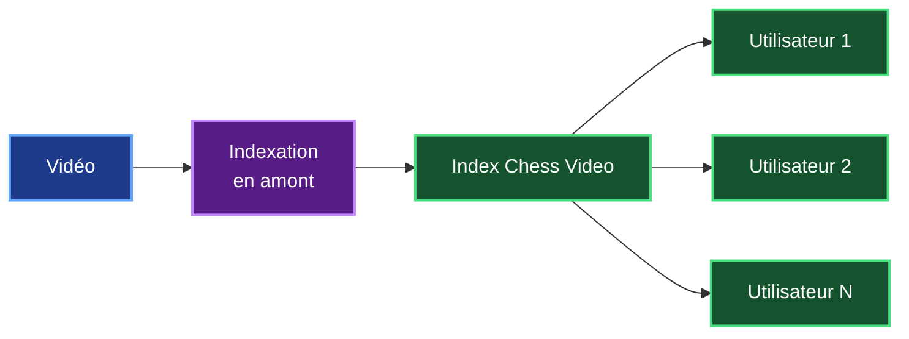
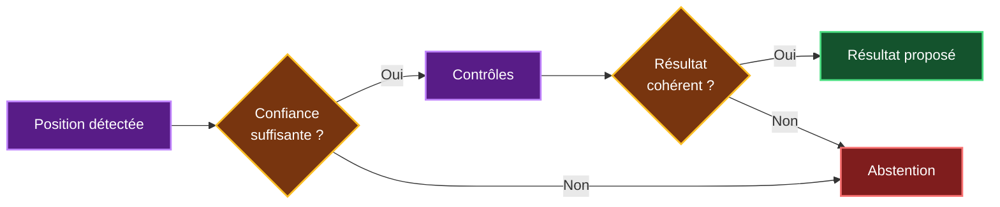
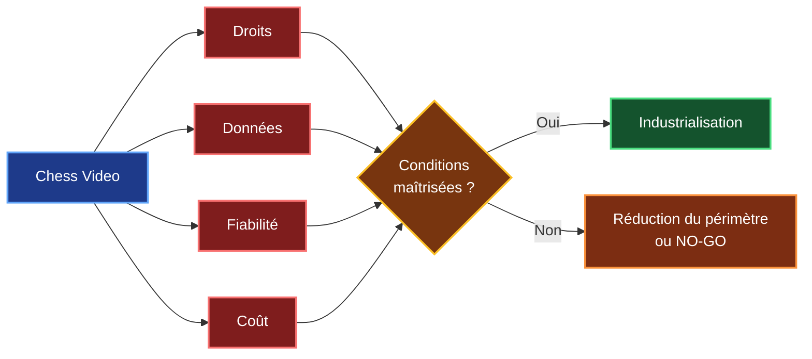
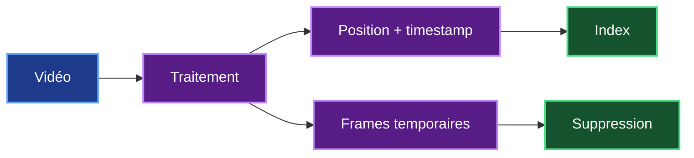
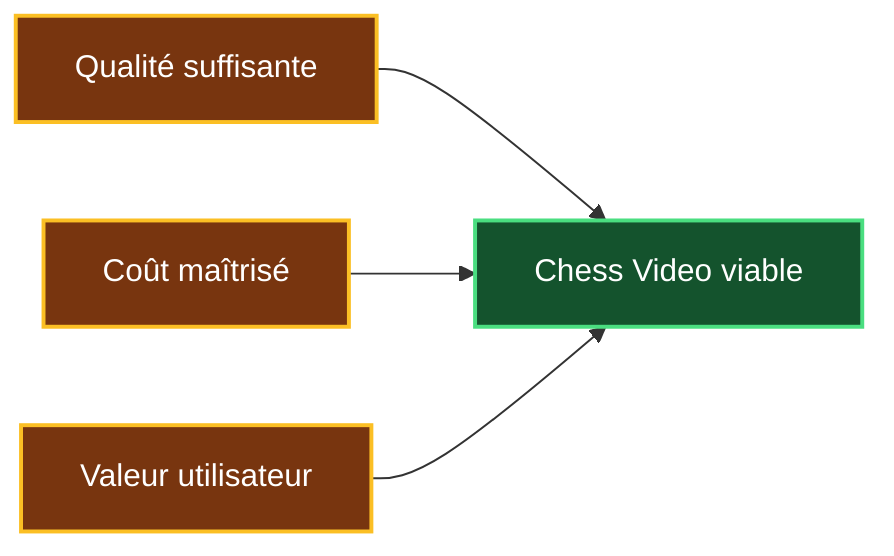
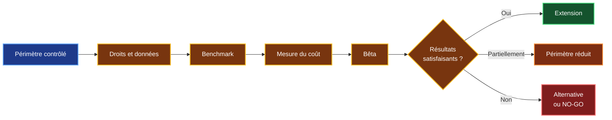

# 8. Bénéfices, limites et risques de Chess Video

## 8.1 Objectif

Les chapitres précédents m'ont permis de définir le besoin, les technologies, l'architecture, la faisabilité technique et le coût prévisionnel de Chess Video.

Je cherche maintenant à prendre du recul sur la solution.

Cette partie doit répondre à trois questions :

1. **Quelle valeur Chess Video apporte-t-il réellement à Chess Agent ?**
2. **Quelles limites dois-je accepter pour une première version ?**
3. **Quels risques peuvent remettre en cause le développement ou l'industrialisation ?**

Toutes les difficultés n'ont pas la même importance.

Une précision temporelle légèrement imparfaite ou un thème graphique mal reconnu peuvent être corrigés ou intégrés aux limites de la V1.

En revanche, l'absence de droits sur les vidéos, une reconnaissance insuffisamment fiable ou un coût d'exploitation trop élevé peuvent remettre directement en cause le projet.



---

## 8.2 Bénéfice principal : accéder directement au bon passage

Chess Agent sait déjà rechercher une vidéo en rapport avec une ouverture ou une position.

Le système peut donc répondre à une question du type :

> **« Quelle vidéo peut m'aider à comprendre cette position ? »**

La limite actuelle est que l'utilisateur doit ensuite parcourir lui-même la vidéo pour retrouver le passage qui l'intéresse.

Chess Video ajoute cette information manquante.


Un résultat pourrait par exemple devenir :

```text
Vidéo : Comprendre la défense sicilienne
Position : retrouvée
Passage : 18 min 24 s
```

Le bénéfice principal de Chess Video est donc :

> **passer d'une vidéo pertinente à un passage réellement associé à la position étudiée.**

### Une recherche plus précise

La recherche vidéo actuelle repose principalement sur des informations générales comme le titre, la description, l'ouverture ou les mots-clés.

Chess Video apporte une information différente : **la position apparaît réellement dans le contenu de la vidéo**.

| Recherche actuelle | Avec Chess Video |
|---|---|
| Vidéo pertinente pour le thème | Passage pertinent dans la vidéo |
| Recherche par métadonnées | Recherche par position |
| Granularité vidéo | Granularité passage |
| Réponse générale | Réponse contextualisée |

Chess Video ne remplace donc pas la recherche vidéo existante de Chess Agent.

Il **la complète**.

### Un intérêt pédagogique

Chess Agent combine déjà plusieurs sources autour d'une position.

| Source | Apport |
|---|---|
| Stockfish | Évaluation de la position |
| Statistiques | Fréquence et résultats |
| RAG | Informations documentaires |
| IA | Explication pédagogique |
| Recherche vidéo | Ressource audiovisuelle |
| **Chess Video** | **Passage vidéo directement lié à la position** |

Le passage vidéo peut notamment aider l'utilisateur à comprendre les idées stratégiques, les variantes ou le raisonnement expliqué par un formateur.

---

## 8.3 Bénéfice de l'indexation en amont

L'un des choix importants de Chess Video est de séparer **l'indexation** de **la recherche utilisateur**.

L'analyse visuelle, qui représente le traitement le plus coûteux, est réalisée avant la demande utilisateur.



Une vidéo peut donc être analysée une fois puis interrogée plusieurs fois.

Lorsqu'un utilisateur effectue une recherche, Chess Video n'a pas besoin de relancer l'analyse visuelle de la vidéo.

Cette organisation apporte deux avantages :

| Avantage | Conséquence |
|---|---|
| Analyse réalisée une seule fois | Le coût de vision n'est pas répété à chaque recherche |
| Index déjà disponible | La recherche utilisateur peut rester rapide |

Le coût de l'indexation reste cependant un élément important à mesurer pendant le benchmark.

---

## 8.4 Bénéfice architectural de MCP

Chess Video est conçu comme un service indépendant de Chess Agent.

Chess Agent utilise un client MCP pour interroger les fonctions exposées par Chess Video avec FastMCP.

Pour le parcours utilisateur de la V1, l'interface principale peut rester simple :

```text
video.search_position
```

Le fonctionnement est alors :


Cette séparation permet de faire évoluer Chess Video sans intégrer toute sa logique directement dans Chess Agent.

Par exemple, le modèle de vision ou la stratégie de stockage peuvent évoluer sans modifier le principe de l'appel effectué par Chess Agent.

MCP apporte donc principalement :

- un découplage entre les deux applications ;
- une interface claire ;
- une meilleure modularité ;
- la possibilité de faire évoluer Chess Video indépendamment.

L'indexation reste un traitement réalisé **en amont** et n'est pas déclenchée par une recherche utilisateur.

---

## 8.5 Limites de la V1

Chess Video ne pourra pas reconnaître immédiatement toutes les positions dans toutes les vidéos d'échecs.

La première version doit rester volontairement limitée.

### Variabilité des vidéos

Les vidéos peuvent présenter de nombreuses différences visuelles.

| Variation | Conséquence possible |
|---|---|
| Thème graphique | Pièces ou cases moins bien reconnues |
| Orientation | Risque d'inversion du plateau |
| Résolution | Perte de détails |
| Compression | Artefacts dans l'image |
| Flèches et annotations | Pièces partiellement masquées |
| Overlays | Plateau partiellement caché |
| Animations | Images intermédiaires |
| Zoom | Géométrie variable |

Le périmètre initial reste donc principalement :

> **des échiquiers numériques 2D avec des interfaces suffisamment représentées dans le benchmark.**

Les échiquiers physiques et la reconnaissance universelle restent hors périmètre de la V1.

### La position doit être entièrement correcte

Une bonne précision moyenne par case ne suffit pas.

Sur 64 cases :

```text
63 cases correctes / 64
=
98,4 % de précision
```

Pourtant, si une pièce est incorrecte, la position reconnue est différente.

La métrique principale doit donc être :

> **le pourcentage de positions entièrement correctes.**

### Limites de `python-chess`

`python-chess` peut détecter certaines incohérences échiquéennes.

Il ne peut cependant pas vérifier qu'une position reconnue correspond réellement à l'image.

Une mauvaise reconnaissance peut produire une autre position parfaitement valide.

Son rôle reste donc :

> **un contrôle complémentaire et non une validation absolue de la vision.**

### Limites de la FEN

Une image permet principalement de reconnaître le placement des pièces.

Certaines informations d'une FEN complète ne sont pas directement visibles.

| Information | Visible sur une image ? |
|---|---|
| Placement des pièces | **Oui** |
| Joueur au trait | Pas toujours |
| Droits de roque | Pas toujours |
| Prise en passant | Non directement |
| Compteur de demi-coups | Non |
| Numéro du coup | Non |

La V1 peut donc commencer par utiliser une représentation principalement basée sur **le placement des pièces** lorsque cela suffit pour rechercher une position dans une vidéo.

### Précision temporelle

La précision du timestamp dépend également de la fréquence d'analyse des images.

Analyser davantage de frames améliore potentiellement la précision temporelle, mais augmente le coût.

```text
Plus de frames
     ↓
Timestamp plus précis
     ↓
Plus de calcul

Moins de frames
     ↓
Moins de calcul
     ↓
Timestamp moins précis
```

Le benchmark devra déterminer le meilleur compromis.

### Particularité des vidéos pédagogiques

Une vidéo pédagogique ne représente pas nécessairement une partie jouée chronologiquement.

Un formateur peut :

- présenter une variante ;
- revenir en arrière ;
- déplacer manuellement une pièce ;
- revenir à une position précédente.

Chess Video doit donc indexer **les positions réellement affichées dans la timeline**, sans supposer que chaque transition correspond obligatoirement à un coup légal depuis la position précédente.

---

## 8.6 Fiabilité, confiance et généralisation

La fiabilité constitue la principale limite technique du projet.

Deux erreurs sont particulièrement importantes :

| Erreur | Signification | Effet |
|---|---|---|
| **Faux positif** | Une position est annoncée alors qu'elle n'est pas présente | Mauvais passage |
| **Faux négatif** | Une position présente n'est pas retrouvée | Aucun résultat |

Le faux positif est le plus problématique.

Un utilisateur peut accepter qu'aucune correspondance ne soit trouvée.

Il est beaucoup plus gênant de l'envoyer vers un passage qui ne correspond pas à sa position.

La priorité retenue est donc :

> **fiabilité avant couverture maximale.**

### Confiance et abstention

Chess Video doit pouvoir refuser de proposer une correspondance lorsque la confiance est insuffisante.



L'abstention n'est donc pas considérée comme un échec.

Elle protège l'utilisateur contre un résultat présenté avec une fausse certitude.

### Généralisation

Une solution performante sur les vidéos utilisées pendant son développement peut devenir moins fiable sur de nouvelles vidéos.

Le benchmark doit donc obligatoirement contenir des vidéos **absentes du corpus de développement**.

Les tests devront notamment varier :

- les créateurs ;
- les thèmes graphiques ;
- les orientations ;
- les résolutions ;
- les annotations ;
- les overlays ;
- la compression.

Si les performances chutent trop fortement sur ces vidéos, le périmètre de Chess Video devra être réduit.

---

## 8.7 Risques du projet

Toutes les limites précédentes ne remettent pas directement le projet en cause.

Je distingue donc trois niveaux de risque.

| Niveau | Signification |
|---|---|
| 🔴 **Critique** | Peut empêcher l'industrialisation |
| 🟠 **Important** | Peut fortement dégrader la solution |
| 🟢 **Maîtrisable** | Difficulté normale de développement |

### Les quatre risques critiques

Quatre risques peuvent réellement remettre en cause Chess Video.

| Risque critique | Pourquoi il est déterminant | Réponse principale |
|---|---|---|
| 🔴 **Droits sur les vidéos** | Sans contenu exploitable légalement, le catalogue ne peut pas exister | Utiliser des sources autorisées |
| 🔴 **Données personnelles** | Une exploitation non conforme peut empêcher la production | Minimisation et suppression |
| 🔴 **Fiabilité** | Une mauvaise reconnaissance conduit au mauvais passage | Benchmark, confiance et abstention |
| 🔴 **Viabilité économique** | Un coût d'indexation trop élevé peut rendre le service non viable | Mesurer le coût par heure vidéo |



### Droits sur les vidéos

Une vidéo accessible publiquement n'est pas automatiquement librement téléchargeable, analysable, stockable ou réutilisable dans un service commercial.

Chess Video doit donc travailler avec des sources dont le traitement est autorisé.

Les sources privilégiées seront :

- les vidéos appartenant au projet ;
- les contenus fournis par des partenaires ;
- les fichiers explicitement autorisés ;
- les autres sources dont les conditions permettent le traitement prévu.

Une validation juridique adaptée devra être réalisée avant une exploitation commerciale.

> **Sans catalogue légalement exploitable, Chess Video ne peut pas être industrialisé.**

### Données personnelles

Une vidéo peut contenir un visage, une voix, un pseudonyme ou d'autres informations concernant une personne.

Chess Video n'a pas besoin de conserver ces éléments pour construire son index.

Le principe retenu est donc la **minimisation**.



Les frames temporaires devront être supprimées lorsqu'elles ne sont plus nécessaires et les accès aux données devront être contrôlés.

Une analyse juridique et RGPD adaptée au fonctionnement final devra être réalisée avant la production commerciale.

### Fiabilité

Une erreur de vision peut se propager jusqu'à l'utilisateur :

```text
Mauvaise reconnaissance
        ↓
Mauvaise position
        ↓
Mauvaise correspondance
        ↓
Mauvais timestamp
        ↓
Perte de confiance
```

Les principales protections prévues sont :

| Protection | Rôle |
|---|---|
| Benchmark sur vidéos inconnues | Mesurer la généralisation |
| Position entièrement correcte | Mesurer la qualité réelle |
| Score de confiance | Quantifier l'incertitude |
| Validation sur plusieurs frames | Éviter les états intermédiaires |
| `python-chess` | Détecter certaines incohérences |
| Abstention | Éviter les résultats douteux |

Si la fiabilité reste insuffisante, le périmètre devra être réduit.

### Viabilité économique

La référence économique du projet reste celle définie au chapitre 7.

| Indicateur | Valeur |
|---|---:|
| **Charge V1** | **65 j.h** |
| **Durée** | **11 à 13 semaines** |
| **Build** | **≈ 42 000 € HT** |
| **OPEX annuel** | **≈ 5 000 à 12 000 € HT** |
| **Première année** | **≈ 47 000 à 54 000 € HT** |
| Indexation initiale | **À benchmarker** |

Le principal élément économique encore inconnu est :

> **le coût réel d'indexation d'une heure de vidéo.**

Il devra être mesuré pendant le benchmark avant toute montée en charge importante.

### Risques importants

D'autres risques sont importants sans constituer immédiatement un blocage.

| Risque | Effet possible | Réponse |
|---|---|---|
| 🟠 Généralisation insuffisante | Baisse de précision | Tests sur vidéos inconnues |
| 🟠 Dépendance à un fournisseur IA | Prix ou modèle modifié | Architecture interchangeable |
| 🟠 Sécurité des fichiers | Fichier invalide ou malveillant | Validation et isolation |
| 🟠 Faible adoption | Fonction peu utilisée | Bêta utilisateur |
| 🟠 Surinvestissement | Budget engagé trop tôt | Développement progressif |
| 🟠 Montée en charge | Hausse des besoins CPU/GPU | Mesurer puis adapter l'infrastructure |

Les difficultés comme les animations, la précision temporelle, les erreurs temporaires ou les thèmes non supportés sont considérées comme **des problèmes techniques à tester et corriger**, plutôt que comme des risques stratégiques.

---

## 8.8 Synthèse et décision

La proposition de valeur de Chess Video est claire :

> **transformer une vidéo pertinente en un passage réellement associé à la position étudiée.**

La réussite du service dépend cependant d'un équilibre entre trois dimensions.



Une solution très précise mais trop coûteuse n'est pas viable.

Une solution peu coûteuse mais peu fiable n'apporte pas suffisamment de valeur.

Enfin, une solution techniquement excellente mais peu utilisée ne justifie pas une industrialisation importante.

### Validation par une bêta

Après le benchmark technique, une bêta devra donc vérifier la valeur réelle pour les utilisateurs.

| Indicateur | Ce qu'il permet de vérifier |
|---|---|
| Taux de clic sur les vidéos | Intérêt pour la ressource |
| Utilisation du timestamp | Valeur du passage précis |
| Temps gagné | Efficacité du parcours |
| Satisfaction | Pertinence perçue |
| Erreurs signalées | Qualité réelle |
| Réutilisation | Intérêt dans la durée |

### Matrice de décision

| Dimension | Condition attendue | Décision si insuffisante |
|---|---|---|
| Droits vidéo | Catalogue exploitable légalement | Réduire ou changer les sources |
| Données personnelles | Traitement conforme et minimal | Corriger avant production |
| Fiabilité | Peu de faux positifs et précision suffisante | Réduire le périmètre |
| Coût | Indexation économiquement acceptable | Optimiser ou limiter le catalogue |
| Valeur utilisateur | Usage réel pendant la bêta | Revoir ou arrêter l'extension |

La démarche retenue reste progressive :



La conclusion de cette analyse est donc :

> ## **Les bénéfices de Chess Video justifient le développement d'une V1 et la réalisation du benchmark.**

L'industrialisation complète reste cependant conditionnée principalement à quatre validations :

1. **disposer de vidéos légalement exploitables ;**
2. **maîtriser les données personnelles ;**
3. **obtenir une reconnaissance suffisamment fiable ;**
4. **maintenir un coût d'indexation acceptable.**

La référence économique reste celle définie au chapitre précédent :

> **65 j.h de développement, 11 à 13 semaines, environ 42 000 € HT de Build et environ 47 000 à 54 000 € HT pour la première année, hors coût d'indexation initiale.**

La priorité reste donc de **fournir moins de résultats si nécessaire, mais de fournir des résultats suffisamment fiables pour conserver la confiance de l'utilisateur**.

Le chapitre suivant peut maintenant étudier les alternatives possibles et déterminer dans quels cas une autre approche pourrait compléter ou remplacer une partie de la reconnaissance visuelle.