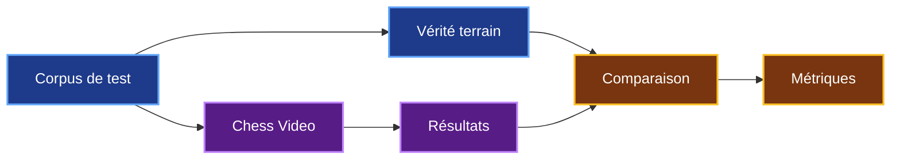
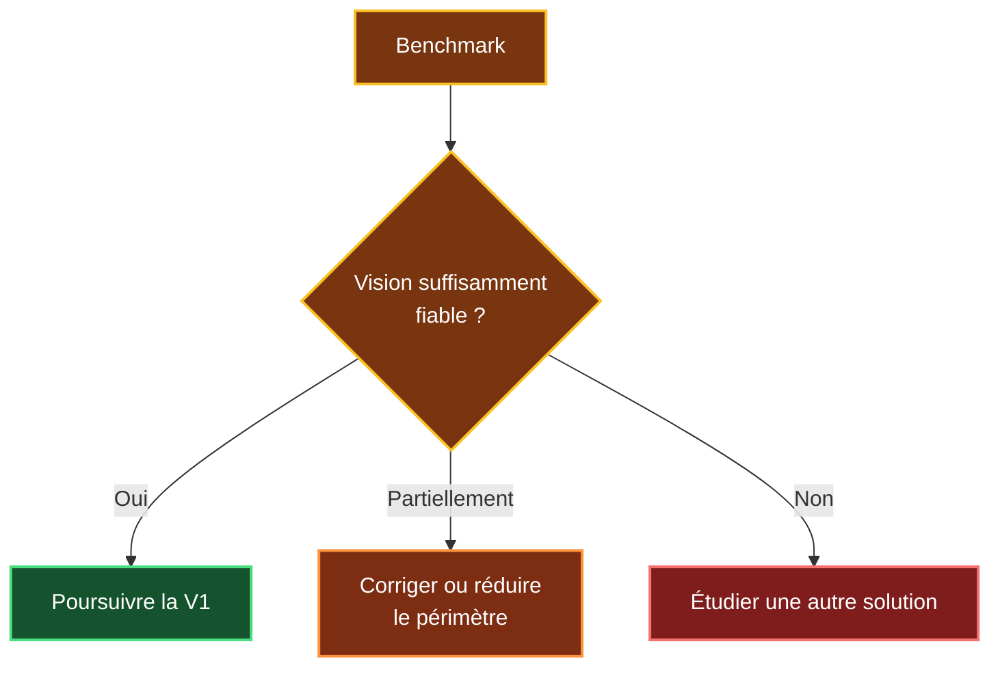
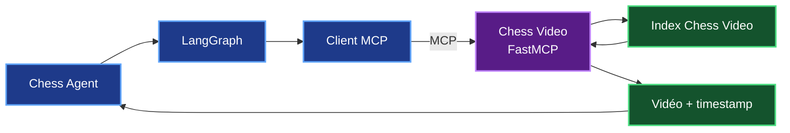
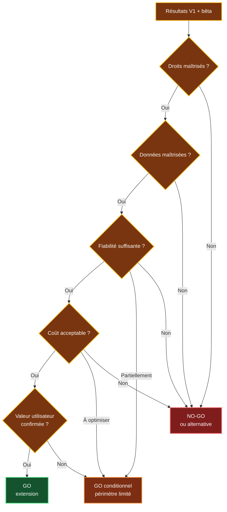

# 9. Plan de développement de Chess Video

## 9.1 Objectif du plan

Chess Agent dispose déjà d'un POC fonctionnel avec FastAPI, LangGraph, `python-chess`, Stockfish, MongoDB, Milvus, Angular et Docker.

Le plan de développement ne consiste donc pas à reconstruire Chess Agent.

Il concerne uniquement la création du nouveau module :

> **Chess Video**

Mon objectif est de développer Chess Video progressivement afin de **valider les points les plus risqués avant d'engager davantage de temps et de budget**.

La démarche retenue est :


Le principe est simple :

> **Je ne cherche pas à industrialiser Chess Video avant d'avoir mesuré sa précision, son coût et sa valeur pour l'utilisateur.**

---

## 9.2 Les grandes étapes du développement

Je retiens huit étapes principales.

| Étape | Objectif principal |
|---|---|
| **1. Cadrage** | Définir précisément la V1 |
| **2. Fondations MLOps** | Préparer un environnement de développement fiable |
| **3. Pipeline vidéo** | Extraire les frames utiles et leurs timestamps |
| **4. Vision / IA** | Reconnaître les positions |
| **5. Benchmark** | Mesurer qualité, temps et coût |
| **6. Chess Video + MCP** | Construire le service et le connecter à Chess Agent |
| **7. Bêta** | Vérifier l'intérêt dans des conditions réelles |
| **8. Décision** | Étendre, limiter ou arrêter |

Cette organisation permet de traiter d'abord **les plus grandes incertitudes techniques**, en particulier la reconnaissance visuelle.

---

## 9.3 Étapes 1 et 2 : cadrage et préparation

### Cadrage

La première étape consiste à définir précisément ce que Chess Video doit supporter.

Je dois notamment fixer :

- les sources vidéo autorisées ;
- le type d'échiquier supporté ;
- les formats acceptés ;
- la représentation des positions ;
- les règles de conservation des données ;
- les critères de confiance ;
- les métriques du benchmark ;
- les critères permettant de décider d'un GO ou d'un NO-GO.

Le périmètre initial reste volontairement limité.

| Contenu | V1 |
|---|---|
| Échiquier numérique 2D | **Oui** |
| Orientation Blancs / Noirs | **Oui** |
| Plusieurs thèmes | **À benchmarker** |
| Flèches et annotations | **À tester** |
| Plateau fortement masqué | **Non prioritaire** |
| Échiquier physique | **Hors V1** |
| Toutes les vidéos d'échecs | **Hors périmètre** |

### Fondations MLOps

Le MLOps / DevOps intervient également dès le début afin de préparer un environnement reproductible.

Son rôle initial concerne notamment :

- le dépôt Git ;
- la CI/CD ;
- Docker ;
- les environnements ;
- les secrets ;
- le stockage des données ;
- le stockage des artefacts ;
- les sauvegardes.

Les vidéos et datasets volumineux ne doivent pas être conservés directement dans Git.

Le principe est :

```text
Git
↓
Code + configuration

Stockage dédié
↓
Vidéos + données de test

Artefacts
↓
Modèles + versions

Base de données
↓
Positions + timestamps
```

Ces deux premières étapes permettent de commencer le développement sur des bases propres avant de travailler sur la vision.

---

## 9.4 Étapes 3 et 4 : pipeline vidéo et vision

### Pipeline vidéo

Le Data Engineer construit d'abord la chaîne permettant de transformer une vidéo en frames exploitables avec leurs timestamps.


L'objectif est notamment d'éviter d'envoyer inutilement de nombreuses images identiques au modèle de vision.

Une vidéo de 30 minutes analysée toutes les deux secondes représente déjà :

```text
30 × 60 / 2 = 900 frames
```

La détection des changements doit réduire ce nombre avant l'appel au modèle.

### Computer Vision

Le Data Scientist / Computer Vision travaille ensuite sur la reconnaissance du plateau.

La chaîne devient :


Pour la V1, je privilégie **un modèle de vision existant**.

Le développement d'un modèle spécialisé ne sera envisagé que si les résultats montrent qu'il est nécessaire.

L'AI / ML Engineer intervient ensuite pour transformer le modèle retenu en composant réellement utilisable dans le pipeline :

- intégration du modèle ;
- format des entrées et sorties ;
- gestion du score de confiance ;
- abstention ;
- optimisation des inférences ;
- contrôles avec `python-chess`.

---

## 9.5 Étape 5 : benchmark

Le benchmark constitue **la première grande porte de décision du projet**.

Avant de construire toute l'intégration finale, je dois vérifier que le cœur de Chess Video fonctionne suffisamment bien.

Le benchmark doit utiliser un corpus comportant notamment :

- plusieurs thèmes graphiques ;
- différentes orientations ;
- plusieurs résolutions ;
- des annotations ;
- de la compression ;
- des vidéos absentes du corpus de développement.

Pour chaque extrait, je dois disposer d'une vérité terrain :

```text
position réelle
+
timestamp réel
```

Le principe est :



Les principales mesures sont :

| Indicateur | Ce que je veux vérifier |
|---|---|
| **Positions entièrement correctes** | Qualité réelle de la reconnaissance |
| **Faux positifs** | Risque de retourner un mauvais passage |
| **Timestamp** | Précision temporelle |
| **Taux d'abstention** | Prudence du système |
| **Frames analysées / heure** | Efficacité du filtrage |
| **Temps d'indexation / heure** | Performance |
| **Coût / heure vidéo** | Viabilité économique |
| **Vidéos inconnues** | Généralisation |

Les quatre indicateurs les plus importants sont :

> **position correcte + faux positifs + temps d'indexation + coût par heure vidéo**

### Première décision

Après ce benchmark :



Si un modèle existant est insuffisant, le développement d'un modèle spécialisé pourra alors être étudié.

Cette évolution représente environ :

> **+20 à 30 jours.homme**

et n'est pas comprise dans la charge de la V1.

---

## 9.6 Étape 6 : construction et intégration de Chess Video

Une fois la faisabilité de la vision suffisamment validée, les briques sont assemblées dans le service Chess Video.

Le pipeline d'indexation alimente l'index en amont :

```text
Vidéo
↓
Pipeline vidéo
↓
Vision
↓
Position + timestamp
↓
Index Chess Video
```

Le Backend / AI Engineer construit ensuite :

- l'index des positions ;
- le moteur de recherche ;
- l'interface FastMCP ;
- la connexion avec Chess Agent.

Pendant l'utilisation, le fonctionnement devient :



Pour la V1, la fonction MCP principale reste :

```text
video.search_position
```

Chess Agent n'a pas besoin de déclencher l'indexation pendant une recherche utilisateur.

L'index a déjà été préparé en amont.

### Déploiement

Le MLOps / DevOps intervient ensuite pour préparer l'exploitation :

- déploiement ;
- versionnement ;
- logs ;
- métriques ;
- supervision ;
- sauvegardes ;
- ressources CPU / GPU ;
- alertes.

Je ne prévois pas d'imposer dès la V1 une architecture complexe avec plusieurs workers ou une file distribuée.

Ces mécanismes pourront être ajoutés plus tard si le volume de vidéos le justifie.

---

## 9.7 Étapes 7 et 8 : bêta et décision

### Bêta limitée

Après l'intégration technique, une bêta permet de vérifier que Chess Video apporte réellement de la valeur.

Le lancement reste volontairement limité.

Le scénario économique étudié utilise un catalogue pouvant aller jusqu'à **environ 300 vidéos** pour une première exploitation contrôlée.

La bêta doit mesurer deux dimensions.

### Mesures techniques

| Indicateur | Objectif |
|---|---|
| Positions correctes | Vérifier la fiabilité réelle |
| Faux positifs | Éviter les mauvais passages |
| Timestamp | Vérifier la précision |
| Abstention | Mesurer la prudence |
| Temps d'indexation | Mesurer les performances |
| Coût d'indexation | Vérifier la viabilité |

### Mesures utilisateurs

| Indicateur | Question |
|---|---|
| Clic sur la vidéo | La ressource intéresse-t-elle ? |
| Utilisation du timestamp | Le passage précis est-il utile ? |
| Temps gagné | Le parcours est-il amélioré ? |
| Satisfaction | Le résultat est-il pertinent ? |
| Erreurs signalées | Le niveau de confiance est-il suffisant ? |

La bêta doit donc valider :

```text
Qualité technique
+
Coût
+
Valeur utilisateur
```

### Décision finale

La décision repose principalement sur les éléments étudiés dans le chapitre précédent.



Trois résultats sont donc possibles :

- **GO** : la solution peut être étendue ;
- **GO conditionnel** : Chess Video reste limité à un périmètre maîtrisé ;
- **NO-GO** : la solution doit être revue ou abandonnée sous cette forme.

---

## 9.8 Planning, métiers et synthèse

La charge de référence reste celle définie dans l'étude économique :

> **65 jours.homme**

Les métiers interviennent à différents moments du projet.

| Période | Travail principal | Métier dominant |
|---|---|---|
| **S1** | Cadrage | Équipe projet |
| **S1-S2** | Fondations techniques | MLOps / DevOps |
| **S2-S3** | Pipeline vidéo | Data Engineer |
| **S4-S6** | OpenCV et vision | Data Scientist / CV |
| **S6-S7** | Intégration du modèle | AI / ML Engineer |
| **S7-S9** | Index, FastMCP et connexion | Backend / AI Engineer |
| **S9-S11** | Benchmark et corrections | Plusieurs métiers |
| **S11-S12** | Déploiement et supervision | MLOps / DevOps |
| **S12-S13** | Stabilisation | Équipe projet |

```mermaid
flowchart LR
    A["S1<br/>Cadrage"]
    B["S1-S2<br/>MLOps"]
    C["S2-S3<br/>Data Engineering"]
    D["S4-S6<br/>Computer Vision"]
    E["S6-S7<br/>AI / ML"]
    F["S7-S9<br/>Backend + MCP"]
    G["S9-S11<br/>Benchmark"]
    H["S11-S12<br/>Déploiement"]
    I["S12-S13<br/>Stabilisation"]

    A --> B --> C --> D --> E --> F --> G --> H --> I

    classDef start fill:#1E3A8A,stroke:#60A5FA,color:#FFFFFF,stroke-width:2px
    classDef data fill:#374151,stroke:#9CA3AF,color:#FFFFFF,stroke-width:2px
    classDef ai fill:#701A75,stroke:#E879F9,color:#FFFFFF,stroke-width:2px
    classDef mcp fill:#581C87,stroke:#C084FC,color:#FFFFFF,stroke-width:2px
    classDef evaluation fill:#78350F,stroke:#FBBF24,color:#FFFFFF,stroke-width:2px
    classDef finish fill:#14532D,stroke:#4ADE80,color:#FFFFFF,stroke-width:2px

    class A start
    class B,C data
    class D,E ai
    class F mcp
    class G evaluation
    class H data
    class I finish
```



La répartition des charges reste :

| Métier | Charge |
|---|---:|
| Data Engineer | **14 j.h** |
| Data Scientist / Computer Vision | **15 j.h** |
| AI / ML Engineer | **12 j.h** |
| Backend / AI Engineer | **13 j.h** |
| MLOps / DevOps | **11 j.h** |
| **TOTAL** | **65 j.h** |

La durée prévisionnelle reste :

> **11 à 13 semaines, soit environ 3 mois.**

Le budget de référence reste :

| Indicateur | Valeur |
|---|---:|
| **Build** | **≈ 42 000 € HT** |
| **OPEX annuel** | **≈ 5 000 à 12 000 € HT** |
| **Première année** | **≈ 47 000 à 54 000 € HT** |
| Indexation initiale | **À benchmarker** |
| Modèle spécialisé éventuel | **+20 à 30 j.h** |

Le parallélisme entre certains métiers réduit la durée calendaire, mais ne modifie pas la charge totale de **65 jours.homme**.

### Tableau récapitulatif

| Étape | Bénéfice | Limite / risque | Réponse concrète |
|---|---|---|---|
| **Cadrage** | Évite de développer hors besoin | Mauvais périmètre | Définir précisément la V1 |
| **MLOps initial** | Travail reproductible | Charge dès le départ | Git, CI/CD, Docker |
| **Pipeline vidéo** | Automatise la préparation | Trop de frames | Filtrage des changements |
| **Vision** | Reconnaît les positions | Précision incertaine | Benchmark |
| **Modèle existant** | Développement plus rapide | Résultats à démontrer | Tester avant spécialisation |
| **Benchmark** | Décision basée sur des mesures | Temps nécessaire | Corpus représentatif |
| **MCP** | Sépare Chess Agent et Chess Video | Nouveau service | Interface simple |
| **Bêta** | Mesure la valeur utilisateur | Catalogue limité | Extension progressive |
| **Build** | V1 contrôlée | ≈ 42 k€ à engager | Décisions par étapes |
| **Modèle spécialisé** | Amélioration possible | +20 à 30 j.h | Seulement si nécessaire |

---

## Conclusion

Le plan de développement de Chess Video repose sur une progression volontairement prudente.

Je commence par préparer le projet et construire le pipeline vidéo.

Je teste ensuite le point le plus incertain : **la reconnaissance visuelle**.

Le benchmark doit alors me permettre de mesurer :

> **qualité + temps + coût**

Ce n'est qu'après cette première validation que je poursuis vers l'intégration complète avec Chess Agent.

Une bêta limitée permet ensuite de mesurer :

> **qualité technique + coût + valeur utilisateur**

La logique générale du projet devient donc :


La conclusion de ce chapitre est donc :

> **Chess Video doit être développé progressivement : définir le périmètre, construire le pipeline, valider la vision par benchmark, intégrer le service à Chess Agent, réaliser une bêta puis décider de la montée en charge.**

Cette organisation permet de **tester les principales incertitudes avant d'augmenter l'investissement** et de conserver une V1 cohérente avec la charge prévue de **65 jours.homme sur environ 3 mois**.