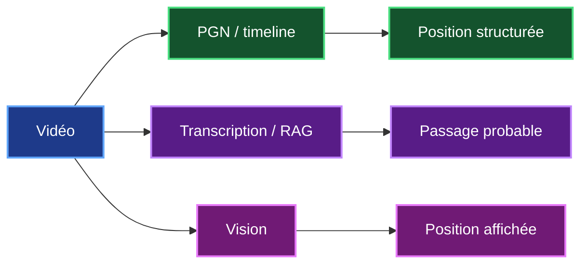
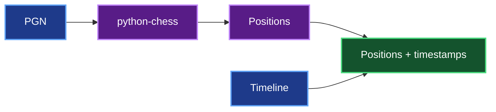
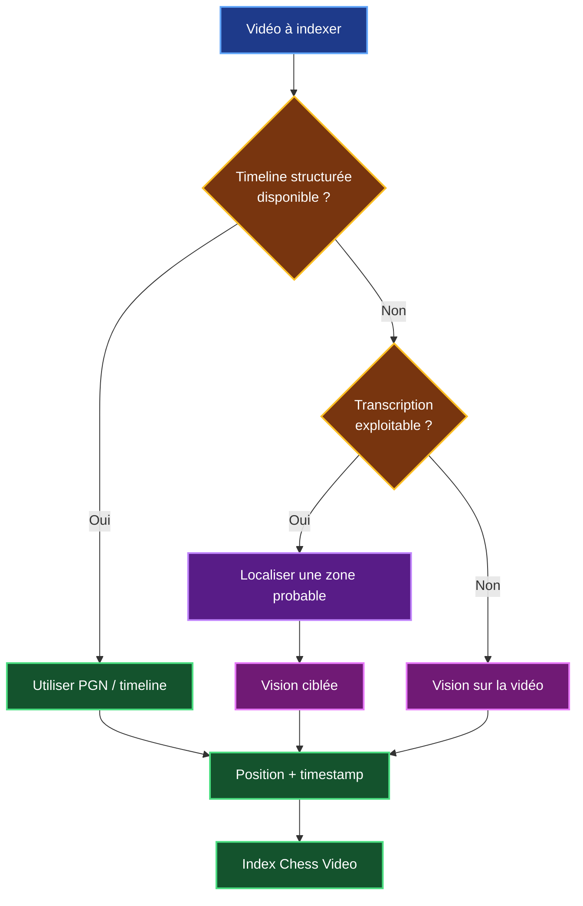
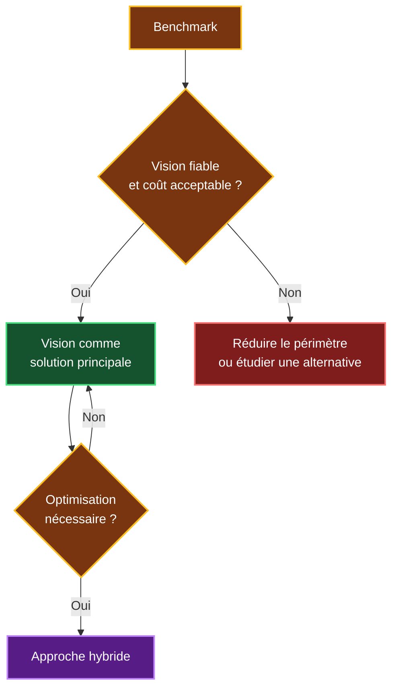
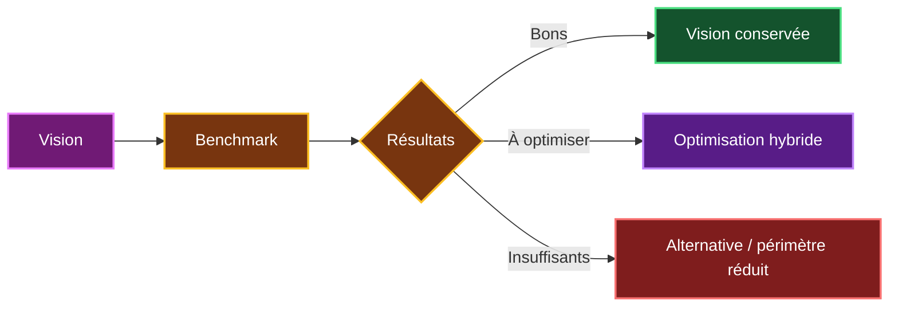

# 10. Alternatives et approche hybride de Chess Video

## 10.1 Pourquoi étudier des alternatives ?

La solution principale étudiée pour Chess Video repose sur la **Computer Vision**.

Son objectif est d'analyser les échiquiers présents dans les vidéos afin d'associer :

```text
Position
+
Vidéo
+
Timestamp
```

La vision répond directement au besoin de Chess Video puisqu'elle permet de vérifier qu'une position est réellement affichée dans une vidéo.

Cependant, c'est également la partie la plus incertaine et la plus coûteuse du projet.

Elle dépend notamment :

- de la qualité des vidéos ;
- des thèmes graphiques ;
- des annotations présentes à l'écran ;
- de la précision du modèle ;
- du nombre de frames analysées ;
- des ressources CPU, GPU ou API nécessaires.

Je dois donc vérifier s'il existe des solutions permettant de **compléter ou d'optimiser la vision**, sans remettre en cause le besoin principal de Chess Video.

---

## 10.2 Trois sources d'information possibles

J'ai identifié trois sources pouvant aider à retrouver un passage dans une vidéo.

| Source | Ce qu'elle permet d'obtenir | Limite principale |
|---|---|---|
| **PGN / timeline** | Position et timestamp à partir de données structurées | Ces données ne sont pas toujours disponibles |
| **Transcription / RAG** | Passage où une position ou une idée est expliquée | Ne prouve pas que la position est affichée |
| **Vision** | Position réellement visible dans la vidéo | Plus complexe et plus coûteuse |

Ces trois méthodes ne répondent donc pas exactement au même besoin.



La **vision reste la méthode de référence** lorsque je dois confirmer qu'une position apparaît réellement à l'écran.

Les deux autres méthodes peuvent cependant réduire le travail nécessaire dans certains cas.

---

## 10.3 Alternative 1 : utiliser un PGN ou une timeline

Certaines vidéos peuvent être accompagnées de données structurées décrivant la partie présentée.

Par exemple :

```text
00:45 → 1. e4
01:02 → ... c5
01:38 → 2. Nf3
02:04 → ... d6
```

Si ces informations sont disponibles et synchronisées avec la vidéo, `python-chess` peut reconstruire les positions successives.



### Avantage

Cette solution est beaucoup plus simple que la reconnaissance visuelle.

Elle demande peu de calcul et fournit une position structurée très précise lorsque la synchronisation est fiable.

### Limite

Elle dépend entièrement de la disponibilité du PGN et surtout de sa **synchronisation avec la vidéo**.

Or Chess Video doit également pouvoir travailler avec des vidéos qui ne possèdent pas ces informations.

Je considère donc cette solution comme :

> **une optimisation intéressante lorsqu'une timeline fiable est disponible, mais pas comme la solution générale de Chess Video.**

---

## 10.4 Alternative 2 : utiliser la transcription

Une vidéo pédagogique contient souvent des explications orales.

La transcription peut permettre de retrouver le moment où une ouverture, une variante ou une idée stratégique est abordée.

Par exemple :

```text
18:10
"Nous arrivons maintenant dans une position typique
de la défense sicilienne."

18:24
"Les Blancs peuvent jouer Be3."

18:50
"L'idée est de contrôler la case d5."
```

Chaque segment peut être associé à son timestamp :

```text
video_id
start_timestamp
end_timestamp
text
```

Chess Agent possède déjà un système RAG avec embeddings et Milvus.

Une transcription pourrait donc être indexée et recherchée de manière sémantique.


### Avantage

Cette solution réutilise une partie importante de l'architecture actuelle de Chess Agent :

- RAG ;
- embeddings ;
- Milvus ;
- informations déjà extraites de la position.

Elle peut donc aider à identifier rapidement **une zone intéressante dans la vidéo**.

### Limite

Une transcription ne permet pas de savoir avec certitude ce qui est affiché à l'écran.

Le formateur peut par exemple dire :

> « Dans quelques coups nous arriverons à cette position. »

La transcription parle bien de la position, mais celle-ci n'est pas encore affichée.

Je considère donc la transcription comme :

> **un moyen de trouver une zone temporelle probable, et non comme une preuve que la position est réellement visible.**

---

## 10.5 Vision complète ou vision ciblée

La vision reste nécessaire lorsque je veux confirmer qu'une position est réellement affichée.

Mais il n'est pas forcément nécessaire d'analyser toute la vidéo de la même manière.

Deux stratégies peuvent être comparées.

| Stratégie | Principe |
|---|---|
| **Vision complète** | Parcourir la vidéo et analyser les changements de position |
| **Vision ciblée** | Identifier d'abord une zone probable puis concentrer la vision sur cette zone |

La seconde stratégie peut notamment utiliser la transcription.

```mermaid
flowchart LR
    A["Vidéo"]
    B["Transcription"]
    C["RAG"]
    D["Zone temporelle probable"]
    E["Vision ciblée"]
    F["Position confirmée"]
    G["Timestamp"]

    A --> B --> C --> D --> E --> F --> G

    classDef source fill:#1E3A8A,stroke:#60A5FA,color:#FFFFFF,stroke-width:2px
    classDef rag fill:#581C87,stroke:#C084FC,color:#FFFFFF,stroke-width:2px
    classDef vision fill:#701A75,stroke:#E879F9,color:#FFFFFF,stroke-width:2px
    classDef result fill:#14532D,stroke:#4ADE80,color:#FFFFFF,stroke-width:2px

    class A source
    class B,C,D rag
    class E,F vision
    class G result
```



### Exemple

Pour une vidéo de 30 minutes avec une frame analysable toutes les deux secondes :

```text
30 × 60 / 2
=
900 frames potentielles
```

Si une autre méthode permet d'identifier une fenêtre de 90 secondes :

```text
90 / 2
=
45 frames potentielles
```

Dans cet exemple théorique, le modèle travaillerait donc sur :

```text
900 frames
↓
45 frames
```

Cette réduction est uniquement un **ordre de grandeur théorique**.

Le gain réel devra être mesuré pendant le benchmark.

L'intérêt potentiel est cependant important :


---

## 10.6 Comparaison des solutions

Les différentes méthodes peuvent maintenant être comparées.

| Critère | PGN / timeline | Transcription / RAG | Vision |
|---|---|---|---|
| Position exacte | **Très bonne** si synchronisée | Faible | **Potentiellement élevée** |
| Timestamp | **Très bon** si synchronisé | Bon | **Bon** |
| Position réellement visible | Non vérifiée | Non vérifiée | **Oui** |
| Complexité | Faible | Faible à moyenne | **Élevée** |
| Coût de calcul | Faible | Faible à moyen | **Plus élevé** |
| Réutilisation du POC | `python-chess` | **RAG + Milvus** | Partielle |
| Dépendance aux thèmes graphiques | Non | Non | **Oui** |
| Disponibilité | Variable | Assez large | **Générale si la vision fonctionne** |

Aucune méthode n'est donc parfaite dans toutes les situations.

Le choix dépend principalement :

- des données disponibles ;
- du niveau de précision recherché ;
- du coût de traitement ;
- de la fiabilité obtenue pendant le benchmark.

### Positionnement retenu

Pour le besoin principal de Chess Video :

> **la vision reste la solution principale.**

Le PGN et la transcription sont considérés comme :

> **des moyens complémentaires permettant éventuellement de réduire le coût ou d'améliorer la recherche.**

---

## 10.7 Approche hybride proposée

À partir de cette comparaison, je peux envisager une architecture qui utilise la source la plus pertinente selon les informations disponibles.



Cette architecture concerne toujours **l'indexation réalisée en amont**.

Elle ne change pas le fonctionnement de la recherche utilisateur.

Une fois l'index construit :


C'est une distinction importante :

> **PGN, transcription et vision servent à construire l'index en amont. L'utilisateur, lui, interroge simplement l'index déjà construit.**

---

## 10.8 Recommandation

Je ne recommande pas de remplacer immédiatement la vision par une autre méthode.

Le besoin initial reste :

> **retrouver le moment où une position apparaît réellement dans une vidéo.**

La Computer Vision est donc la méthode qui répond le plus directement à cette demande.

Cependant, le benchmark peut également vérifier si les autres sources permettent de réduire le coût de traitement.

Je retiens trois scénarios à comparer :

| Scénario | Ce que je veux mesurer |
|---|---|
| **Vision** | Faisabilité et coût de la solution principale |
| **PGN / timeline** | Gain lorsque des données structurées existent |
| **Transcription + vision ciblée** | Réduction possible du nombre d'inférences |

Les indicateurs restent les mêmes :

- positions entièrement correctes ;
- faux positifs ;
- précision du timestamp ;
- temps d'indexation ;
- nombre de frames analysées ;
- coût par heure vidéo.

La décision peut alors être prise à partir des mesures.



### Synthèse

| Solution | Place dans Chess Video |
|---|---|
| **Vision** | **Solution principale étudiée** |
| **OpenCV** | Réduction des frames et préparation des images |
| **PGN / timeline** | Alternative simple lorsqu'elle est disponible |
| **Transcription / RAG** | Aide possible pour cibler une zone temporelle |
| **Vision ciblée** | Optimisation potentielle |
| **`python-chess`** | Reconstruction et contrôles complémentaires |
| **MCP** | Interface entre Chess Agent et Chess Video |

La référence économique reste inchangée :

| Indicateur | Valeur |
|---|---:|
| **Charge V1** | **65 j.h** |
| **Durée** | **11 à 13 semaines** |
| **Build** | **≈ 42 000 € HT** |
| **OPEX annuel** | **≈ 5 000 à 12 000 € HT** |
| **Première année** | **≈ 47 000 à 54 000 € HT** |
| Indexation initiale | **À benchmarker** |
| Modèle spécialisé éventuel | **+20 à 30 j.h** |

L'approche hybride ne doit donc pas être considérée comme une nouvelle architecture obligatoire ajoutée à la V1.

Elle constitue plutôt **une possibilité d'optimisation qui sera décidée à partir des résultats du benchmark**.

---

## Conclusion

La Computer Vision reste au centre de l'étude Chess Video car elle permet de répondre directement au besoin :

```text
Position
↓
Vidéo
↓
Timestamp
↓
Passage précis
```

Cependant, elle n'est pas forcément la seule source d'information exploitable.

Un PGN synchronisé peut permettre de reconstruire directement une timeline lorsqu'il est disponible.

Une transcription peut permettre d'identifier une zone temporelle probable avant d'utiliser la vision.

Je retiens donc la stratégie suivante :



> **Je conserve donc la vision comme solution principale de Chess Video. Les données structurées et la transcription sont étudiées comme des alternatives ou des optimisations permettant de réduire le coût et les risques lorsque cela est possible.**

Cette approche me permet de rester fidèle au besoin initial du projet tout en prévoyant des solutions de repli si le benchmark montre que l'analyse visuelle complète est trop coûteuse ou insuffisamment fiable.