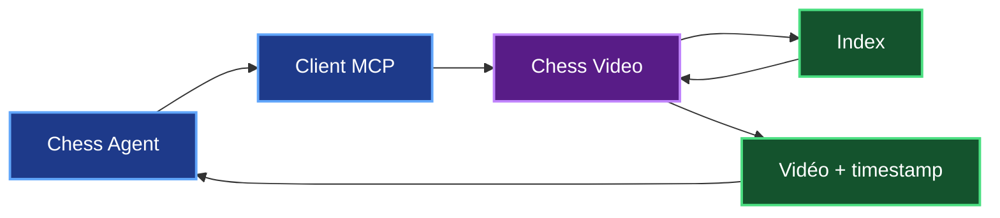
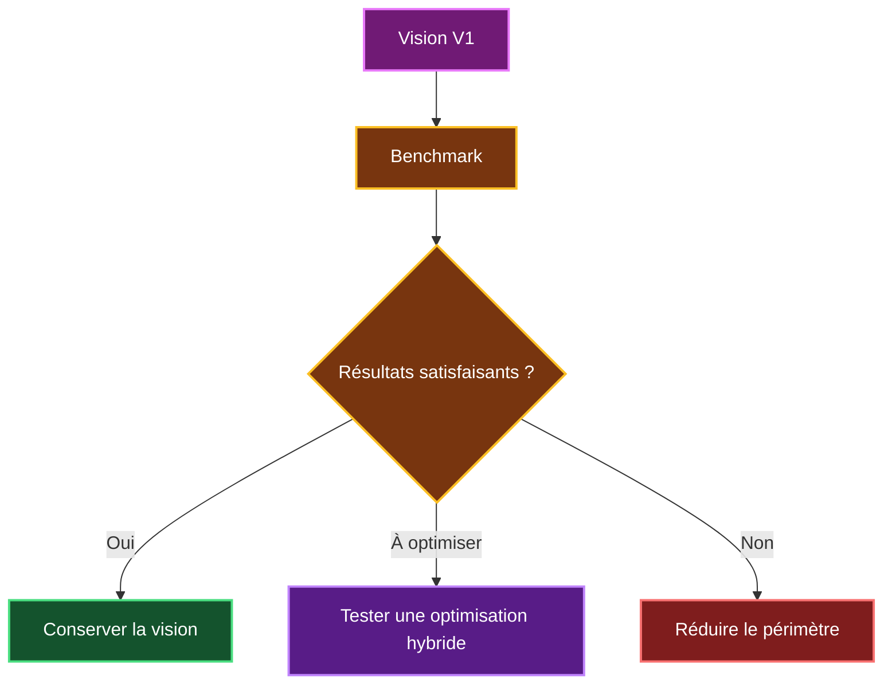
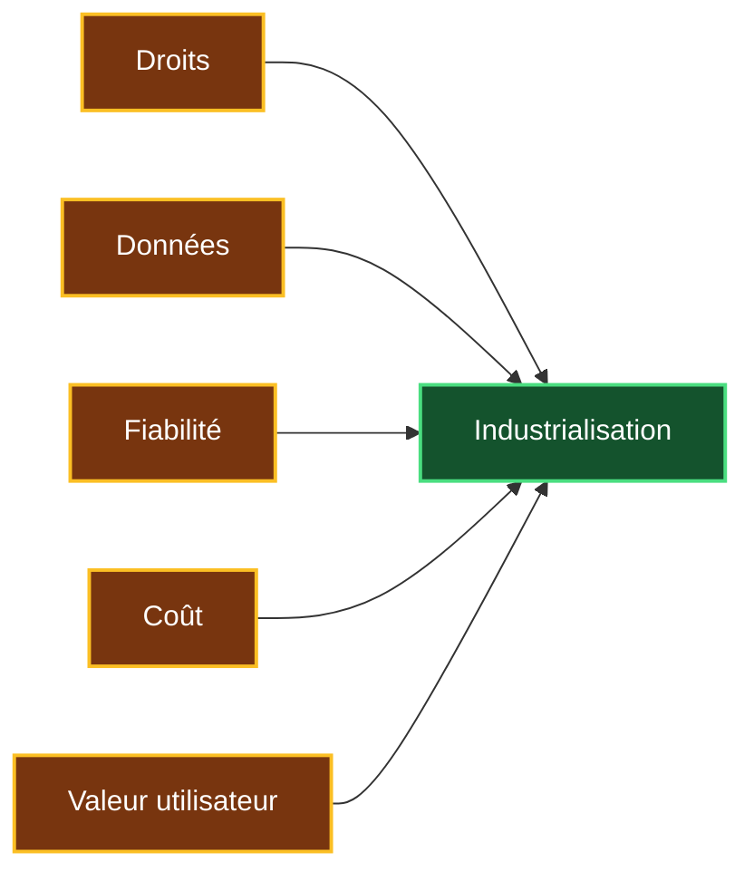
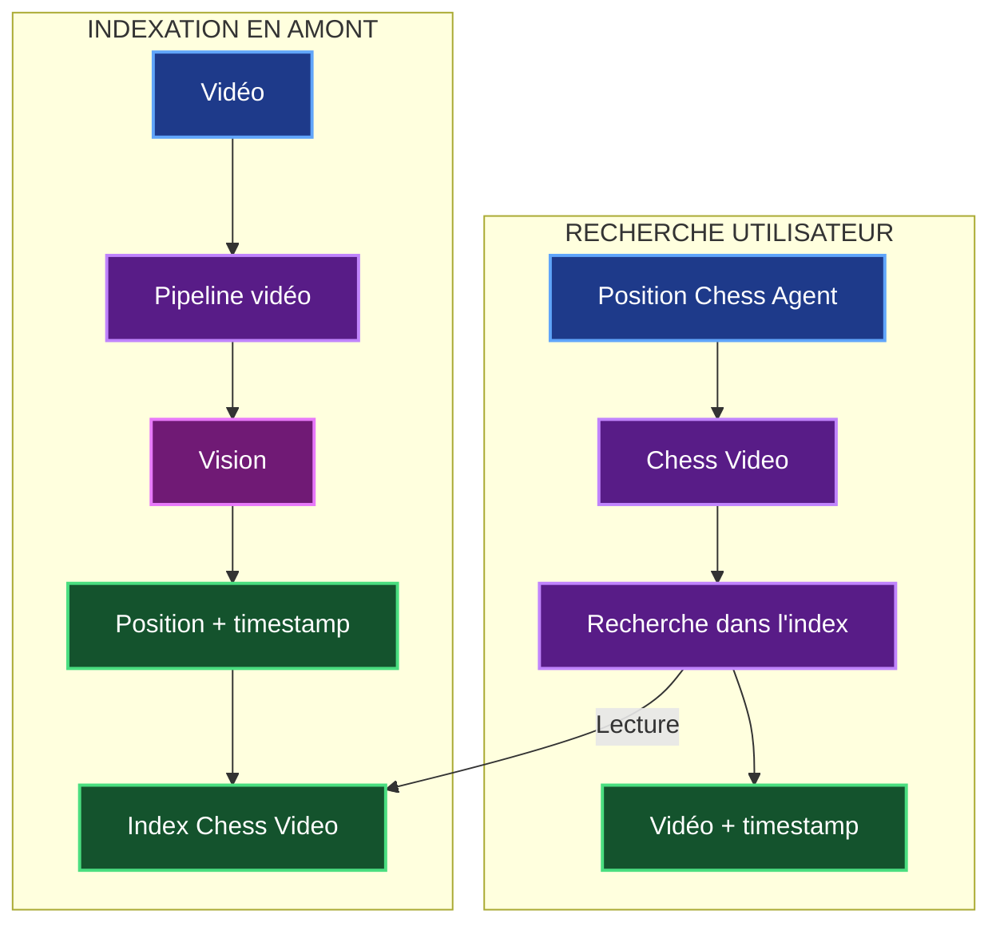
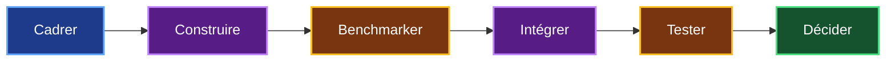

# 11. Conclusion et décision GO / NO-GO

## 11.1 Conclusion de l'étude

Cette étude avait pour objectif de déterminer s'il est réaliste de faire évoluer mon POC **Chess Agent** avec un nouveau service capable de retrouver le moment où une position d'échecs apparaît dans une vidéo.

Le besoin peut être résumé simplement :


L'étude montre que ce projet est **techniquement réalisable sur un périmètre contrôlé**.

Plusieurs briques nécessaires reposent sur des technologies déjà disponibles :

- OpenCV pour préparer et localiser l'échiquier ;
- un modèle de vision pour reconnaître les pièces ;
- `python-chess` pour manipuler et contrôler les positions ;
- une base de données pour construire l'index ;
- FastMCP pour exposer Chess Video à Chess Agent.

La principale incertitude ne concerne donc pas la possibilité de construire le pipeline.

Elle concerne surtout :

> **la fiabilité de la reconnaissance visuelle sur des vidéos différentes de celles utilisées pendant le développement.**

C'est ce point que le benchmark devra principalement valider.

---

## 11.2 Solution retenue pour la V1

Pour la première version, je retiens une architecture volontairement simple.

### Indexation en amont

Les vidéos sont analysées avant les recherches des utilisateurs.


L'objectif est de construire progressivement un index contenant les positions reconnues et leurs timestamps.

### Recherche utilisateur

Lorsqu'un utilisateur analyse ensuite une position, Chess Agent n'a pas besoin de retraiter la vidéo.

Il interroge simplement Chess Video.



La séparation entre **indexation** et **recherche** est importante.

> **Le traitement lourd est réalisé en amont. La recherche utilisateur doit rester rapide.**

Pour la V1, l'interface principale entre Chess Agent et Chess Video peut donc rester simple :

```text
video.search_position
```

Il n'est pas nécessaire d'imposer dès la V1 une architecture complexe avec plusieurs workers ou une file de jobs.

Ces mécanismes pourront être étudiés plus tard si le volume de vidéos le nécessite.

---

## 11.3 Choix technologique

Deux possibilités principales ont été étudiées pour la reconnaissance.

| Solution | Avantage | Limite |
|---|---|---|
| Modèle spécialisé | Contrôle important | Dataset, entraînement et maintenance |
| Modèle existant | Développement plus rapide | Précision à mesurer |

Pour la V1, je retiens :

> **OpenCV + modèle de vision existant**

Cette solution permet de tester la faisabilité sans commencer immédiatement par la création d'un modèle spécialisé.

Le modèle spécialisé reste une évolution possible si le benchmark montre que la solution initiale n'est pas assez précise.

Son développement représenterait environ :

> **+20 à 30 jours.homme**

Cette charge supplémentaire n'est pas comprise dans les **65 j.h de la V1**.

---

## 11.4 Ce que le benchmark doit encore démontrer

L'étude permet de conclure que l'architecture est réalisable.

Elle ne permet cependant pas d'affirmer aujourd'hui que la reconnaissance sera suffisamment fiable.

Le benchmark devra donc mesurer les performances réelles.

| Indicateur | Pourquoi ? |
|---|---|
| **Positions entièrement correctes** | Vérifier la qualité réelle de la reconnaissance |
| **Faux positifs** | Éviter de proposer un mauvais passage |
| **Précision du timestamp** | Vérifier que le passage retourné est suffisamment précis |
| **Taux d'abstention** | Vérifier que le système sait refuser un résultat incertain |
| **Temps d'indexation** | Mesurer les performances |
| **Frames analysées** | Mesurer l'efficacité du filtrage |
| **Coût par heure vidéo** | Vérifier la viabilité économique |
| **Vidéos inconnues** | Vérifier la généralisation |

La question principale du benchmark sera donc :

> **Chess Video reconnaît-il suffisamment bien les positions sur des vidéos qu'il n'a jamais vues, avec un coût acceptable ?**

---

## 11.5 Alternatives possibles

L'étude a également montré que la vision n'est pas forcément la seule information exploitable.

Deux sources complémentaires peuvent être utilisées lorsqu'elles sont disponibles :

| Source | Utilité |
|---|---|
| **PGN / timeline** | Reconstruire directement les positions si les données sont synchronisées |
| **Transcription / RAG** | Identifier une zone temporelle probable avant la vision |

Ces solutions ne remplacent pas automatiquement la vision.

Elles constituent surtout des **possibilités d'optimisation**.



Je ne considère donc pas l'approche hybride comme une obligation pour la V1.

Elle pourra être retenue si elle apporte un gain mesurable en précision, en temps ou en coût.

---

## 11.6 Faisabilité économique

La référence économique retenue dans l'ensemble du dossier est :

| Indicateur | Valeur de référence |
|---|---:|
| **Charge V1** | **65 j.h** |
| **Durée calendaire** | **11 à 13 semaines** |
| **Durée simplifiée** | **≈ 3 mois** |
| **Coût humain** | **38 400 € HT** |
| **Réserve projet** | **3 840 € HT** |
| **Build** | **≈ 42 000 € HT** |
| **OPEX annuel** | **≈ 5 000 à 12 000 € HT** |
| **Première année** | **≈ 47 000 à 54 000 € HT** |
| **Indexation initiale** | **À mesurer pendant le benchmark** |
| **Modèle spécialisé éventuel** | **+20 à 30 j.h** |

La charge de 65 jours.homme est répartie entre cinq compétences.

| Métier | Charge |
|---|---:|
| Data Engineer | **14 j.h** |
| Data Scientist / Computer Vision | **15 j.h** |
| AI / ML Engineer | **12 j.h** |
| Backend / AI Engineer | **13 j.h** |
| MLOps / DevOps | **11 j.h** |
| **TOTAL** | **65 j.h** |

Le parallélisme entre certaines tâches explique pourquoi **65 jours.homme de travail correspondent à environ 11 à 13 semaines calendaires**.

---

## 11.7 Risques à surveiller

Quatre risques principaux peuvent encore remettre en cause l'industrialisation de Chess Video.

| Risque | Problème | Réponse prévue |
|---|---|---|
| **Droits vidéo** | Toutes les vidéos accessibles ne sont pas forcément exploitables | Utiliser des sources autorisées |
| **Données personnelles** | Certaines vidéos peuvent contenir des données personnelles | Minimiser et supprimer les données inutiles |
| **Fiabilité** | Une mauvaise reconnaissance produit un mauvais timestamp | Benchmark, confiance et abstention |
| **Coût** | L'indexation peut devenir coûteuse avec le volume | Mesurer le coût par heure vidéo |

Ces quatre risques ne bloquent pas la réalisation d'une V1.

Ils doivent cependant être maîtrisés avant une industrialisation plus importante.

---

## 11.8 Périmètre de la décision

Je ne recommande pas de chercher immédiatement à reconnaître toutes les vidéos d'échecs.

La V1 doit rester contrôlée.

| Type de contenu | Décision |
|---|---|
| Échiquier numérique 2D | **GO** |
| Orientation Blancs / Noirs | **GO** |
| Plusieurs thèmes graphiques | **GO sous benchmark** |
| Flèches et annotations | **À tester** |
| Plateau fortement masqué | **Hors priorité** |
| Échiquier physique | **À reporter** |
| Toutes les vidéos d'échecs | **NO-GO temporaire** |

Cette limitation permet de mesurer la faisabilité avant d'augmenter progressivement la difficulté.

---

## 11.9 Décision GO / NO-GO

À partir des éléments étudiés, je peux maintenant prendre une décision.

### V1 Chess Video

> ## **GO**

Je considère qu'il est pertinent de développer une V1 de Chess Video sur un périmètre contrôlé.

Les technologies nécessaires existent et l'architecture proposée est réalisable.

### Industrialisation

> ## **GO conditionnel**

L'industrialisation dépendra des résultats du benchmark et de la bêta.

Les cinq éléments à valider sont :



### Reconnaissance universelle

> ## **NO-GO temporaire**

Je ne dispose pas encore d'éléments permettant de garantir que Chess Video pourra reconnaître correctement toutes les interfaces, tous les thèmes, toutes les résolutions et tous les types d'échiquiers.

Cette ambition pourra être réévaluée après les résultats de la V1.

---

## 11.10 Synthèse finale

L'ensemble de l'étude peut être résumé dans le tableau suivant.

| Dimension | Conclusion |
|---|---|
| **Besoin utilisateur** | **Pertinent** |
| **Pipeline vidéo** | **Faisable** |
| **OpenCV** | **Faisable** |
| **Reconnaissance des pièces** | **À valider par benchmark** |
| **Indexation en amont** | **Faisable** |
| **Recherche dans l'index** | **Faisable** |
| **MCP / FastMCP** | **Faisable** |
| **PGN / timeline** | Alternative si disponible |
| **Transcription / RAG** | Optimisation possible |
| **Généralisation** | **À démontrer** |
| **Charge V1** | **65 j.h** |
| **Durée** | **11 à 13 semaines** |
| **Build** | **≈ 42 000 € HT** |
| **OPEX annuel** | **≈ 5 000 à 12 000 € HT** |
| **Première année** | **≈ 47 000 à 54 000 € HT** |
| **Modèle spécialisé** | **Option +20 à 30 j.h** |
| **V1 contrôlée** | **GO** |
| **Industrialisation** | **GO conditionnel** |
| **Reconnaissance universelle** | **NO-GO temporaire** |

---

# Conclusion générale du dossier

Cette étude m'a permis de partir d'un besoin simple :

> **ne plus seulement proposer une vidéo pertinente, mais retrouver le passage précis correspondant à une position d'échecs.**

Pour répondre à ce besoin, j'ai étudié une évolution de Chess Agent appelée **Chess Video**.

Le fonctionnement retenu repose sur deux traitements bien séparés.



La partie la plus incertaine reste la reconnaissance visuelle.

C'est pourquoi je ne considère pas la faisabilité comme définitivement démontrée avant le benchmark.

La démarche retenue est donc progressive :



La référence retenue pour la V1 est :

> **65 jours.homme, 11 à 13 semaines et environ 42 000 € HT de Build.**

Le coût de la première année est estimé entre :

> **47 000 et 54 000 € HT**, hors indexation initiale qui devra être mesurée pendant le benchmark.

La décision finale de cette étude est donc :

> ## **GO pour développer une V1 contrôlée de Chess Video.**

Puis :

> ## **GO conditionnel pour son industrialisation.**

Enfin :

> ## **NO-GO temporaire pour une reconnaissance universelle de toutes les vidéos d'échecs.**

Cette décision me permet de poursuivre le projet sans considérer comme acquises les parties qui doivent encore être mesurées.

Le **benchmark et la bêta** seront les deux étapes qui permettront de transformer cette étude de faisabilité en une décision d'industrialisation fondée sur des résultats réels.